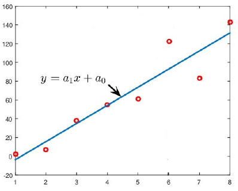

# Метод наименьших квадратов
*Јована Арсеновић, Николина Живановић, Анастасија Голић,*
*Вељко Радојичић, Стефан Топалов*
*20. ноябрь 2023.*

## Элементы теории ошибок

Все больше реальных проблем во всех областях жизни сегодня решается математическим моделированием и их симуляцией, благодаря интенсивному развитию компьютеров. Если бы мы хотели моделировать процесс, измерения которого представлены на рисунке 1, самым простым способом было бы использование процедуры линейной регрессии, и тогда связь между характеристиками можно было бы представить в линейной форме:
$$ y = a_1x + a_0, \tag{1}$$
где $a_1$ и $a_0$ - неизвестные параметры, которые мы хотим определить в процедуре оптимизации, при этом параметр $a_1$ представляет угол наклона кривой, а параметр $a_0$ - точку пересечения с ординатой.

**Фигура 1: Иллюстрация линейной регрессии - аппроксимация данных полиномом первого порядка.**

В течение процесса оптимизации необходимо найти те значения параметров $a_1$ и $a_0$, которые позволят прямой наилучшим образом описать данный процесс, то есть чтобы разница между реальным и аппроксимированным значением была минимальной:
$$ E_i = |y - y_i|. \tag{2}$$

Этот тип ошибки называется абсолютной ошибкой и может быть представлен следующим образом:

1. **Максимальная абсолютная ошибка:**
$$ E_\infty(f) = \max \left| y(x_k) - y_k \right|, \quad 1 < k < n $$

2. **Средняя абсолютная ошибка:**
$$ E_1(f) = \frac{1}{n} \sum_{k=1}^{n} \left| y(x_k) - y_k \right|^2 $$

3. **Среднеквадратичная абсолютная ошибка:**
$$ E_2(f) = \sqrt{\frac{1}{n} \sum_{k=1}^{n} |f(x_k) - y_k|^2} $$  

## Метод наименьших квадратов

Начнем с процедуры линейной регрессии, опираясь на метод наименьших квадратов (поскольку эти процедуры являются основой машинного обучения) и представим их как задачу оптимизации. С самого начала необходимо определить критерий оптимальности и представить его в квадратичной форме, где цель - минимизировать ошибку:

$$ F = \sum_{k=1}^{n} \left( y(x_k) - y_k \right)^2 \tag{3}$$ 

Поскольку мы решаем проблему линейной регрессии, критерий оптимальности теперь принимает форму:

$$ F = \sum_{k=1}^{n} \left( a_1x_k + a_0 - y_k \right)^2 \tag{4}$$

Как мы ранее отметили, наша цель - определить оптимальные значения параметров $a_0$ и $a_1$, чтобы критерий оптимальности (2) был минимален. На основе необходимых условий экстремума получаем следующую систему уравнений:

$$ \begin{cases}
\frac{\partial F}{\partial a_0} = \sum_{k=1}^{n} 2(a_1x_k + a_0 - y_k) = 0 \\
\frac{\partial F}{\partial a_1} = \sum_{k=1}^{n} 2(a_1x_k + a_0 - y_k)x_k = 0
\end{cases} \tag{5}$$

Линейная система уравнений (5) также может быть записана в матричной форме:

$$ \begin{bmatrix} n & \sum_{k=1}^{n} x_k \\ \sum_{k=1}^{n} x_k & \sum_{k=1}^{n} x_k^2 \end{bmatrix} \begin{bmatrix} a_0 \\ a_1 \end{bmatrix} = \begin{bmatrix} \sum_{k=1}^{n} y_k \\ \sum_{k=1}^{n} x_ky_k \end{bmatrix} \tag{6} $$

Решим ее методом Краммера: 

Mетод Краммера представляет собой теорему в линейной алгебре, которая предоставляет решения системы линейных уравнений с использованием детерминант. Если систему уравнений представить в виде умножения матриц: $Ax = c$, где $A$ - квадратная матрица, $x$ - вектор-столбец переменных, и матрица $A$ является регулярной (невырожденной), то решение можно выразить следующим образом:

$$x_i = \frac{\text{det}(A_i)}{\text{det}(A)}$$

где $A_i$ - матрица, полученная заменой $i$-го столбца в матрице $A$ вектором-столбцом $c$.

В дальнейшем мы рассмотрим решение матричного уравнения (8) и его дальнейшее применение в изучении проблемы регрессии. Решение системы (6) получается с использованием правила Крамера. После решения системы уравнений и получения оптимальных значений параметров $a_0$ и $a_1$ формально завершается процесс линейной регрессии.

$$ a_1 = \frac{n \sum_{k=1}^{n} x_k y_k - \sum_{k=1}^{n} x_k \sum_{k=1}^{n} y_k}{n \sum_{k=1}^{n} x_k^2 - (\sum_{k=1}^{n} x_k)^2} \tag{7a}$$

$$ a_0 = \frac{\sum_{k=1}^{n} y_k - a_1 \sum_{k=1}^{n} x_k}{n} \tag{7b}$$

Где $a_0^*$ и $a_1^*$ обозначают оптимальные значения параметров $a_0$ и $a_1$ в соответствии с предполагаемым критерием оптимальности (2). Оптимальное значение критерия обозначим как $F_{LSE}$ и вычислим его следующим образом:

$$ F_{LSE} = \sum_{i=1}^{n} (a_1^*x_i + a_0^* - y_i)^2 \tag{8} $$

## Линеаризация нелинейных моделей.

Логично предположить, что связь между входом $ x_i $ и выходом $ y_i $ не всегда линейна. Однако существует широкий класс нелинейных проблем, где с подходящими изменениями начальная проблема нелинейной регрессии может быть приведена к линейной.

Если мы хотим аппроксимировать начальную проблему полиномом второй степени:

$$ y = a_2x^2 + a_1x + a_0 \tag{9} $$

Тогда критерий оптимальности будет иметь следующую форму:

$$ F = \sum_{k=1}^{n} (a_2x_k^2 + a_1x_k + a_0 - y_k)^2 \tag{10} $$

Простой математикой мы получаем условия экстремума, приравнивая частные производные к нулю. Оптимальные значения параметров $ a_2, a_1 $ и $ a_0 $ также получаются с использованием правила Крамера. Оставим читателя с упражнением:

$$ \frac{\partial F}{\partial a_0} = \sum_{k=1}^{n} 2(a_2x_k^2 + a_1x_k + a_0 - y_k) = 0 \tag{11a} $$
$$ \frac{\partial F}{\partial a_1} = \sum_{k=1}^{n} 2(a_2x_k^2 + a_1x_k + a_0 - y_k)x_k = 0 \tag{11b} $$ 
$$ \frac{\partial F}{\partial a_2} = \sum_{k=1}^{n} 2(a_1x_k + a_0 - y_k)x_k^2 = 0 \tag{11с} $$

Экспоненциальную модель можно представить следующим образом:

$$ y(x) = Ce^{Ax} $$

Если мы вставим эту модель в критерий оптимальности (3):

$$ F = \sum_{k=1}^{n} (Ce^{Ax_k} - y_k)^2 \tag{12} $$

Необходимые условия экстремума получаются дифференцированием критерия по всем переменным:

\[ \frac{\partial F}{\partial A} = \sum_{k=1}^{n} 2(Ce^{Ax_k} - y_k)Cx_ke^{Ax_k} = 0 \tag{13a} \]

\[ \frac{\partial F}{\partial C} = \sum_{k=1}^{n} 2(Ce^{Ax_k} - y_k)e^{Ax_k} = 0 \tag{13b} \]

Очевидно, что это нельзя записать в матричной форме, поэтому мы прибегаем к процессу аппроксимации - линеаризации.

Линеаризация этой модели естественна и довольно проста. Если мы возьмем натуральный логарифм предыдущего выражения, мы получим:

\[ \ln y = \ln C + Ax \]

Теперь очевидно, что новое \( Y = \ln y \), а коэффициенты из уравнений (7) - это \( a_0 = \ln C \) и \( a_1 = A \), то есть:

\[ Y = a_0 + a_1 x \]

Применяя уравнения (7), мы легко определяем оптимальные значения параметров линеаризованной модели, то есть вычисляем \( a_0 \) и \( a_1 \), что в конечном итоге дает экспоненциальную регрессионную модель:

\[ y(x) = Ce^{Ax} = e^{a_0}e^{a_1x} \]

#### Пример

Во время экзамена были собраны данные о студентах, сколько времени они потратили на подготовку к экзамену и сколько баллов они получили, и эти данные представлены в таблице.

\[
\begin{array}{|c|c|}
    \hline
    \text{SATI} & \text{BODOVI} \\
    \hline
    6 & 82 \\
    10 & 88 \\
    2 & 56 \\
    4 & 64 \\
    0 & 23 \\
    \hline
\end{array}
\]

**(a) Линейная аппроксимация:**

Поскольку требуется представить данные линейно, необходимо определить параметры прямой. Для линейной аппроксимации данных необходимо найти оптимальные значения \(a_0\) и \(a_1\), используя выражения (7):

\[
a_1 = \frac{5(6 \cdot 82 + 10 \cdot 88 + 2 \cdot 56 + 4 \cdot 64) - (6 + 10 + 2 + 4)(82 + 88 + 56 + 64 + 23)}{5(36 + 100 + 4 + 16) - (6 + 10 + 2 + 4)^2}
\]

\[
a_0 = \frac{82 + 88 + 56 + 64 + 23 - a_1(6 + 10 + 4 + 2)}{5}
\]

Решив эти уравнения, получаем \(a_1 \approx 6.1284\) и \(a_0 \approx 35.6351\). Таким образом, уравнение прямой имеет вид \(y = 6.1284x + 35.6351\). На основе этого можно сделать вывод, что для сдачи экзамена необходимо потратить 2.5 часа на подготовку.

**(b) Экспоненциальная аппроксимация:**

Сначала необходимо определить \(Y\) как \(\ln(y)\):

\[ Y = \ln(y) = [4.4067, 4.4773, 4.0254, 4.1589, 3.1355] \]

Это подставляется в выражение (7), и получаем оптимальные значения параметров \(a_1^* = 0.1183\) и \(a_0^* = 3.5202\). На основе этого можно вычислить \(C = e^{a_0^*} = 33.7927\), и получить экспоненциальную кривую \(y = 33.7927e^{0.1183x}\).