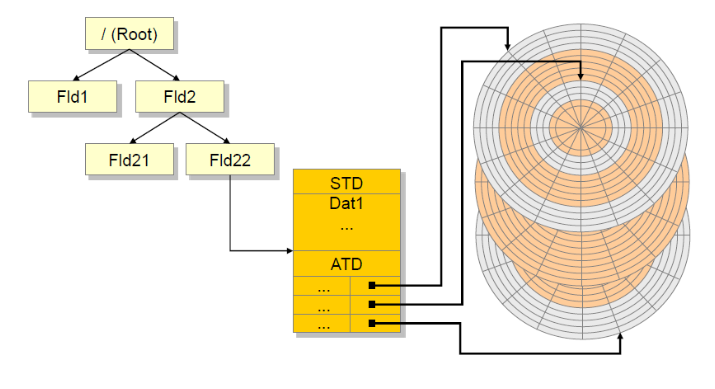
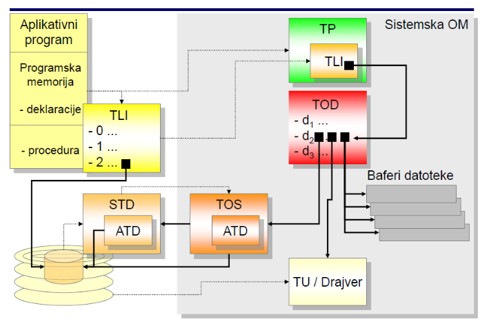
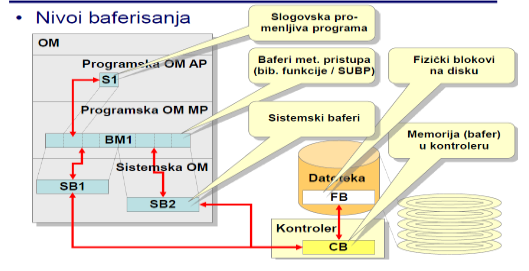
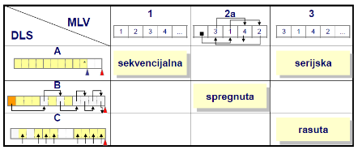
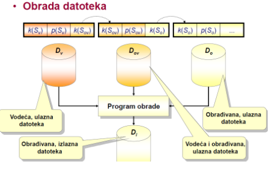
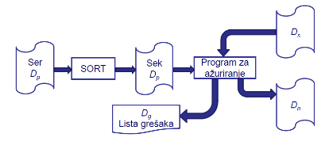
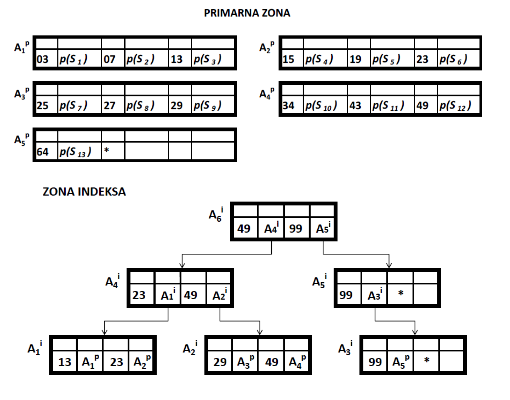
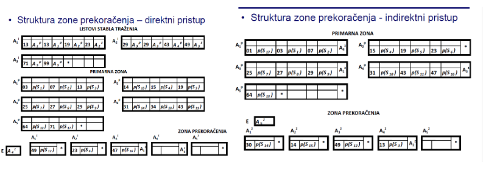
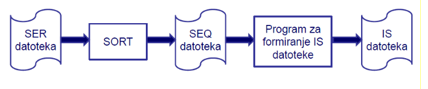

```table-of-contents
title: # Содержание
style: nestedList # TOC style (nestedList|inlineFirstLevel)
minLevel: 0 # Include headings from the specified level
maxLevel: 0 # Include headings up to the specified level
includeLinks: true # Make headings clickable
debugInConsole: false # Print debug info in Obsidian console
```
# Файловая система операционной системы

## УСЛУГИ ОС В ОРГАНИЗАЦИИ ДАННЫХ ФАЙЛОВОЙ СИСТЕМЫ

### ФАЙЛОВАЯ СИСТЕМА ОС
**ЗАДАЧИ:**
1. Управление файлами - физическими структурами данных (FSP) на внешних устройствах памяти.
2. Управление и осуществление обмена данными между прикладными программами и файлами.
3. Обеспечение механизма защиты от несанкционированного доступа к файлам и повреждения данных в условиях многопользовательского и многозадачного режима работы.
4. Обеспечение поддержки различных видов просмотра LSP файла - отображение LSP в FSP и наоборот.

**УСЛУГИ ФАЙЛОВЫХ СИСТЕМ**
- **УСЛУГИ НИЗКОГО УРОВНЯ** - Включают в себя перечисленные задачи, но предоставляют вид LSP файла только как последовательность байтов и его отображение в FSP последовательности блоков.
  - Услуги низкого уровня - это сервисы, принадлежащие исключительно ОС. К ним относятся:
    1. Управление областью памяти.
    2. Управление каталогом.
    3. Управление физическим обменом данными.
    4. Обеспечение связи между программой и файлом.
    5. Системные вызовы.
- **УСЛУГИ ВЫСОКОГО УРОВНЯ** - Эти услуги могут быть встроены в ОС, библиотеки языков программирования или SUBP, или могут быть предоставлены на уровне прикладной программы, обычно при разработке специальных приложений или использовании специализированных процессорных устройств для обработки данных.
  - Обязательно включают в себя все услуги низкого уровня. Предоставляют различные взгляды на LSP файлы как на различные структуры из набора записей/блоков/байтов и их отображения в FSP последовательности блоков. Также обеспечивают построение специализированных вспомогательных структур для повышения эффективности обработки данных и поиска на основе значений данных.
  - К ним относятся:
    6. Методы доступа.
    
Каждая из указанных услуг включает соответствующие рутины и специализированные структуры данных.

## УПРАВЛЕНИЕ ПАМЯТЬЮ

**Рутины управления пространством внешнего устройства памяти - диска.** В эти рутины включаются:
1. Установка адресного пространства и файловой системы.
   - Форматирование диска на низком и высоком уровнях.
   - Создание структуры данных с записью свободного и занятого пространства на диске (индекс свободных и занятых блоков).
2. Поддержание структуры данных с записью свободного и занятого пространства на диске.
   - Выделение и освобождение пространства по запросу других рутин ОС.
   - Реорганизация (дефрагментация) свободного пространства по запросу администратора ОС.
3. Архивирование, восстановление и восстановление содержимого диска (резервное копирование, восстановление и восстановление рутины).

## УПРАВЛЕНИЕ КАТАЛОГОМ

**Каталог** представляет собой иерархическую структуру каталогов типа дерева. Корень представляет собой корневой каталог и формируется автоматически в процессе форматирования диска. Каждый узел в структуре может быть каталогом или файлом. Вводится понятие текущего каталога.
Каталог может быть создан на одном или нескольких дисковых устройствах с прямым доступом. Каталог также позволяет относительную и абсолютную ссылку на узлы в структуре.

**Рутины управления каталогом:**
1. Создание, удаление, переименование и переключение каталогов в структуре.
2. Перечисление и поиск содержимого каталогов и файлов.
3. Создание и удаление файлов в каталоге с использованием системных вызовов.
4. Переименование, копирование и перемещение файлов в структуре.
5. Назначение и отмена прав доступа к каталогам и файлам (конкретным пользователям или назначение ролей на уровне ОС).
6. Изменение атрибутов файлов.

## УПРАВЛЕНИЕ ФИЗИЧЕСКИМ ОБМЕНОМ ДАННЫХ

**Рутины управления физическим обменом данными (физический ввод/вывод, надзор над вводом/выводом, драйверы устройств)** отвечают за управление обменом блоков через подсистему ввода/вывода между контроллером диска и оперативной памятью.

**Рутины управления физическим обменом данными:**
1. Инициализация физической передачи данных одного физического блока и установка параметров передачи.
2. Обмен сообщениями с программами для физической передачи данных, который осуществляется как передача процессором или DMA.
3. Передача статуса успешного выполнения передачи данных.

## ОБЕСПЕЧЕНИЕ СВЯЗИ МЕЖДУ ПРОГРАММОЙ И ФАЙЛОМ

**Управление структурами данных о:**
A. Внешних устройствах памяти
B. Файлах на внешнем устройстве памяти
C. Использовании файлов в прикладных программах
D. Файлах в оперативном использовании

**ТАБЛИЦА ОС** - Структура данных для описания ресурса, которым операционная система оперативно управляет. Вышеупомянутые структуры данных частично представлены через таблицы ОС.

1. **ТАБЛИЦА УСТРОЙСТВА**
2. **СИСТЕМНАЯ ТАБЛИЦА ФАЙЛОВ**
3. **АЛЛОКАЦИОННАЯ ТАБЛИЦА ФАЙЛОВ**
4. **ТАБЛИЦА ЛОГИЧЕСКИХ ИМЕН ФАЙЛА**
5. **ТАБЛИЦА ПРОЦЕССОВ**
6. **ТАБЛИЦА ОТКРЫТЫХ ФАЙЛОВ**
7. **ТАБЛИЦА ОПИСАНИЯ ФАЙЛА**

\[A\] - Данные о внешнем устройстве памяти.
ОС поддерживает на дисковом устройстве структуры данных о:
- Производственных характеристиках самого дискового устройства (название, адрес и тип устройства, общее количество цилиндров, дорожек на цилиндре и секторов на дорожке)
- Нумерации секторов
- Работоспособных и неисправных секторах
- Запасных секторах для неисправных секторов
- Определенной емкости блока
- Корневом каталоге и системе каталогов
- Свободном пространстве

**ТАБЛИЦА УСТРОЙСТВА - TU**
Запись с данными, необходимыми для использования устройства. Формируется при запуске ОС или монтировании устройства. Используются рутины для управления физическим вводом/выводом (драйверы).
Содержит:
1. Данные о характеристиках устройства
2. Адреса рутин (драйверов) для управления физическим вводом/выводом для данного устройства.

\[B\] - Данные о файлах на внешнем устройстве памяти.
ОС поддерживает на дисковом устройстве структуры данных о файлах, распределенных по системе каталогов.

**СИСТЕМНАЯ ТАБЛИЦА ФАЙЛОВ - STD**
Представляет собой постоянную запись о файле, которую поддерживает ОС. Формируется при создании файла, уничтожается при удалении и модифицируется при изменении содержимого файла. Загружается в оперативную память при оперативном использовании файла. Связана с системой каталогов и адресуется из соответствующего каталога.
Содержит:
1. Название файла
2. Расширение и версия файла
3. Тип файла (bin/txt)
4. Данные о владельце и разрешениях на использование файла
5. Размер файла
6. Дата и время создания или последней модификации содержимого
7. Данные о других атрибутах (системный, скрытый файл и т. д.)
8. Аллокационная таблица файла

**АЛЛОКАЦИОННАЯ ТАБЛИЦА ФАЙЛА - ATD**
Представляет собой карту выделенного пространства диска для файла и служит для ведения учета выделенного пространства файла. Содержит массив пар вида (указатель, количество блоков), где указатель - это тройка (цилиндр, трек, сектор), то есть адрес начала зоны выделенного пространства, а количество блоков указывает на размер зоны в виде количества физических блоков. Каждое выделение нового пространства вызывает формирование новой пары в массиве, а каждое освобождение ненужного пространства вызывает удаление пары из массива.



\[C\] - Данные об использовании файлов в прикладных программах
Обеспечивают связь между прикладными программами и ОС. Формируются компилятором и используются и дополняются ОС на основе спецификаций использования файлов в программе. Находятся в части оперативной памяти, зарезервированной для прикладной программы.
Содержание этих данных может зависеть от уровня услуг ОС - могут быть включены данные, связанные с форматом записи или блока файла, способы использования и доступа к данным файла.

**ТАБЛИЦА ЛОГИЧЕСКИХ ИМЕН ФАЙЛА - TLI**
Состоит из массива пар (имя файла, указатель), где индекс массива - это порядковый номер указанного файла (дескриптор файла, значение 0,1 или 2), имя файла указывает на связанное имя файла из STD, а указатель указывает на запись с данными об открытом файле в TOD.

\[D\] - Данные о файлах в оперативном использовании
Обеспечивают связь данных, содержащихся в TU, STD и TLI. Формируются и используются ОС, когда требуется оперативное использование файла из прикладной программы (подготовка файла к оперативному использованию данными приложения или процесса ОС). Находятся в системной части оперативной памяти, управляемой ОС.

**ТАБЛИЦА ПРОЦЕССОВ - TP**
Содержит идентификатор процесса и необходимую информацию о процессе, созданном на основе прикладной программы. Также включает данные о текущем состоянии процесса на уровне ОС и данные из TLI.

**ТАБЛИЦА ОТКРЫТЫХ ФАЙЛОВ ПРОЦЕССА - TOP**
Представляет собой TLI в системной части оперативной памяти, содержит указатели на записи о открытых файлах, то есть на таблицу открытых файлов (TOD).

**ТАБЛИЦА ОТКРЫТЫХ ФАЙЛОВ - TOD**
Представляет собой массив записей об открытых файлах в системе. Каждое открытие файла создает одну запись в TOD, а индекс массива обозначает порядковый номер открытого файла в системе. Каждая запись содержит данные, необходимые для успешного обмена данными между прикладной программой и файлом.
Содержание записи:
- Возможные способы использования файла
- Указатель на текущую позицию в файле (текущий указатель)
- Массив указателей на зарезервированные системные буферы
- Связи между блоками и системными буферами в форме (номер_блока, статус, буфер)
  - номер_блока - порядковый номер загруженного блока в системный буфер
  - статус - индикатор изменения содержимого блока после последней загрузки
  - буфер - маркер системного буфера, в который загружен блок
- Указатель на TU / драйвер устройства в таблице драйверов
- Указатель на таблицу описания файла (TOS)

**ТАБЛИЦА ОПИСАНИЯ ФАЙЛА - TOS**
Представляет скопированное содержимое STD вместе с ATD в оперативной памяти. Обновляется во время использования файла, а обновленное содержимое передается в STD по завершении работы с файлом.



## СИСТЕМНЫЕ ВЫЗОВЫ
Системные вызовы - это вызовы процедур ОС для управления файлами.
A. Предоставляют услуги низкого уровня, т.е. обеспечивают:
   1. **ПРЕДСТАВЛЕНИЕ ФАЙЛА КАК ПОСЛЕДОВАТЕЛЬНОСТИ БАЙТОВ** - обмен данными между прикладной программой и файлом, организованный как последовательности байтов.
   2. **УПРАВЛЕНИЕ БЛОКАМИ ФАЙЛА** - группировка последовательностей байтов в блоки и обмен целыми блоками между диском и системными буферами в оперативной памяти.
   3. **УПРАВЛЕНИЕ СИСТЕМНЫМИ БУФЕРАМИ** - команды для резервирования и освобождения буферов, а также учет размещения блоков в буферах.
   4. **НЕЗАВИСИМОСТЬ ПРИКЛАДНОЙ ПРОГРАММЫ ОТ ФИЗИЧЕСКИХ ХАРАКТЕРИСТИК ДИСКА** - преобразование номера байта в номер блока и номера блока в абсолютный адрес блока на диске.
B. Учитывают характеристики файла - начало и конец файла, а также индикатор актуальности.
C. Поддерживают ПОСЛЕДОВАТЕЛЬНЫЙ ДОСТУП к байтам файла при операциях чтения и записи. Они требуют указания общего количества байтов для операции и автоматически поддерживают значение текущего указателя.
D. Поддерживают и ПРЯМОЙ ДОСТУП к байтам файла при операциях позиционирования. Они требуют указания значения текущего указателя, то есть номера байта, относительно которого начинается следующая операция.
E. Принимают параметры вызова из вызывающего окружения прикладной программы или окружения, отвечающего за предоставление услуг высокого уровня.
F. Передают в вызывающее окружение информацию о статусе выполнения системного вызова, что является основой для обработки исключения. Исключение - это событие, которое приводит к прерыванию нормальной обработки данных.

### ТИПЫ СИСТЕМНЫХ ВЫЗОВОВ
1. create - создание файла
2. open - открытие файла
3. read - чтение содержимого файла
4. write - запись данных в файл
5. seek - перемещение на указанное место
6. close - закрытие файла
7. sync - синхронизация измененных буферов
8. delete - удаление и уничтожение файла
9. truncate - удаление содержимого файла
10. stat - получение информации о файле

**CREATE** - системный вызов для создания файла на основе указанных параметров
Создание полностью нового файла и его открытие для записи - ЗАДАЧИ:
- Проверка всех необходимых условий для создания файла (пространство, путь, права доступа)
- Выделение начального пространства для нового файла на диске
- Создание STD с ATD
- Формирование записи в каталоге и связывание её с STD
- Возвращение данных об успешности операции и дескриптора файла

**OPEN** - системный вызов для открытия файла на основе указанных параметров
Подготовка файла к оперативному использованию:
- Для оперативного использования файла требуется доступ к данным в STD и TLI
- Чтобы избежать повторного доступа к диску, удобно поместить эти данные в оперативную память
СПОСОБЫ ОТКРЫТИЯ ФАЙЛА:
a. Открытие несуществующего файла
b. Открытие существующего файла
c. Открытие в режиме чтения и записи
d. Открытие в режиме эксклюзивного чтения содержимого
e. Открытие в режиме эксклюзивного записи содержимого
ЗАДАЧИ:
- Если указан запрос на создание нового файла, выполнение вызова типа CREATE
- В случае запроса на открытие существующего файла, проверка выполнимости необходимых условий (пространство, путь, имя файла) и разрешений на выполнение операции OPEN
- Перенос содержимого STD в оперативную память, создание TOS и связывание его с STD
- Формирование записи в TOD и связывание с TOS и TLI в TP (связывание физического имени и логического обозначения файла в TLI и связывание адресов соответствующих программ для обработки системных вызовов для обмена данными)
- Инициализация значения текущего указателя
- Начальное резервирование системных буферов (запись указателей на буферы в соответствующую запись в TOD и заполнение буферов начальными блоками файла)
- Передача вызывающему окружению данных об успешности операции и дескрипторе файла

### УПРАВЛЕНИЕ СИСТЕМНЫМИ БУФЕРАМИ
**РЕЗЕРВИРОВАНИЕ И ОСВОБОЖДЕНИЕ БУФЕРОВ ФАЙЛА** - Осуществляется с использованием сервисов ядра ОС. Открытому файлу должен быть назначен как минимум один буфер.
**УЧЕТ РАЗМЕЩЕНИЯ БЛОКОВ В БУФЕРАХ** - в записи из TOD или в ссылочной структуре данных, поддерживаемой ядром ОС.
**ТЕХНИКИ РЕЗЕРВИРОВАНИЯ И ОСВОБОЖДЕНИЯ БУФЕРОВ** - может быть фиксированным (статическим) или динамическим выделением буферов файлу.
- **ФИКСИРОВАННОЕ ВЫДЕЛЕНИЕ** - фиксированное количество буферов назначается при открытии, и все буферы освобождаются при закрытии файла.
- **ДИНАМИЧЕСКОЕ ВЫДЕЛЕНИЕ** - все системные буферы ОС доступны всем открытым файлам, и буферы назначаются и освобождаются по мере необходимости.

**МНОЖЕСТВЕННОЕ ОТКРЫТИЕ ОДНОГО И ТОГО ЖЕ ФАЙЛА**
Не разрешено в некоторых ОС. Файл открывается и блокируется исключительно одним процессом. Для каждого файла в TOD может существовать не более одной записи. Другие процессы могут открыть только файл для чтения. Это позволяет сохранить согласованность данных в многопользовательском режиме, но существенно снижает уровень возможной параллелизации обработки и использования данных файла.
Допускается в некоторых ОС. Файл может открываться несколькими различными процессами одновременно или одним процессом несколько раз. Каждое открытие файла создает отдельную запись в TOD, которая связана с соответствующей записью в TLI из TP. Это обеспечивает высокий уровень параллелизма при обработке данных, но не гарантирует сохранение согласованности.
   
**READ** - системный вызов для загрузки последовательности байтов из открытого файла на основе заданных параметров. Фактическая передача части содержимого файла в вызывающее окружение, заданное количество байтов с текущей позиции указателя.
**ЗАДАЧИ:**
- Проверка, открыт ли файл и разрешено ли его чтение.
- Вычисление номера первого блока и длины последовательности исходных блоков, в которых находятся запрошенные данные.
- Проверка, находятся ли запрошенные блоки уже в буферах. Если нет, выбор буферов для размещения блоков, вычисление абсолютных адресов запрошенных блоков и инициализация физической передачи блоков с диска.
- Передача запрошенного содержимого из буферов в целевую переменную.
- Увеличение значения текущего указателя.
- Передача вызывающему окружению данных о результате операции и количестве принятых байтов.

4. **WRITE** – системный вызов для записи последовательности байтов в открытый файл.
   Фактическая передача последовательности байтов из вызывающего окружения в файл, заданное количество байтов с текущей позиции указателя.
   **ЗАДАЧИ:**
   - Проверка, открыт ли файл и разрешено ли его запись.
   - Вычисление номера первого блока и длины последовательности целевых блоков, в которые нужно поместить исходные данные.
   - Проверка, требуется ли сохранение предыдущего содержимого целевых блоков. Если да, проверка, находятся ли запрошенные блоки уже в буферах.
   - Если блоки не находятся в буферах, выбор буферов для размещения блоков, вычисление абсолютных адресов запрошенных блоков и инициализация физической передачи блоков с диска.
   - Передача запрошенного содержимого из исходной переменной в буферы.
   - Увеличение значения текущего указателя.
   - Передача вызывающему окружению данных о результате операции и количестве переданных байтов.

5. **SEEK** – системный вызов для позиционирования на желаемую позицию.
   Управление содержимым текущего указателя для обеспечения прямого доступа к желаемому байту файла.
   **ЗАДАЧИ:**
   - Проверка, открыт ли файл.
   - Установка нового значения текущего указателя сдвигом на заданное количество байтов или на определенную точку.
   - Передача вызывающему окружению данных о результате выполненной операции.

6. **CLOSE** – системный вызов для закрытия открытого файла.
   Организованное завершение оперативного использования файла. Гарантирует, что файл останется сохраненным на диске в согласованном состоянии. Закрытие файла происходит либо автоматически, либо явно.
   **ЗАДАЧИ:**
   - Освобождение содержимого занятых буферов, сброс измененного содержимого (очистка буфера) и инициирование физической передачи блоков на диск.
   - Освобождение всех занятых буферов и возврат ОС.
   - Перенос содержимого TOS с ATD на диск, обновление содержимого STD с ATD.
   - Уничтожение TOS и соответствующей записи в TOD, разрыв всех установленных связей с TLI, TP и STD.
   - Передача вызывающему окружению данных о результате выполненной операции.

7. **SYNC** – системный вызов для синхронизации (очистки) "грязных" буферов, выполняется по запросу или автоматически через определенные интервалы.
   
8. **DELETE** – системный вызов для удаления имени и уничтожения файла.
   **ЗАДАЧИ:**
   - Освобождение выделенного пространства файла на диске.
   - Уничтожение записей о файле в каталоге.
   - Возврат информации об успешном выполнении операции.

9. **TRUNCATE** – системный вызов для удаления содержимого файла.
   Деаллоцирует пространство файла на диске, но сохраняет информацию в STD.

## МЕТОДЫ ДОСТУПА
Методы доступа используют или включают в себя службы низкого уровня выбранной операционной системы. Сервисы методов доступа могут быть встроены в ОС, язык программирования с библиотеками или SUBP.

1. **Обеспечение представлений LSP файлов:** Методы доступа позволяют различным представлениям файла LSP (Логическое Последовательное Представление) как различных структур над набором записей или блоков, обязательно как массива блоков. Кроме того, они обеспечивают отображение этих представлений в FSP (Физическое Последовательное Представление) массива физических блоков.

2. **Построение специальных вспомогательных структур:** Методы доступа позволяют создавать специальные вспомогательные структуры, которые улучшают эффективность обработки данных.

3. **Поиск на основе значений данных:** Методы доступа обеспечивают поиск на основе значений данных.

Эти методы требуют разрешения вопросов организации и хранения полей, записей и блоков, способов адресации и способов хранения логических связей, возможных типов услуг на уровне записи или блока, поддержки различных типов организации файлов и поддержки общих процедур управления содержимым файлов.

# Методы доступа и организация файла

## ОСНОВНАЯ СТРУКТУРА ФАЙЛА

### ФАЙЛ КАК СТРУКТУРА ЗАПИСЕЙ

Файл организован вокруг типа записи как линейной структуры атрибутов.

**ФОРМАТ ЗАПИСИ** – правила для структурирования и интерпретации содержимого записи.

Общая структура файла как ФСП (Физическая структура података) – включает данные из LSP (Линейной Структуры Података) и данные об организации ФСП на внешнем запоминающем устройстве. Каждая запись представляет собой массив полей со значениями атрибутов.

- **k** – поле значения первичного ключа
- **p** – поле значений остальных атрибутов
- **s** – поле состояния записи, индикатор актуальности записи в LSP
- **u** – поле указателя для хранения связей в LSP
- **f** – контрольные поля для записей переменной длины

Файл часто рассматривается как линейная структура записей, упорядоченных по возрастанию или убыванию значений первичного ключа. Порядок полей в формате записи не обязательно совпадает с общей структурой записи. Формат поля записи зависит от спецификации области соответствующего атрибута, то есть применяемого типа данных. Поля в записях могут быть константной или переменной длины, при этом необходимо хранить информацию о границах полей.

### ТИПЫ ЗАПИСЕЙ ПО ДЛИНЕ

**ЗАПИСИ КОНСТАНТНОЙ ДЛИНЫ** – все поля в каждой записи имеют постоянную длину, и нет необходимости хранить информацию о границах записи. Они широко используются на практике, более просты в доступе к данным и обновлении, проще и точнее оценивать производительность обработки данных, но менее эффективны в использовании памяти.

**ЗАПИСИ ПЕРЕМЕННОЙ ДЛИНЫ** – в каждой записи есть хотя бы одно поле переменной длины, и полностью необходимо хранить информацию о границах записи. Они чрезвычайно часто встречаются на практике, доступ к данным и их обновление сложнее, трудно оценить производительность, но более эффективны в использовании памяти.

### ТИПЫ ЗАПИСЕЙ ПО ПОВТОРЕНИЮ ЗНАЧЕНИЙ

**ЗАПИСИ С ПОВТОРЯЮЩИМИСЯ ГРУППАМИ** – множественное появление значений атрибутов в одной записи, всегда должны быть записи переменной длины.

**ЗАПИСИ БЕЗ ПОВТОРЯЮЩИХСЯ ГРУПП** – не допускается множественное появление значений атрибутов.

Поля указателей в структуре записи представляют собой адреса местоположений в памяти. Существует 3 вида адресов местоположений:
- **АБСОЛЮТНЫЙ (МАШИННЫЙ) АДРЕС** – структурированный по адресному пространству диска. Практически не используется, так как создает зависимость от физических характеристик устройства. Не требует трансформации.
- **РЕЛЯТИВНЫЙ АДРЕС** – представляет собой порядковый номер местоположения. Очень часто используется в организации файлов, так как обеспечивает независимость от физических характеристик устройства. Требует одну или несколько трансформаций до абсолютного адреса.
- **СИМВОЛИЧЕСКИЙ (АССОЦИАТИВНЫЙ) АДРЕС** – значение ключа. Часто используется в организации файлов. Требует трансформации в релятивный адрес на уровне метода доступа.

## ФАЙЛ КАК НАБОР БЛОКОВ

Линейная структура блоков файла, где каждый блок содержит набор записей файла. Этот строго типизированный файл с присвоенной семантикой организован как структура над набором записей, которая отображается в структуру на наборе блоков (которая в свою очередь отображается в структуру над набором байтов, а затем физических блоков).

**Блок**

Логический блок, как организованная единица данных, представляет собой набор записей и имеет постоянную емкость. Обычно он представляет собой целочисленное кратное емкости физического блока. Один блок обычно состоит из набора из 2n физических блоков.

**Общая структура блока**

Блок содержит адрес блока (относительный), относительный адрес порядковой записи в блоке и коэффициент блокировки (количество записей в блоке). Также он содержит заголовок блока, который не является обязательным и который может содержать данные, связанные с файлом FSP, такие как количество записей в блоке или индекс начала записей.

**Типы блоков**

- *Блоки с записями переменной длины*: в один блок может быть помещено несколько записей. Допускается, что размер одной записи превышает емкость блока, и в этом случае происходит цепочка блоков одной записи.
- *Блоки с записями постоянной длины*: блоки содержат одинаковое количество записей. При использовании блоков с записями постоянной длины возможен расчет необходимой емкости файла.

**Заголовок файла**

Необходимо расширение основной структуры файла. Вводится специальная запись в начале файла с данными об организации файла и формате блока и записи файла.

**Маркер конца файла**

1. Введение специальной записи для маркировки конца файла.
2. Введение специального маркера конца в поле указателя.
3. Ведение специального учета использования пространства.
4. Конец файла - конец пространства, выделенного для файла.

## МЕТОДЫ  ДОСТУПА

Модуль программ (роутина) для поддержки высокоуровневых сервисов. Предоставляет:

1. Управление строго структурированными файлами - организацией и хранением полей, записей и блоков.
2. Управление буферами метода доступа - более высокий уровень буферизации по сравнению с системными буферами.
3. Поддержку различных типов организации файла - различных способов хранения логических связей и адресации, учет категорий, поддержку построения специальных вспомогательных структур для повышения эффективности обработки данных.
4. Поддержку общих процедур управления содержимым файлов (создание, поиск, обновление и реорганизация).
5. Использует или включает сервисы низкого уровня выбранной ОС в зависимости от места и способа реализации метода доступа.
6. Обеспечивает независимость прикладной программы от сервисов низкого уровня ОС - отображение строго структурированного файла в FSP набор физических блоков и преобразование относительного адреса записи или блока файла в относительный адрес байта или физического блока.

### Управление строго структурированными файлами

- Поддержка организации записей и полей постоянной или переменной длины.
- Поддержка различных типов данных и кодировок.
- Преобразование данных из типа данных переменной программной переменной в тип данных атрибута файла и наоборот, или из типа данных атрибута строго структурированного файла в массив байтов и обратно.

#### Сервисы обмена данными с прикладной программой

- На уровне записи - группировка записей в блоки при записи и разбиение блока на записи при чтении данных. Поддержка текущего указателя как относительного адреса записи и преобразование указателя в форму (номер блока, номер записи).
- На уровне блока - обмен содержимым полных логических блоков между прикладной программой и файлом, поддержка текущего указателя как относительного адреса блока в форме номера блока в файле.

#### Сервисы доступа к данным из прикладной программы

- Последовательный доступ - автоматическое обновление значения текущего указателя при операциях чтения и записи данных.
- Прямой доступ - требует явного задания значения текущего указателя (номер записи или блока файла при операциях позиционирования).
- Динамический (комбинированный) доступ - комбинация прямого и последовательного доступа.

#### Вызовы роутин метода доступа

Принимают параметры вызова из вызывающей среды (путь, имя, метка и т. д.) и передают информацию о статусе выполнения роутине вызывающей среде. К вызовам относятся:

- Открытие и закрытие файла
- Чтение и запись содержимого записи или блока
- Позиционирование на запись или блок файла
- Проверка статуса файла
- Создание и удаление файла

### Управление буферами метода доступа

Среда, в которой реализован метод доступа, управляет задачами управления буферами (выделение, освобождение, ведение учета содержимого и т. д.).

Существует три уровня буферизации данных файла в оперативной памяти:

1. Уровень системных буферов - управляется ОС.
2. Уровень буфера метода доступа - управляется средой, в которой реализован метод.
3. Уровень переменных местоположений в прикладной программе - управляется прикладной программой.


Да, некоторые сервисы метода доступа могут быть реализованы непосредственно в прикладной программе.

Среды, включающие методы доступа:
- **Операционная система**
- **Язык программирования с соответствующими библиотеками функций**
- **Система управления базами данных (СУБД)**

## Параметры организации файлов

**Организация данных:**
- Это проектирование логической структуры атрибутов LSO.
- Проект и реализация FSP.
- Цель - удовлетворение требований пользователя и обеспечение эффективной обработки данных.
- Результат: Система базы данных или файловая система.

### Проект и реализация FSP включают:
1. Выбор метода распределения местоположений записям.
2. Выбор метода хранения логических связей между записями в LSP.
3. Проектирование основных структур данных.
4. Проектирование вспомогательных структур данных.
5. Расчет и резервирование необходимого пространства на внешних устройствах хранения.
6. Размещение записей с связями на внешние устройства хранения.
7. Расчет, отслеживание и анализ производительности процедур обработки данных.

### Организация файла:
- Проектирование LSO сводится к проектированию типа сущности N(Q,C), то есть типа записи.
- Выбор типа организации файла зависит от значений параметров, таких как метод распределения местоположений записям, метод учета свободного и занятого пространства и метод хранения логических связей между записями в LSP.

### Методы распределения местоположений записям (DLS):
1. Каждая новая запись добавляется в конец файла, физически смежно с последней записью файла.
2. Каждой новой записи выдается первое свободное место из связанной линейной структуры свободных мест.
3. Каждой новой записи выдается свободное место, адрес которого является функцией значения ключа.

### Методы хранения логических связей между записями в LSP (MLV):
1. Физическое позиционирование - логически смежные записи размещаются в физически смежных местах.
2. С использованием указателей в виде относительных адресов - поля указателей, хранящие относительный адрес логически смежной записи, могут быть встроены в основную или вспомогательную структуру данных.
3. Логические связи не хранятся - в FSP отсутствуют данные о логически смежных записях.

### Виды организации файлов
- **Основные организации:** FSP над набором записей организованы в одной области памяти. К ним относятся последовательный, последовательный с прямым доступом, индексированный и рассеянный файлы с единой областью памяти.
- **Сложные организации:** достигаются путем комбинирования основных организаций, где FSP включает как минимум две области памяти. К ним относятся рассеянные файлы с областью переполнения и статические и динамические индексные файлы.



#### Распределенные (хэш) с переполнением

- **Основная зона** - основная структура, организация по распределению
- **Зона переполнения** - продолжение основной структуры, последовательная или связанная организация

#### Статические индексные (индекс-последовательные)

- **Основная зона** - основная структура, последовательная организация
- **Зона переполнения** - продолжение основной структуры, связанная организация
- **Зона индекса** - вспомогательная структура, связанная организация в виде дерева поиска

#### Динамические индексные (с B-деревом)

- **Основная зона** - основная структура, последовательная или связанная организация
- **Зона индекса** - вспомогательная структура, связанная организация в виде B-дерева

Указанные типы организации встречаются на практике как:
- **Физические организации файлов** - в файловых системах каждый файл в файловой системе может представлять собой один или несколько отдельных файлов ОС
- **Физические организации таблиц** - в SUBP, где каждая таблица базы данных может быть распределена по нескольким файлам данных, управляемым SUBP, и где в одном файле данных может быть храниться несколько таблиц базы данных.

## ОБЩИЕ ПРОЦЕДУРЫ С ФАЙЛАМИ

**Создание файла** – процесс создания файла с ФСП и размещения записей на диск согласно проектированной организации, на основе содержания другой структуры данных.

**Доступ к файлу** – процесс позиционирования на нужное место записи или блока файла. Существует несколько видов доступа:

1. **Последовательный доступ** – автоматическое поддержание относительного адреса текущего указателя, операция выполняется на непосредственно смежном месте относительно предыдущей операции.
2. **Прямой доступ** – явное задание относительного адреса текущего указателя, указывающего на место выполнения операции.
  
3. **Динамический** – комбинация последовательного и прямого доступа.

**Поиск в файле**(trazenje) – для заданного значения поиска возвращает индикацию успешности поиска, относительный адрес места остановки поиска и содержание записи на месте остановки поиска. Применяется для определения существования записи для вставки, удаления или изменения.

### Методы поиска на основе типа процедуры

1. **Линейный поиск** – возможен в последовательных, последовательных и распределенных организациях.

2. **Двоичный поиск** – возможен исключительно в последовательных организациях.

3. **Поиск по указателям** – возможен только в связанных организациях.

4. **Поиск по преобразованию аргумента в адрес** – только в распределенных организациях.

### Методы поиска с учетом предыстории поиска

1. **Поиск случайно выбранной записи** – не зависит от места остановки предыдущего поиска, возможен во всех организациях файлов.

2. **Поиск логически следующей записи** – начальный адрес представляет собой адрес, на котором остановился предыдущий поиск, и каждый последующий адрес поиска может быть только адресом логически следующей записи.

**Поиск в файле**(pretrazivanje) – для заданного значения аргумента поиска генерирует и возвращает программе набор записей или набор адресов записей, удовлетворяющих логическому условию поиска.

**Обновление файла** – процесс приведения файла с ЛСП в соответствие с измененным состоянием класса сущностей в реальной системе. Основные операции:

1. **Вставка новой записи** – требует предварительного неудачного поиска, может потребовать перемещения определенного количества существующих записей.

2. **Изменение значений атрибутов** – требует предварительного успешного поиска, запрещено изменение значений атрибутов первичного ключа, так как по нему установлена организация.

3. **Удаление записи** – требует предварительного успешного поиска, может потребовать перемещения определенного количества других записей. Удаление может быть **логическим** (изменение поля статуса записи) или **физическим** (освобождение памятного места записи в памяти).

**Обработка файла** – алгоритмически выраженная последовательность операций над ЛСП одного или нескольких файлов, с целью целесообразного преобразования данных файла.

### РАЗДЕЛЕНИЕ ПО ТИПУ ПРИМЕНЯЕМЫХ ОПЕРАЦИЙ В ОБРАБОТКЕ

- **ВХОДНЫЙ ФАЙЛ** – файл, в котором осуществляются только чтения.
  
- **ВЫХОДНОЙ ФАЙЛ** – файл, в который записываются только новые записи в обработке.
  
- **ВХОДНО-ВЫХОДНЫЙ ФАЙЛ** – выполняется как чтение, так и модификация записей.

### РАЗДЕЛЕНИЕ ПО РОЛИ В ПОИСКОВЫХ ЗАПРОСАХ

1. **ЛИДИРУЮЩИЙ ФАЙЛ** – файл, который исключительно генерирует аргументы для поиска или обработки записей во время обработки. По крайней мере, один входной файл в обработке должен быть лидирующим.

2. **ОБРАБАТЫВАЕМЫЙ ФАЙЛ** – файл, в котором выполняются исключительно поиски или обработка на основе сгенерированных аргументов.

3. **ЛИДИРУЮЩИЙ И ОБРАБАТЫВАЕМЫЙ** – файл с обеими ролями, лидирующим для какого-то другого обрабатываемого и обрабатываемым относительно какого-то лидирующего.

### РАЗДЕЛЕНИЕ ПО СПОСОБУ ПОИСКА ЗАПИСЕЙ В ОБРАБАТЫВАЕМОМ ФАЙЛЕ

а. **ПРЯМАЯ ОБРАБОТКА** – на каждом последующем шаге обработки требуется поиск случайно выбранной записи.

б. **ПОСЛЕДОВАТЕЛЬНАЯ ОБРАБОТКА** – на каждом последующем шаге обработки требуется поиск логически следующей записи или последовательный доступ к физически соседней локации.


**РЕОРГАНИЗАЦИЯ ФАЙЛА** – повторное формирование файла с целью приведения ФСП в соответствие с новым состоянием ЛСП из-за деградации производительности работы с файлом.

Организации, требующие периодической реорганизации: последовательная, спрегнутая, статическая рассеянная и статическая индексная.

Организации, не требующие периодической реорганизации: серийная, индексная с B-деревом и динамическая рассеянная.

Извините за недоразумение. Вот перевод:

## ПРОИЗВОДИТЕЛЬНОСТЬ ОБРАБОТКИ ФАЙЛА

Производительность обработки файла оценивается по способности файла с заданной организацией участвовать в обработке как ведущий или обрабатываемый, как в последовательной, так и прямой обработке.

**ИДЕАЛЬНАЯ ОРГАНИЗАЦИЯ ФАЙЛА** требует точно столько же мест, сколько существует записей, максимум один доступ для поиска следующей логической и случайно выбранной записи, максимум один доступ для поиска и обновления, и никогда не требует реорганизации.

Выбор типа организации файла является компромиссом, поскольку один тип организации не может удовлетворить все требования. Предпочтительными являются желаемые показатели производительности по сравнению с использованием памяти.

Общее время поиска или сканирования записей зависит от количества и времени доступа к блокам на диске, времени передачи блока с диска в оперативную память, количества и времени сравнения аргументов с ключевым значением. Поэтому эти параметры определяются преимущественно типом организации файла.

**ИЗМЕРЕНИЕ ПРОИЗВОДИТЕЛЬНОСТИ** включает в себя:

- **Количество обращений к блокам**
- **Количество сравнений аргументов и значений ключей**
- **Среднее количество**
- **Максимальное количество**
- **Поиск логически следующей записи**
- **Поиск случайно выбранной записи**
- **Операции обновления**
- **Успешные операции**
- **Неудачные операции**

# Серийный и Последовательный Файл

## Серийный
### ОСНОВНАЯ СТРУКТУРА
Записи располагаются одна за другой в последовательные местоположения памяти. Физическая структура не содержит информации о связях между записями логической структуры файла. Нет связи между значением ключа записи и адресом местоположения, в котором она хранится. Обычно записи упорядочены по хронологическому порядку создания. Записи могут быть блокированными или неблокированными.

### СОЗДАНИЕ
Процесс, цель которого - обеспечить начальное сохранение правильных данных. Основная деятельность - запись данных на носитель, выполняемая оператором или специализированным программным обеспечением с соответствующими устройствами.

**ВЕРИФИКАЦИЯ:** Процесс существенной проверки правильности введенных данных, который может быть выполнен вручную или автоматически.

**ФОРМАТ ПРОГРАММЫ:** Графическая программа для описания данных. Содержит описание формата документа, распределение полей, правила навигации, описания и форматирование содержимого полей, специальные контроли содержимого полей и допустимые операции с содержимым полей.

Серийный файл обычно создается в процессе обхвата данных. Время выполнения обхвата данных может быть в реальном времени (в месте и в момент создания данных) или позднее (после определенного временного интервала с момента создания данных). Записи формируются передачей данных из различных источников (документов или программного обеспечения и устройств для считывания значений в реальном времени) и записываются одна за другой в последовательные местоположения памяти. Каждая новая запись добавляется в конец файла. Результатом обхвата данных является неблокированный или блокированный серийный файл.

### ПОИСК ЗАПИСИ

Поиск логически следующей и случайно выбранной записи односится на одинаковые процессы, так как между значением ключа и адресом местоположения записи отсутствует функциональная связь. Применяется метод линейного поиска - начинается с начала файла и последовательно осуществляется доступ к запомненным блокам и записям.

Успешный поиск - 1 <= Ru <= B Неудачный поиск - Rn = B Общее число блоков - B = (N+1)/f

### ОБРАБОТКА ПОСЛЕДОВАТЕЛЬНОГО ФАЙЛА

Существуют 2 вида обработки: ПРЯМАЯ И ПОСЛЕДОВАТЕЛЬНАЯ
- Может использоваться в качестве ведущего при прямой обработке
- Может использоваться в качестве ведущего при последовательной обработке файла, ключ которого содержит в качестве внешнего ключа, когда она упорядочена по неубывающим значениям этого внешнего ключа.

Программа, выполняющая последовательную обработку последовательного файла, загружает последовательные записи ведущего файла. Каждая последующая запись ведущего файла содержит логически следующее значение ключа обрабатываемого последовательного файла. Эти значения ключа используются в качестве аргументов для поиска в последовательном файле методом линейного поиска. В режиме прямой обработки последовательные записи ведущего файла содержат случайно выбранные значения ключа обрабатываемого последовательного файла. Поиск также линейный. Количество доступов не различается для случая прямой и последовательной обработки.

### ОБНОВЛЕНИЕ ПОСЛЕДОВАТЕЛЬНОГО ФАЙЛА

- ДОБАВЛЕНИЕ НОВОЙ ЗАПИСИ - производится в первую свободную локацию в конце файла. Этому должен предшествовать один неудачный поиск. Процесс прост, но требует большого количества доступов.
- УДАЛЕНИЕ СУЩЕСТВУЮЩЕЙ ЗАПИСИ - должен предшествовать один успешный поиск. Обычно это только логическое удаление, то есть изменение статуса актуальности записи. Физическое удаление потребовало бы большого количества доступов.
- ИЗМЕНЕНИЕ СОДЕРЖАНИЯ ЗАПИСИ - должен предшествовать один успешный поиск.

Ожидаемое количество доступов для удаления или изменения содержания записи - Rd = Ru + 1.

### ПРИМЕНЕНИЯ И ХАРАКТЕРИСТИКИ

- ПОДХОДЯТ КАК МАЛЕНЬКИЕ ФАЙЛЫ - когда они могут быть полностью помещены в ОП, из-за большого количества доступов, необходимых для нахождения логически следующей или случайно выбранной записи, так как другие типы организации привносят лишь незначительные улучшения эффективности обработки малых файлов.
- Серийная организация данных в сочетании с индексными структурами очень удобна для прямой обработки и является основной физической структурой реляционных баз данных.
- Серийный файл является результатом охвата данных и является отправной точкой для создания файлов с другими типами организации данных.

## ПОСЛЕДОВАТЕЛЬНЫЙ

### БАЗОВАЯ СТРУКТУРА
Записи хранятся последовательно, одна за другой. Логически соседние записи размещаются в физически соседних местоположениях памяти. В физической структуре данных файла содержится информация о связях между записями логической структуры данных.

Последовательный файл реализован как линейная логическая структура данных, располагая запись с большим значением ключа в местоположение с бОльшим адресом. Упорядочение по значениям ключа - запись с минимальным значением ключа помещается в первое место. Его также называют физически последовательной организацией.

Связь между сохраненными значениями ключа и адресами местоположения не встроена в структуру файла и не представляет собой какую-либо математическую функцию. Записи размещаются в блоках по f >= 1 записи.

### СОЗДАНИЕ
Обычно выполняется путем сортировки последовательного файла в порядке возрастания или убывания значений ключа.

### ПОИСК ЗАПИСИ

**ПОИСК СЛУЧАЙНО ВЫБРАННОЙ ЗАПИСИ**
Этот метод может использоваться для линейного поиска, бинарного поиска или поиска по путям m. Он не имеет практического смысла, если файл велик и хранится на внешнем носителе информации. Его можно применять только если весь файл помещается в оперативную память. В этом случае его можно представить как линейную структуру над множеством записей или блок другого файла.

**ПОИСК ЛОГИЧЕСКИ СЛЕДУЮЩЕЙ ЗАПИСИ**
Он выполняется методом линейного поиска. Начиная с первой записи, физически соседние блоки загружаются в оперативную память. В ЦП производится сравнение аргументов поиска и значений ключей последовательных записей до тех пор, пока не будет найдена искомая запись, аргумент поиска не станет меньше значения ключа записи или не будет достигнут конец файла. Поиск новой логически следующей записи начинается с записи, на которой остановился предыдущий поиск, то есть с текущей записи файла.

### ОБРАБОТКА ПОСЛЕДОВАТЕЛЬНОГО ФАЙЛА
**ДИРЕКТНАЯ ОБРАБОТКА** - имеет смысл, если последовательный файл небольшой и может поместиться в оперативную память. Производительность обработки немного отличается от обработки серийного файла.

**ЛИДИРУЮЩИЙ ФАЙЛ В ДИРЕКТНОМ И ПОСЛЕДОВАТЕЛЬНОМ ПОРЯДКЕ** - это более распространенное использование, последовательная загрузка физически соседних записей, начиная с первой и заканчивая последней. Общее количество доступов при использовании последовательного файла в качестве лидера в обработке равно B.

**ПОСЛЕДОВАТЕЛЬНАЯ ОБРАБОТКА** - итеративный процесс, ведущий файл генерирует логически следующие значения ключа для поиска в обрабатываемом последовательном файле. Каждый шаг обработки фактически представляет собой поиск логически следующей записи и выполняется методом линейного поиска. Каждый блок файла загружается в ОП только один раз.

### ОБНОВЛЕНИЕ ПОСЛЕДОВАТЕЛЬНОГО ФАЙЛА
- **ВСТАВКА НОВОЙ ЗАПИСИ** - перед ней идет неудачный поиск. Место для вставки новой записи находится, то есть место записи с первым большим значением ключа, чем у данной. Все записи с ключами больше ключа новой записи сдвигаются на одну позицию вправо.
- **УДАЛЕНИЕ СУЩЕСТВУЮЩЕЙ ЗАПИСИ** - перед ним идет успешный поиск. Все записи с большими значениями ключей сдвигаются влево, если удаление физическое.
- **МОДИФИКАЦИЯ СОДЕРЖИМОГО ЗАПИСИ** - перед ним идет успешный поиск.

В режиме прямой обработки - в среднем половина всех записей сдвигается на одну позицию при вставке или удалении записи. Применяется, когда весь файл помещается в оперативную память.

В режиме последовательной обработки - итеративный процесс, создание полностью нового файла на основе существующего. Подходит, когда файл можно полностью поместить в оперативную память.


- **Ds** - обрабатываемый входной последовательный файл.
- **Dn** - обработанный выходной последовательный файл.
- **Dp** - ведущий файл изменений, серийный, входной.
- **Dg** - файл ошибок.

### ПРИМЕНЕНИЕ И ХАРАКТЕРИСТИКИ
**ПРЕИМУЩЕСТВА**
1. Самая удобная физическая организация для последовательной обработки (из-за того, что логически смежные записи размещаются в физически смежных местоположениях, загрузка одного блока в ОП обеспечивает f записей, которые наиболее вероятно будут использоваться в следующих шагах обработки).
2. Экономное использование оперативной памяти.
3. Возможность использования как магнитной ленты, так и магнитного диска в качестве носителей данных.

**НЕДОСТАТКИ**
1. Непригодна для прямой обработки
2. Необходимость сортировки при создании.
3. Относительно длительный процесс обновления.

## Индексно-последовательный файл

**ХАРАКТЕРИСТИКИ ИНДЕКСНЫХ ФАЙЛОВ**
**Индексно-последовательный файл** представляет собой структуру данных, в которой существует индекс, вспомогательная структура данных, реализованная в отдельном файле как дерево поиска. Она содержит пары (значение ключа, относительный адрес записи/блока), которые используются для отображения аргумента поиска в адрес записи и для быстрого доступа к случайно выбранной и логически следующей записи.

**Виды индексных файлов**:
- **Статические** - статическое выделение памяти, определяется во время проектирования организации, статический индекс формируется и не обновляется.
- **Динамические** - необходимы в реальных проектах, динамическое выделение памяти, динамический индекс обновляется параллельно с обновлением зоны данных.

**Эффективность использования**:
Секвенциальные файлы идеальны для последовательной обработки и поиска логически следующих записей, в то время как разбросанные файлы идеальны для прямой обработки и поиска случайно выбранных записей. Индексные файлы представляют собой структуру компромисса. Они обеспечивают надежную поддержку как прямой, так и последовательной обработки, а также обеих видов поиска.

### Статическая индекс-последовательная файловая система
Включает три области памяти или основных организации:
- **Основная зона или зона данных**: организована последовательно.
- **Индексная зона**: представляет собой n-арное дерево.
- **Зона переполнения**: организована в виде цепочки переполнения.

#### ОСНОВНАЯ ЗОНА
Записи упорядочены по возрастанию значений ключей и сгруппированы в блоки. Основная зона создается при формировании статической индекс-последовательной файловой системы и никогда не обновляется позже.

Цели:
- Использование преимуществ последовательной организации при последовательной обработке данных.
- Избежание плохой производительности при обновлении последовательно организованной файловой системы.

#### ЗОНА ИНДЕКСА

Полное дерево поиска, спаренная структура порядка n и высоты h. Узел дерева - это блок, содержащий от 1 до n элементов. Каждый элемент содержит значение ключа записи S и адрес блока основной зоны, в котором находится запись S в случае листа, или другого узла дерева поиска, который также содержит ключ, в случае нелистового узла. Элементы в узле упорядочены по возрастанию значений ключа.

**РЕДКО ЗАПОЛНЕННЫЙ ИНДЕКС** - поскольку представительные значения ключа каждого блока основной зоны распространяются в дереве. Значения ключа в дереве могут быть наибольшими или наименьшими значениями ключа из каждого блока основной зоны. Листья дерева содержат по одному значению ключа из каждого блока, а узлы на более высоких уровнях иерархии дерева содержат по одному значению ключа из каждого непосредственно подчиненного узла. Значения ключа повторяются в узлах на всех более низких уровнях иерархии. Каждый нелистовой узел с m элементами имеет m непосредственно подчиненных узлов.

Дерево поиска обеспечивает относительно быстрый доступ для поиска случайно выбранной записи.

##### ВИДЫ ЗОНЫ ИНДЕКСА
- **ЗОНА ИНДЕКСА С РАСПРОСТРАНЕНИЕМ НАИБОЛЬШИХ ЗНАЧЕНИЙ КЛЮЧА ИЗ КАЖДОГО БЛОКА** - В случае последнего блока распространяется наибольшее допустимое значение ключа вместо текущего наибольшего значения ключа.
- **ЗОНА ИНДЕКСА С РАСПРОСТРАНЕНИЕМ НАИМЕНЬШИХ ЗНАЧЕНИЙ КЛЮЧА ИЗ КАЖДОГО БЛОКА** - В случае первого блока распространяется наименьшее допустимое значение ключа вместо текущего наименьшего значения ключа.



#### ЗОНА ПЕРЕПОЛНЕНИЯ
Содержит полные записи файла, так же как и основная зона, которые записываются в зону переполнения при добавлении новых записей. Эти записи называются переполнителями, и каждый блок основной зоны может иметь свои переполнители.
- Когда блок в основной зоне не полный, добавление новой записи приводит только к перемещению записей в блоке.
- Когда блок в основной зоне полный, добавление каждой новой записи приводит к добавлению одной из записей, принадлежащих блоку, в зону переполнения.
  - Если ключ добавляемой записи меньше максимального значения ключа в блоке, новая запись добавляется в блок, а все записи с ключом большим смещаются на одну позицию в конец блока. Запись с наибольшим значением ключа в блоке добавляется в зону переполнения.
  - Если ключ записи больше максимального ключа в блоке, запись добавляется непосредственно в зону переполнения.

Логически соседние переполнители из одного блока связаны. Фактор блокировки равен 1. Для каждого блока основной зоны существует не более одной связи переполнения. Записи в каждой связи переполнения упорядочены по возрастанию или убыванию.

Существуют два способа хранения указателей на начало связи:
- **Прямое связывание с листом дерева поиска** - указатель на начало связи размещается в соответствующем листе.
- **Косвенное связывание с листом дерева поиска** - указатель на начало связи размещается в дополнительной части соответствующего блока в основной зоне.



### ИНДЕКСИРАННЫЙ ПОСЛЕДОВАТЕЛЬНЫЙ МЕТОД ДОСТУПА

Обеспечивает формирование, поиск, обновление и реорганизацию, а также последовательный, прямой и динамический способы доступа к индексированному последовательному файлу. Обычно поддерживается в системах управления файлами, встроенных в ОС, или SUBP.

**ФОРМИРОВАНИЕ ФАЙЛА**

Программа последовательно загружает записи входного последовательного файла, размещает блоки в основной зоне или, альтернативно, объявляет уже сформированный последовательный файл основной зоной, а затем выполняет формирование индекса.


**ФОРМИРОВАНИЕ ЗОНЫ ИНДЕКСА**

Итеративный процесс, выполняемый по уровням дерева поиска - снизу вверх, слева направо. Сначала формируются все листья или узлы уровня h, затем уровня h-1 и так далее до 1. В каждом узле на i-м уровне иерархии записываются наибольшие или наименьшие значения ключа из n последовательных узлов на уровне i + 1. 

При передаче минимальных значений, в последний элемент крайнего правого узла записывается максимально допустимое значение ключа, а при передаче максимальных значений, в первый элемент крайнего левого узла записывается минимально допустимое значение ключа.

**ФОРМИРОВАНИЕ ЗОНЫ ПЕРЕПОЛНЕНИЯ**

Выделяется пустая зона переполнения, все блоки связываются в цепь свободных блоков, и начало цепи записывается в заголовок зоны переполнения.

**ПОИСК ЛОГИЧЕСКИ СЛЕДУЮЩЕЙ ЗАПИСИ**

Осуществляется совмещенным применением метода линейного поиска и метода поиска с отслеживанием указателя. Начинается в первом блоке основной зоны, и каждый последующий поиск продолжается от текущей записи файла в блоке основной зоны - линейным методом. При достижении последней записи блока поиск продолжается в цепи переполнения, если она существует - методом отслеживания указателя.

**При косвенной связи переполнителей** - поиск продолжается непосредственно в зоне переполнения. Поиск логически следующей записи более эффективен из-за меньшего числа доступов.

**При прямой связи переполнителей** - доступ к непосредственно вышестоящему листу и продолжение поиска в зоне переполнения. Происходит доступ к блокам основной зоны, переполнителям и листьям дерева поиска, что не так эффективно, как в случае косвенной связи.

**ПОИСК СЛУЧАЙНО ВЫБРАННОЙ ЗАПИСИ**

Поиск осуществляется путем отслеживания указателей в дереве доступа. Начинается в корне и доходит до листа в дереве поиска. Учитывается организация с передачей максимальных или минимальных значений ключа из каждого блока.

При косвенной связи переполнителей - следится за указателем соответствующего элемента в списке и переходит в блок данных в основной зоне. По необходимости поиск продолжается с отслеживанием цепи переполнителей.

При прямой связи переполнителей - при достижении соответствующего элемента в списке принимается решение о продолжении поиска в блоке основной зоны или с последующим отслеживанием цепи переполнителей в зоне переполнения. Поиск более эффективен при прямой связи, чем при косвенной.

**ОБРАБОТКА ФАЙЛА**

Возможна эффективная обработка как в режиме последовательной, так и в режиме прямой обработки. Подходят для использования в качестве ведущего файла в обоих режимах.

При последовательной обработке через ведущий файл происходит чередование доступа к блокам основной зоны и их цепям переполнителей. Адрес первого блока основной зоны находится в заголовке файла. Последовательная обработка немного эффективнее для файлов с косвенной связью переполнителей.

Прямая обработка немного эффективнее для файлов с прямой связью переполнителей.

**ОБНОВЛЕНИЕ ФАЙЛА**

Происходит в режиме прямой обработки.

**ДОБАВЛЕНИЕ НОВОЙ ЗАПИСИ**

- Если неудачный поиск закончился в блоке основной зоны:
   1. Слоги с более высоким значением ключа перемещаются на одну позицию к концу блока.
   2. Новая запись вставляется на место, занятое записью с первым более высоким значением ключа, а запись с наивысшим значением ключа вставляется в зону переполнения.
   3. Запись переполнителя вставляется в позицию, адрес которой содержит индекс свободных мест, и связывается с остальными переполнителями из блока.
- Если неудачный поиск закончился в переполнителе, новая запись вставляется в первое свободное место и связывается с остальными переполнителями.

**УДАЛЕНИЕ ЗАПИСИ**

Обычно логическое - место логически удаленной записи может быть использовано для вставки новой записи, если значение ключа новой записи находится в соответствующих границах. Физическое удаление требует перемещения записей с обновлением цепи переполнителей и требует гораздо большего числа доступов к файлу.

**ИЗМЕНЕНИЕ СОДЕРЖИМОГО ЗАПИСИ**

После успешного поиска достаточно одного доступа для записи измененной записи в файл.

**РЕОРГАНИЗАЦИЯ IS ФАЙЛА**

Из-за вставки записей в зону переполнения и логического удаления записей происходит значительное снижение производительности поиска записей и обработки файла в реальном времени. По этой причине необходимо периодически проводить реорганизацию файла, то есть устранение негативных последствий обновлений.

Процесс состоит в повторном формировании основной зоны через последовательную обработку - поиском логически следующих записей в существующей основной зоне и зоне переполнения, затем генерацией нового дерева поиска и формированием новой пустой зоны переполнения.

Интервал времени между двумя реорганизациями может быть фиксированным или динамически определенным.

**РАСПРЕДЕЛЕННОЕ СВОБОДНОЕ ПРОСТРАНСТВО** - смягчает проблему снижения производительности обработки из-за вставки новых записей. Блоки данных при формировании файла заполняются только частично (60-80%), что обеспечивает место для вставки новых записей и увеличивает интервал времени между двумя реорганизациями.

IS файл также может быть обновлен как последовательный в режиме последовательной обработки - после завершения обновления генерируется новое дерево поиска. Такой подход одновременно является и реорганизацией файла.

**ОБЛАСТИ ПРИМЕНЕНИЯ И ХАРАКТЕРИСТИКИ**

**ПРЕИМУЩЕСТВА:**
1. Используется, когда одни и те же данные должны обрабатываться как в режиме последовательной, так и в режиме прямой обработки.
2. Интенсивно используется в пакетной обработке, а также может использоваться и в интерактивной.
3. Производительность последовательной обработки не уступает производительности последовательной обработки последовательного файла.
4. Производительность прямой обработки не уступает производительности прямой обработки распределенного файла.

**НЕДОСТАТКИ:**
1. Вставка записей в зону переполнения приводит к снижению производительности обработки. Единственным решением является периодическая реорганизация файла, которая неудобна.

Файлы, основанные на статической организации IS, интенсивно используются в сетевых системах баз данных. Они имеют историческое значение, но были заменены индексными файлами с B-деревьями.

Основная идея применения IS файлов:
1. Когда данные редко и в большом объеме обновляются.
2. Когда необходимо обеспечить эффективную последовательную обработку и одновременно хорошую производительность прямой обработки.
3. Быстрый доступ к случайно выбранной записи в последовательной структуре осуществляется с использованием дерева поиска как функции, отображающей значение ключа в адрес.

## RASUTA ORGANIZACIJA DATOTEKE

Распределённая организация файла, также называемая прямой, позволяет обращаться к записям или группам записей напрямую на основе знания адреса местоположения в памяти, где они находятся. Адрес местоположения получается путём преобразования значения идентификатора записи в адрес. Преобразование значения осуществляется хэш-функцией, которая отображает область идентификаторов в набор адресов в памяти файла.

Физическая структура данных не содержит информации о связях между записями логической структуры файла - в двух физически смежных местоположениях не обязательно находятся логически смежные записи, они распределены по памяти файла случайным образом.

**ИДЕНТИФИКАТОР** - набор признаков, значения которых однозначно определяют записи файла. Идентификатор может или не может принадлежать набору признаков типа записи файла. Внутренний идентификатор обычно является первичным ключом, а внешний идентификатор - когда значение идентификатора присваивается вне контекста содержания файла.

**ВИДЫ ПРЕОБРАЗОВАНИЯ ЗНАЧЕНИЯ ИДЕНТИФИКАТОРА В АДРЕСУ**

- **ДЕТЕРМИНИСТИЧЕСКОЕ** - функция \(h\) инъективна, каждому значению идентификатора соответствует один адрес, а каждому адресу соответствует не более одного значения идентификатора.
- **ПРОБАБИЛИСТИЧЕСКОЕ** - каждому значению идентификатора соответствует один адрес, а одному адресу может соответствовать несколько результатов преобразования.

**БАКЕТ** - традиционное название блока в распределенных файлах, преобразованием \(h\) значения идентификатора преобразуется в адрес бакета.

**ВИДЫ РАСПРЕДЕЛЕННЫХ ФАЙЛОВ**

- **СТАТИЧЕСКИЕ** - размер адресного пространства определяется и полностью выделяется заранее, и не может изменяться во время использования.
- **ДИНАМИЧЕСКИЕ** - размер выделенного пространства изменяется в соответствии с потребностями во время обновления.

**ОБЩИЙ ПРОЦЕСС ФОРМИРОВАНИЯ СТАТИЧЕСКОГО РАССЕЯННОГО ФАЙЛА**

При создании выделяется $Q$ мест и после создания их нельзя изменить. Порядок размещения записей в файле не имеет значения как в случае детерминистического, так и вероятностного преобразования. Записи записываются в хронологическом порядке их создания, запись предшествует неудачному поиску на основе проведенного преобразования идентификатора в адрес. Запись помещается в бакет с рассчитанным адресом.

## Прямая и Относительная Организация Файла

### Прямая Организация

В прямой организации внешний идентификатор является тривиальным детерминированным преобразованием. Значение идентификатора одно и то же и является адресом блока. Существует два вида прямых файлов в зависимости от типа используемых адресов:

- **Прямой файл с машинными адресами**: Используется адрес блока на диске вида (u, c, t, s). Недостатки включают жесткую связь программы с физическими характеристиками устройства памяти и отсутствие логической связи между значениями идентификатора и содержанием записи.

- **Прямой файл с относительными адресами**: Используются относительные адреса записей. Места в памяти нумеруются порядковыми номерами, где порядковый номер записи в памяти представляет внешний идентификатор записи. Основным недостатком является отсутствие логической связи между значениями идентификатора и содержанием записи.

### Относительная Организация

**Относительный Метод Доступа**

Часть системы управления данными, которая преобразует относительные адреса в машинные и другие операции. Обеспечивает программе услуги на уровне блока. Не выполняет блокирование и разбиение блоков на записи, а принимает только значение фактора блокирования, равное 1. Действия по блокированию и разбиению блоков на записи должны быть реализованы в самой программе.

**Формирование Относительного Файла**

Чаще всего в отдельной процедуре на основе ведущего последовательного или другого типа файла. Последовательная загрузка записей ведущего файла, присваивание значения идентификатора - относительной адресе записи и размещение записи в месте с присвоенным относительным адресом.

## Статическая Распределенная Организация Файла

**Общие Характеристики Распределенного Файла с Вероятностным Преобразованием**

Ключ часто принимает значения из очень большого диапазона возможных значений. Размер адресного пространства, выделенного для файла, определяется как произведение количества блоков и количества мест в блоке. Обычно количество текущих записей в файле намного меньше, чем количество возможных значений ключа.

**Методы Вероятностного Преобразования**

Вводятся для преодоления недостатков, к которым приводит детерминированное преобразование значения ключа в адрес.

**Цели:**
1. Максимально равномерное распределение записей в адресном пространстве.
2. Псевдослучайное преобразование значения ключа в адрес.
3. Правильное проектирование необходимого адресного пространства.

**Шаги:**
1. Преобразование ненумерического значения в числовое значение ключа.
2. Преобразование числового значения ключа в псевдослучайное число.
3. Приведение значения полученного псевдослучайного числа к диапазону допустимых значений относительного адреса.
4. Преобразование относительного адреса в машинный адрес.

**Метод Остатка При Делении** - относительный адрес A является целочисленным остатком от деления числового значения ключа по модулю m (T = k(S)(mod m), A = 1 + T). Чтобы результат преобразования был как можно более случайным, а преобразование как можно более равномерным, m не должно быть четным числом или степенью основания числовой системы, а простым числом или нечетным числом с большими простыми множителями.

**Метод Центральных Цифр Квадрата Ключа** - значение ключа возводится в квадрат, и берется столько центральных цифр квадрата значения ключа, сколько позиций должен содержать относительный адрес. Затем производится центрирование и нормирование псевдослучайного числа в заданный диапазон относительных адресов.

**Метод Перекрытия** - цифры ключа перемещаются, как при перекрытии бумаги, и производится сложение перекрытых значений по модулю Vn. Подходит для применения, когда количество позиций значения ключа намного больше количества позиций относительного адреса. Перекрытие выполняется по осям, которые справа налево определяют количество позиций n относительного адреса.

**Характеристики Вероятностного Преобразования**

**Синонимичные Записи** - два различных значения ключа могут преобразованием получить один и тот же относительный адрес. Метод преобразования разбивает множество возможных значений ключа на B наборов синонимов. Вероятность появления синонимов зависит от распределения значений ключа в пределах диапазона допустимых значений, выбранного метода преобразования и коэффициента заполненности памяти.

**Материнский Блок** - блок, относительный адрес которого представляет результат преобразования. Записи всегда помещаются в материнский блок, пока он не будет заполнен.

**Основная Запись** - запись, помещенная в материнский блок.

**Переполнение** - запись, которая не может быть помещена в материнский блок из-за его заполненности, должна быть помещена в другой блок. Для размещения переполнений определяется специальная процедура. Их появление нежелательно, поскольку требуется особая процедура для поиска новой свободной локации для размещения переполнений, что приводит к увеличению времени доступа при последующем поиске переполненных записей.

**Методы Размещения Переполнений**

- **Размещение Всех Переполнений в Едином Адресном Пространстве** - выбор специальной процедуры для поиска пустой локации для размещения переполнений.
- **Размещение Всех Переполнений в Отдельной Зоне Адресного Пространства** - файл имеет две зоны, основную и зону переполнений.
- **Комбинация Предыдущих Двух** - локальные зоны переполнений в основной зоне, основная зона переполнений отдельная зона.

Выбор коэффициента заполненности оказывает большое влияние на характеристики распределенного файла. Для небольшого q вероятность появления нескольких записей в одном наборе синонимов невелика, но также низкое использование памяти. Для большого q использование памяти хорошее, но высокая вероятность появления синонимов и переполнений. В практике выбирают q <= 0.8.

Выбор коэффициента блокирования влияет на ожидаемое количество переполнений в одном блоке при данном коэффициенте заполнения q. С увеличением коэффициента блокирования вероятность появления переполнений снижается, но увеличивается время обмена содержимым блоков между диском и оперативной памятью. При уменьшении коэффициента блокирования увеличивается ожидаемое количество переполнений, но и количество блоков, что повышает точность преобразования.

**Поиск Записи в Относительном Файле**

Поиск как логической следующей, так и случайно выбранной записи выполняется, указывая относительный адрес местоположения методу доступа. На основе адреса метод доступа переносит блок в рабочую зону программы. Успешный поиск - только если искомая запись существует в переданном блоке.

**Обновление Относительного Файла**

Выполняется в режиме прямой обработки.

- **Добавление Новой Записи**: новой записи присваивается значение идентификатора, запись вводится в файл, если в блоке есть свободное место, перед вводом может выполняться проверка, существует ли запись с тем же значением ключа в том же блоке.

- **Удаление**: реализуется как логическое, читается содержимое адресируемого блока и после проверки значения ключа и изменения содержимого поля статуса записи, измененное содержимое блока снова записывается в файл.

**Производительность Относительного Файла**

- **Поиск Случайно Выбранной Записи**: максимально эффективно
- **Поиск Логически Следующей Записи**: эффективнее, чем последовательная, но менее эффективно, чем последовательная.
- В обоих случаях требуется только один доступ к файлу. Введение относительной адресации в качестве идентификатора решает проблему жесткой связи записей файла с характеристиками диска. С другой стороны, отсутствие связи между значениями идентификатора и содержанием записи в относительной организации файла представляет недостаток.

**Возможное Применение Относительного Метода Доступа**

- Как основа для построения связанных файлов
- Как основа для построения распределенных файлов с вероятностным преобразованием
- Как основа для построения индексных файлов