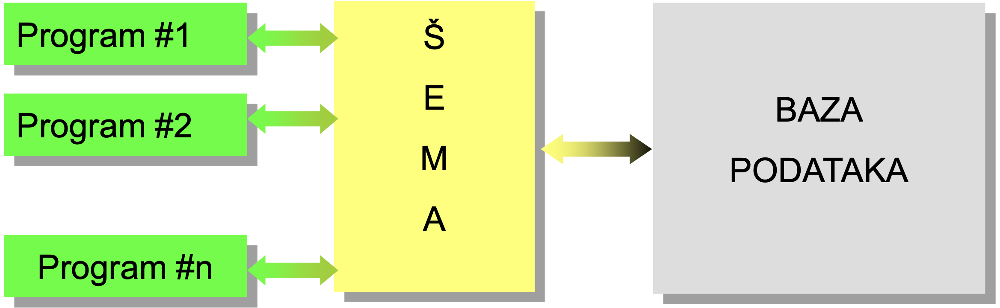
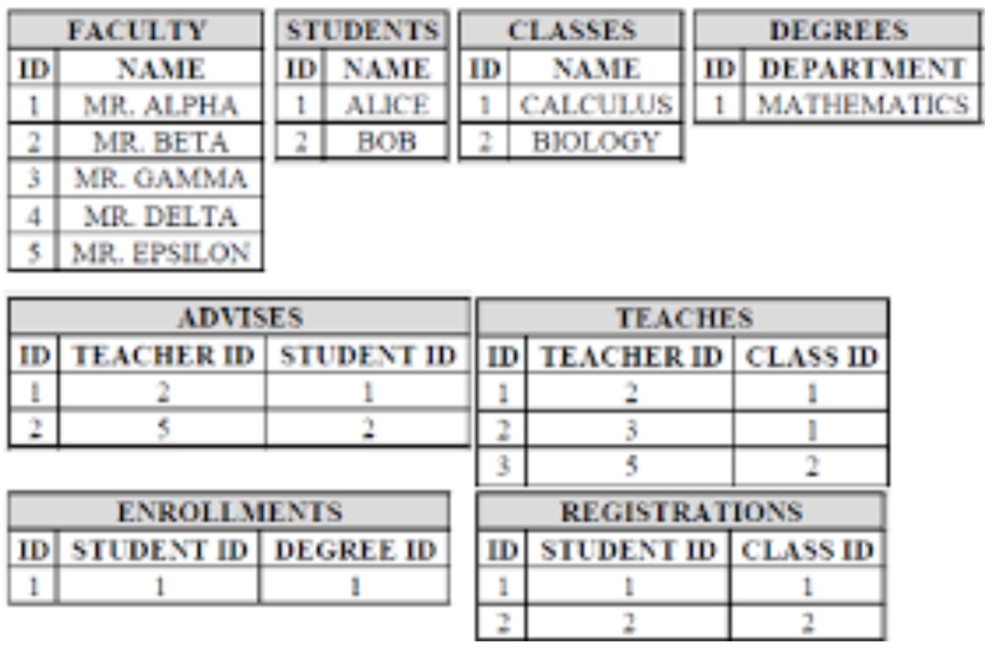
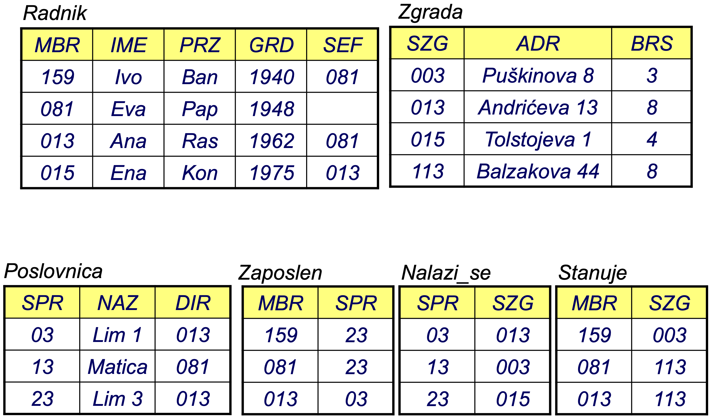

# Основные понятия
## Содержание:
* *Реальная система и информационная система*
* *Введение в базы данных*
* *Объект и соединитель* 
* *Функция, домен и данные*
* *Тип объекта и возникновение типа объекта*
* *Тип ссылки и возникновение типа ссылки*
* *Структуры данных*
* *Логическая структура функций*
* *Логическая структура данных*
* *Физическая структура данных*

## Системы
**Система** – структурированный набор объектов (факторов, элементов). Установившееся состояние и поведение которые находятся во взаимном взаимодействии для достижения заранее определенных целей

#### Реальная система
Система, как часть реального мира:
  * *цель действия*
  * *ресурсы (факторы)*
  * *процессы*
  * *состав*
  * *окружающая среда*

#### Абстрактная система
Система, как часть абстрактного (воображаемого) мира:
  * *задано через математические структуры*

#### Информационная система (ИС)
Модель реальной системы (процессы и ресурсы)

#### Цель построения ИС:
  * *предоставление информации, необходимой для функционирования реальной системы и управления ей*

#### Место ИС в реальной системе:
  * *инфраструктурная составляющая реальной системы*
  * *предназначена для поддержки системы управления реальной системой*

#### Задачи ИС:
  * *покрытие (получение) данных*
  * *хранение данных*
  * *обмен данными*
  * *представление данных*
  * *обработка данных*
  * *автоматизация функций управления в РС*

#### Факторы ИС
  * *компьютерно-коммуникационная и программная инфраструктура*
  * *база данных («склад») данных*
  * *приложения (пакеты программ) для работы с данными*
  * *проектная и пользовательская документация*
  * *конечные пользователи*
  * *бригада по обеспечению эксплуатации и обслуживания*

ИС - это преимущественно программный продукт

## Введение в базы данных
#### База данных
Совокупность всех данных ИС, снабженных структурой
* проектируется и описывается посредством формализма, который называется моделью данных
* используется через программный продукт, называемый системой управления базами данных

#### Классическая организация файлов
#### Самое старое решение
* ИС «на картах», без компьютерной поддержки
  * носитель постоянного запоминания структур данных – бумага

#### Более продвинутое решение
* ИС организована по файловым системам
  * носитель постоянного запоминания структур данных – система диски
* ИС состоит из набора независимых приложений
  * каждое приложение - свои файлы
  * «хранилище данных» — набор файлов
  * данные об одном и том же объекте в разных файлах
  * со временем такая ИС приходит в противоречие сама с собой

#### Основные недостатки
  * отключение приложения
    * необходимость вручную перезаписывать одни и те же или похожие данные
  * избыточность данных
    * необходимость многократного запоминания одних и тех же или схожих данных
  * прочная связь программ и данных
    * программа заботится о файлах FSP, как в описании, так и в процедура
  * конкурентный многопользовательский доступ

#### Последствия:
  * сложное обслуживание ИС
  * препятствовало дальнейшему развитию ИС

#### Пример – отключение и резервирование:

#### Тесная связь между программами и данными:

#### Проблемы, которые можно смягчить или даже решить в классической организации
* отключение приложения
* резервирование
  * Проблема, которую практически невозможно смягчить или решить в классической организации
* прочная связь программ и данных

### Базы данных и СУБД
#### Система управления базой данных (СУБД)
Система управления базами данных (СУБД) – программный продукт, предназначенный для обеспечения возможности построения и использования баз данных

Содержит:
* язык описания данных
  * Язык определения данных – DDL
* язык для манипулирования данными
  * Язык манипулирования данными – DML
* вопросительный язык
  * Язык запросов – QL

Ядро СУБД:
* обеспечение физической организации данных
* процедуры управления данными
* защита от несанкционированного доступа и уничтожения
* обеспечение многопользовательского режима работы
* предоставление распределенной организации БД
* обеспечение назначения схемы базы данных

#### Схема базы данных
Программа, использующая услуги СУБД
* знает только схему БД, как логическую категорию

#### Реляционная база данных

## Сущность и соединитель
Сущность (реальная сущность):
* единица наблюдения
* субъект (ресурс) деятельности в реальной системе

Класс реальных сущностей:
* набор "похожих" сущностей
* группа сущностей, обладающих общим свойством
* формально: E = {e_i | P(e_i)}

Сущности реальной системы находятся во взаимоотношениях (связях) друг с другом.

Связь (соединитель) – представляет отношение между двумя или более реальными сущностьми или
предварительно установленными связями.

Класс соединителей
* набор связей между классами реальных сущностей или предварительно идентифицированными классами связей
* группа связей, обладающих одним и тем же свойством
* формально: S = {(e_1,…, e_m) | P(e_1,…, e_m)}
* e_i (i ∈ {1,..., m})
* одна реальная сущность или предварительно установленная связь

## Признак, домен и данные
#### Признак
* P(e_i), P(e_1,…, e_m):
  * P(e_i) означает предикат (свойство) класса сущностей/связей.
  * Выражает характеристики класса E, то есть класса S.
* Признак:
  * Это свойство класса реальных сущностей или связей.
  * Возникает из семантики предиката P(e_i).
  * Примеры обозначений: A, B, X, W, BRI, Datum_Prispeća, JMBG, Prz, Ime.

* Виды признаков:
  * По возможности декомпозиции на более низкие уровни:
    * Элементарный:
      * Не декомпозируется.
      * Представляет атомарное (элементарное) значение.
      * Пример: Город, Улица, Номер, Квартира.
    * Сложный:
      * Может быть декомпозирован на другие признаки.
      * Представляет собой сложное значение.
      * Пример: АДРЕС = (Город, Улица, Номер, Квартира).
    * Множественный:
      * Представляет собой множество значений того же типа.

#### Домен
* Спецификация множества возможных значений признака:
  * С определенными разрешенными отношениями и операциями над предоставленным множеством.
  * Представляет собой множество возможных значений признака.
* Виды в соответствии с методом создания:
  * Предопределенные (примитивные):
    * "Априори" определенные заранее.
  * Пользовательские (производные):
    * Определенные пользователем с использованием существующих доменов и применением заранее установленных правил.

#### Домен признака
Замечания:
* Каждому признаку присваивается домен.
  * Уточняется множество возможных значений признака.
* Домен признака (Dom(A)), (A : D):
  * Обозначение для связанного домена признака.
* Обозначение для связанного домена признака:
  * dom(A)
* Обозначение для множества возможных значений признака:
  * Dom(A)

Пример:
* Спецификация домена:
  * DOCENA ::= {d ∈ ℕ | d ≥ 5 ∧ d ≤ 10}
* Присвоение домена признаку:
  * Dom(Ocena) = DOCENA
  * (Ocena : DOCENA)
* Множество возможных значений признака:
  * dom(Ocena) = {5, 6, 7, 8, 9, 10}

#### Данные
Данные - упорядоченная четвёрка (Сущность, Признак, Время, Значение):
* Сущность:
  * Идентификатор (метка) сущности.
* Признак:
  * Обозначение (мнемоника) признака.
* Время:
  * Временной параметр.
* Значение:
  * Одно значение из домена (dom(A)).

Контекст данных:
* семантическая (смысловая) компонента данных:
  * представляет собой тройку: (Сущность, Признак, Время)
  * Если явно указано только значение, а признак, сущность или время не являются явно заданными или подразумеваемыми, это не является данными, потому что смысл не определён.

* Время, как компонента данных, может быть опущено, если
  * введена конвенция, согласно которой данные в этом случае относятся к моменту времени, в котором происходит манипуляция этими данными, или
  * выделен определенный признак, значение которого является временным указанием рассматриваемых данных.
* Данные - факт из реальной системы.

## Тип сущности и явление типа сущности
Тип сущности (ТС)
* Модель класса реальных сущностей в информационной системе (ИС)
* Формируется на основе характеристик, необходимых для достижения целей ИС
* Включает в себя:
  * наименование: N
  * набор характеристик: Q = {A_1, ..., An}
* Набор характеристик ТС представляет собой подмножество набора характеристик класса реальных сущностей.

Появление типа сущности
* модель одной реальной сущности в информационной системе (ИС)
* Тип сущности формально представляет собой набор явлений: SP(N) = {p_i | P(p_i)}
* Каждое явление p_i ∈ SP(N) представляет собой ровно одну реальную сущность e_i ∈ E
* Задан тип сущности с наименованием N и набором характеристик Q = {A_1,..., A_n}
* в заданный момент времени p(N, Время), или просто p(N), если временная характеристика не указана, представляет собой набор данных: p(N) = {(A1, a1),..., (An, an)}
* Для каждого A_i ∈ Q справедливо, что a_i ∈ dom(A_i)

Если вводится порядок в набор атрибутов типа сущности (A_1,..., A_n),
* тогда появление p(N) рассматривается как n-кортеж (кортеж): (a_1,..., a_n)
* Порядок значений данных в явлении определяется порядком характеристик в типе сущности.

## Идентификатор типа сущности
Идентификатор типа сущности
* набор атрибутов
* играет роль обеспечения способа уникальной (однозначной) маркировки (идентификации) любого проявления типа сущности

Любое значение идентификатора ТС
* маркирует не более одного проявления типа сущности
* называется идентификатором проявления ТС

Виды идентификаторов типа сущности
* внешний
  * не является подмножеством набора атрибутов данного ТС
* внутренний
  * является подмножеством набора атрибутов данного ТС

Внешний идентификатор ТС
  * не является подмножеством набора атрибутов типа сущности

Пример
* ТС Работник({Мбр, Имя, Фамилия, ЈМБГ})
  * Номер_появления_ТС ∈ {1,..., n}
  * Метка_появления_ТС ∈ {p1,..., pn}
  * Адрес_появления_ТС ∈ {a1,..., an}

Внутренний идентификатор ТС
* подмножество набора атрибутов типа сущности

Пример
* ТС Работник({Мбр, Имя, Фамилия, ЈМБГ})
  * Мбр
  * ЈМБГ
  * {Мбр, Имя, Фамилия, ЈМБГ}

## Ключ типа сущности

Ключ ТС
* минимальный внутренний идентификатор типа сущности
* Формально набор атрибутов типа сущности N
* X ⊆ Q, Q = {A1,..., An}, такой что
  * (1^0)
    * не существует двух проявлений ТС N с одним и тем же значением x (для X)
    * каждое проявление ТС должно иметь заданное значение x
    * свойство однозначной идентификации
  * (2^0)
    * не существует X' ⊂ X, для которого выполняется (1^0)
    * свойство минимальности

Каждый тип сущности имеет как минимум один ключ
* представляет собой упорядоченную структуру:  N(Q, C)
  * N - имя ТС
  * Q = {A1,…, An} - набор атрибутов ТС
  * C - набор ограничений ТС
  * K = {K1,..., Km} ⊆ C - набор ключей ТС (K ≠ ∅)
    * набор всех проявлений ТС SP(N) должен удовлетворять C

Пример
* Работник({Мбр, Имя, Фамилия, ЈМБГ}, {Мбр, ЈМБГ})
  * Мбр и ЈМБГ являются двумя эквивалентными ключами ТС Работник

Первичный ключ
* один, выбранный ключ из набора ключей ТС
* часто обозначается подчеркиванием

Пример
* Работник({Мбр, Имя, Фамилия, ЈМБГ}, {Мбр, ЈМБГ})
* Работник(Мбр, Имя, Фамилия, ЈМБГ)
  * сокращенная, неполная нотация

## Тип связи и экземпляр типа связи
Сущности реальной системы находятся во взаимоотношениях (связях) - связи
* ИС должна содержать модель этих связей

Тип связи (ТС)
* соединяет две или более ТС(TE) или предварительно определенные ТС(TP)
* моделирует отношения между проявлениями связанных ТС(TE) или ТС(TP), то есть между реальными сущностями или связями
* формально, структура N(N1, N2,…, Nm, Q, C)
  * N - название типа связи
  * Ni (i ∈ {1,..., m}) - связанный тип
* тип сущности или предварительно определенный тип связи
  * Q = {B1,…, Bn} - набор атрибутов ТС
  * C - набор ограничений ТС
  * K = {K1,..., Kk} ⊆ C - набор ключей ТС (K ≠ ∅)
* представляет собой набор проявлений связи SP(N) = {(p1,…, pm) | P(p1,…, pm)}
  * pi (i ∈ {1,..., m}) - одно проявление ТС или ТС Ni
  * P(p1,…, pm) - свойство (предикат) ТС N

Проявление типа связи N(N1, N2,…, Nm, {B1,…, Bk }, C)
* представляет собой одну связь в реальной системе
* обозначение:
  * p(N, Время), в заданный момент времени, или просто
  * p(N), если временная характеристика не указана
* представляет собой набор данных: p(N) = (p1,…, pm)(N) = {(B1, b1),..., (Bk, bk)}
  * Для каждого Bi должно быть bi ∈ dom(Bi)
  * набор всех проявлений p(N) должен удовлетворять набору ограничений C

Пример:
* тип связи над ТС Студент и Предмет:
  * Посещает(Студент, Предмет, {Семестр}, C1)
* тип связи над ТС Преподаватель и Предмет:
  * Доверено(Преподаватель, Предмет, {Дата}, C2)
тип связи над ТС Посещает и Доверено:
  * Экзамен(Посещает, Доверено, {Оценка}, C3)

Идентификатор типа связи
* последовательность (N1, N2,…, Nm)
  * или его непустой подпоследовательность
* имеет роль обеспечения способа уникальной (однозначной) маркировки (идентификации) любого проявления типа связи

Любое значение идентификатора ТС - последовательность (p1,…, pm)
* маркирует не более одного проявления типа связи
* называется идентификатором проявления ТС
* последовательность проявлений типов (p1,..., pm) либо связана, либо нет

Ключ ТС
* набор атрибутов X
  * выведен на основе ключей связанных типов (N1, N2,…, Nm)
* очень часто, но не всегда
  * X ⊆ K1 ⋃ ... ⋃ Km, где
  * (∀i ∈ {1,..., m})(Ki - один выбранный ключ связанного типа Ni)
* X = {A1,..., An}, такой что
  * (1^0)
    * не существует двух проявлений ТС N с одним и тем же значением x (для X)
    * свойство однозначной идентификации
  * (2^0)
    * не существует X' ⊂ X, для которого выполняется (10)
    * свойство минимальности

## Альтернативная терминология
В литературе можно встретить альтернативную терминологию:
* тип сущности ⇔ сущность
* проявление типа сущности ⇔ экземпляр сущности
* тип связи ⇔ связь, или отношение
* проявление типа связи ⇔ экземпляр связи
* en-ti-ty () n. pl. <-ties> по Random House Webster's

1. нечто, обладающее реальным существованием; вещь.
2. нечто, существующее как отдельная, независимая или самостоятельная единица.
3. бытие или существование, особенно когда рассматривается как отдельное, независимое или самостоятельное.

## Структуры данных
Структура данных – ориентированный граф G(V, ρ)
* V – множество вершин
  * каждая вершина представляет некоторые данные
  * каждой вершине присвоена определенная семантика
* ρ - множество рёбер
  * ρ ⊆ V x V – бинарное отношение
  * каждое ребро представляет определенные связи между данными
  * каждому ребру присвоена определенная семантика

Виды структур данных
* по уровню абстракции, связанной семантикой
  * логические структуры атрибутов
  * логические структуры данных
  * физические структуры данных
* по возможному количеству прямых предшественников и последователей узлов графа
  * линейные структуры данных
    * циклические
    * ациклические
  * структуры типа дерева
  * сетевые структуры данных

## Логическая структура функций
Логическая структура атрибутов (ЛСА)
* Структура над множеством типов сущностей, типов связей и их атрибутов
* Модель части реальной системы (ресурса) M = (STE, RTE)
* STE
  * множество типов (сущностей и/или связей – два возможных подхода)
* RTE
  * отношение, которое снабжает STE структурой
  * моделирует отношения, существующие между реальными сущностями одинаковых или разных классов
  * каждое ребро в RTE представляет собой одну связь типа с некоторым связанным с ним типом

Возможные подходы к организации ЛСА (STE, RTE)
* (А) – "и ТE и ТP являются узлами"
  * подход, использованный в этом материале
  * ТСС содержит множество всех ТС и ТСС моделируемой части системы
  * ТСС содержит рёбра, представляющие связи ТС с его связанными типами
  * символы для визуального представления узлов могут быть, но не обязательно, разными для ТС и ТСС

Возможные подходы к организации ЛСА (STE, RTE)
* (В) – "ТE являются узлами, а TP являются рёбрами"
  * альтернативный подход – исторически первый
  * STE содержит множество всех ТE моделируемой части системы
  * RTE содержит рёбра, представляющие все TP и связи с их связанными типами
  * подход требует переопределения понятия TP
    * TP не может содержать множество атрибутов Q и множество ограничений C
    * TP не может, как связанный тип, ссылаться на другой TP, а только на ТE
    * изменяется взгляд на использование концепции ТE

Уровень детализации визуального представления ЛСА
* уровень типов сущностей и типов связей
  * глобальное представление
* уровень атрибутов
  * детализированное представление

Пример
* уровень детализации TE и TP
* подход (В) – TE являются узлами, а TP являются рёбрами

Пример
* уровень детализации TE и TP
* подход (А) – и TE и TP являются узлами

Пример
* уровень детализации атрибутов

## Логическая структура данных
Логическая структура данных (ЛСД)
* определяется над множеством данных с использованием специального отношения
* определяется в пределах заданной ЛСА
* ЛСА представляет собой контекст (модель) для ЛСД
СХЕМА логической структуры данных
* ЛСА, на которой определена ЛСД

Проявление ТС
* контекстная ЛСА
  * линейная структура множества атрибутов данного ТС - ТИП ЗАПИСИ
* линейная структура над множеством данных одного сущности, заданного типа - N-КОРТЕЖ, ЗАПИСЬ
* сложные данные, над сложным атрибутом, полученные на основе множества атрибутов ТС Q

Файл
* контекстная ЛСА
  * линейная структура множества атрибутов данного ТС - ТИП ЗАПИСИ
* структура данных над множеством проявлений одного ТС

База данных
* контекстная ЛСА
  * структура над множеством ТС - СХЕМА БАЗЫ ДАННЫХ
* логическая структура над множеством проявлений множества ТС и ТП

#### Представительства ЛСД
Графические и памятные (физические) способы представления логических структур данных
* с использованием графов
* с использованием таблиц

## Физическая структура данных
Физическая структура данных (ФСД)
* логическая структура данных, размещенная на материальном носителе данных - памятный носитель
* включает в себя информацию о самом способе размещения ЛСД на памятном носителе
* требует выбора методов и процедур для:
  * управления свободным и занятым пространством памяти
  * выбора мест для размещения данных
  * кодирования данных
  * форматирования и интерпретации содержания местоположений
  * сохранения связей в структуре данных
  * создания физической структуры данных
  * доступа к данным и их выборки
  * обновления и реорганизации структуры данных
