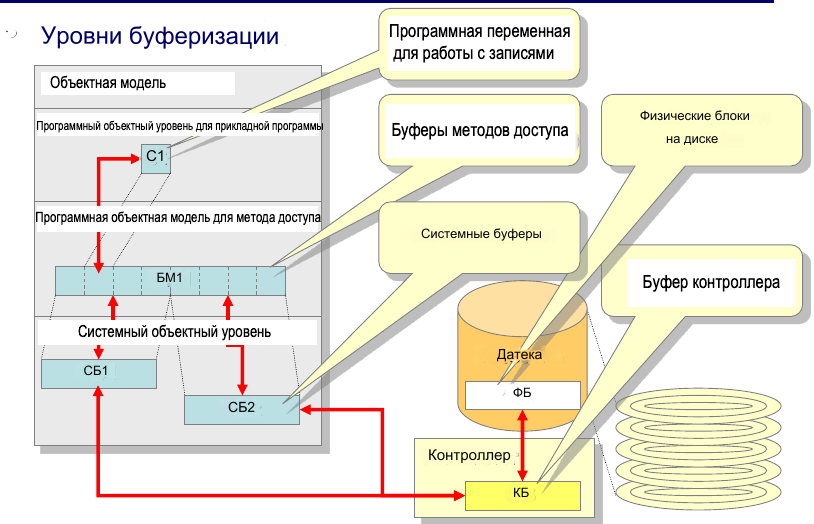
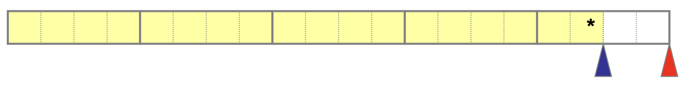
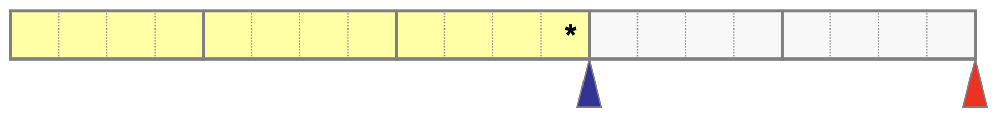
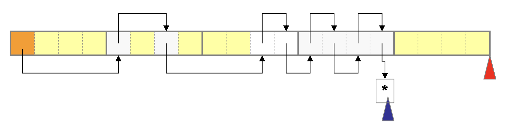
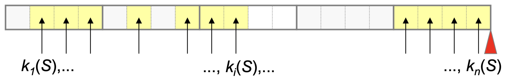
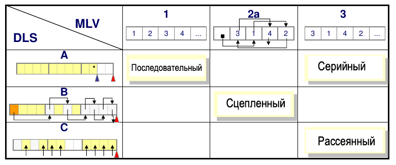
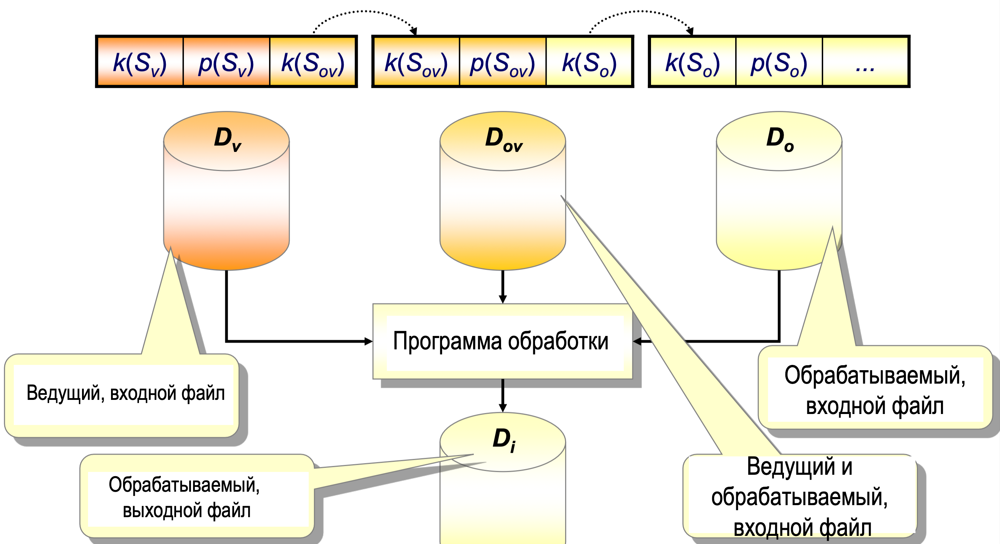
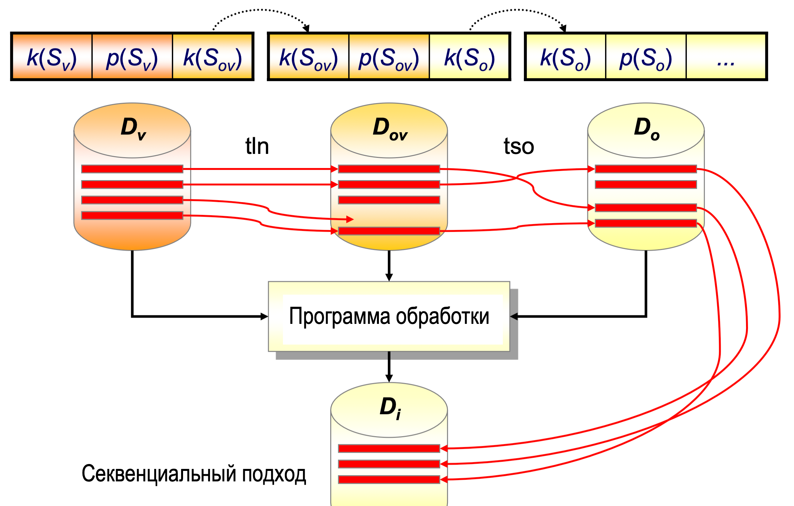

# **Файл как структура записей**

- *Организован по типу записи*
    - Как линейная структура атрибутов.

- *Общая структура файла как FSP (Физическая структура данных)*
    - Включает данные из LSP (Логическая Структура Данных) и данные об организации FSP на внешнем устройстве памяти.
  
    - Информация о структуре типа записи.

    - Информация о связях между записями (Не обязательно).

- *Каждая запись представляет собой последовательность полей со значениями атрибутов.*
  
- *Формат записи*
    - Правила для структурирования и интерпретации содержимого записи.

## **Полная нотация (в памяти снизу вверх)**

| Заголовок                  | Описание                                      |
|----------------------------|-----------------------------------------------|
| $$ k1(S) ... kn(S) $$      | Поле значений атрибута первичного ключа       |
| $$ p1(S) ... pm(S) $$      | Поле статуса записи                           |
| $$ s(S) $$                 | Поле статуса записи                           |
| $$ u1(S)...uk(S) $$        | Поле указателя для сохранения связей          |
| $$ f1(S) ... fl (S) $$     | Контрольное поле для записей переменной длины |

## **Краткая нотация (в памяти снизу вверх)**

| Заголовок                  | Описание                            |
|----------------------------|-------------------------------------|
| $$ k1(S) $$      | Поле значений атрибута первичного ключа       |
| $$ p1(S) $$      | Поле статуса записи                           |
| $$ s(S)  $$      | Поле статуса записи                           |
| $$ u1(S) $$      | Поле указателя для сохранения связей          |
| $$ f1(S) $$      | Контрольное поле для записей переменной длины |

## **Основная структура файла**

- $k(S)$ представляет собой единственную обязательную группу полей:
  - Состоит как минимум из одного поля.

- Часто рассматривается как линейная структура записей:
  - Упорядочена в возрастающем или убывающем порядке значений первичного ключа.

- Порядок полей в формате записи не обязан совпадать с общей структурой записи:
  - Задается на предыдущем слайде.

- Позиция контрольных полей определяется их семантикой.
  
## **Format поля записи**

- Условлен спецификацией домена соответствующего атрибута, то есть примененным типом данных.

## **Виды полей в записях**

- *Поля фиксированной длины:*
  - Не требуется хранение информации о границах полей.

- *Поля переменной длины:*
  - Требуется хранение информации о границах полей.
  - Используется контрольное поле $f_i(S)$.
    - Техники:
      - Указание текущей длины поля в контрольном поле, непосредственно перед содержимым поля.
      - Указание специальной метки конца поля в контрольном поле, непосредственно после содержимого поля.

## **Виды записей по длине**

- *Записи фиксированной длины:*
  - Все поля в каждой записи имеют постоянную длину.
  - Не требуется хранение информации о границах записи.

- *Записи переменной длины:*
  - Есть по крайней мере одно поле переменной длины в записи.
  - Требуется хранение информации о границах записи.
  - Используется контрольное поле $f_i(S)$.
    - Техники:
      - Указание текущей длины записи в контрольном поле, непосредственно перед остальным содержимым всей записи.
      - Указание специальной метки конца записи в контрольном поле, непосредственно после остального содержимого записи.
      - Введение специальной индексной структуры с порядковыми номерами байтов, указывающих на начала записей.

## **Характеристики видов записей по длине**

- *Записи фиксированной длины:*
  - Появляются в практике.
  - Гомогенная структура.
  - Проще доступ и обновление данных.
  - Легче и более точно оценить производительность обработки данных.
  - Меньшая эффективность использования места в памяти.

- *Записи переменной длины:*
  - Исключительно часто появляются в практике.
  - Негомогенная структура.
  - Труднее доступ и обновление данных.
  - Труднее и менее точно оценить производительность обработки данных.
  - Большая эффективность использования места в памяти.

## **О Видах Записей в Зависимости от Повторения Значений**

- *Записи с повторяющимися группами:*
  - Многократное появление значений атрибутов в одной записи.
  - Разрешено представление одного значения атрибута как последовательности значений того же типа.
  - Пример:
    - Тип сущности: `Student({StdID, ..., StdStrJez}, {StdID})`
    - Тип данных: `(StdStrJez : string(55))`
    - Возможное значение, трижды представленное (как три поля):
      - 'английский', 'французский', 'немецкий'
  - Всегда должны быть записи переменной длины.

- *Записи без повторяющихся групп:*
  - Запрещено многократное появление значений атрибутов.
  - Всегда можно спроектировать тип записи без повторяющихся групп, используя соответствующие проектировочные техники.

## **Поля указателей в структуре записи**

- Представляют собой адреса расположения в памяти.

## **Типы адресов расположения**

- *Абсолютный (машинный) адрес:*
  - Структурирован по адресному пространству блока диска.

- *Относительный адрес:*
  - Представляет собой порядковый номер местоположения.
  - Может сопровождаться номером подместоположения.
  - Примеры:
    - Порядковый номер блока, порядковый номер байта, (порядковый номер блока, порядковый номер байта в блоке).
    - Порядковый номер записи (в линейной структуре), (порядковый номер блока, порядковый номер записи в блоке).
  
- *Символический (ассоциативный) адрес:*
  - Значение ключа.

## **Виды адресов расположения**

- *Абсолютный (машинный) адрес:*
  - Практически не используется в организации файлов.
  - Создает зависимость от физических характеристик устройства.
  - Не требует преобразований.

- *Относительный адрес:*
  - Очень часто используется в организации файлов.
  - Обеспечивает независимость от физических характеристик устройства.
  - Требует одно или несколько преобразований до абсолютного адреса.
  - На уровне метода доступа и/или системных вызовов.

- *Символический (ассоциативный) адрес:*
  - Часто используется в организации файлов.
  - Требует преобразования в относительный адрес.
  - На уровне метода доступа.

# Структура файла как массив блоков

## **Блок (логический блок)**

- Как организационная единица данных:
  - Представляет собой последовательность записей.
  - Имеет постоянную вместимость.

- Типичные размеры: 2KB, 4KB, 8KB, 16KB.
  - Чаще всего представляет собой целочисленное кратное физического блока.

## **Отношение блока – физического блока**

- Обычно один блок представляет собой последовательность из $2^n; (n \geq 0)$ физических блоков.
  - Не исключено, что емкость блока будет:
    - Равной емкости физического блока или
    - Меньше емкости физического блока.

## **Общая структура (формат) блока**

- Заголовок блока и последовательность записей

|  | $A^{i}_{1}$ | ...  | $A^{i}_{j}$ | ...  | $A^{i}_{f}$ | 
|-----------|-------------|------|-------------|------|-------------|
| Заголовок блока     |  $s_{1}$    |  ... |  $s_{i}$    |  ... |  $s_{f}$    |

Где:
- $Ai:$ Адрес блока (обычно выражен как относительный).
- $A^{i}_{j}:$ Относительный адрес j-ой записи в i-ом блоке (i, j).
- $f:$ Фактор блокировки – количество записей в блоке.
- **Заголовок блока:** Необязательная категория, включающая данные, связанные с FSP файла, например:
  - Различные поля указателей.
  - Количество записей в блоке.
  - Индексы начал записей.

## **Виды блоков**

- Блоки с записями переменной длины:
  - В один блок может быть помещено несколько записей.
  - Разрешено, чтобы размер одной записи превышал емкость блока.
  - В этом случае происходит цепочка блоков для одной записи.

- Блоки с записями фиксированной длины:
  - Гомогенная структура блока и файла.
  - Каждый блок файла всегда содержит одинаковое количество записей.
  - \(f\) - фактор блокирования файла.
  - \(B\) - общее количество блоков в файле.
  - \(N\) - общее количество записей в LSP файле.
    - \(B = \left\lceil\frac{N + x}{f}\right\rceil\), где \(x\) - количество дополнительно используемых специальных записей.

## **Расчет необходимой емкости файла**

- Возможен при использовании блоков с записями фиксированной длины.
- \(K_s\) - емкость записи, сумма емкостей всех полей (фиксированной длины).
- \(K_b\) - емкость блока (заранее заданная константа).
- \(K_z\) - емкость заголовка блока (зависит от организации).
- \(f = \lfloor\frac{K_b - K_z}{K_s}\rfloor\) - фактор блокирования (округленный вниз).
- \(K_d\) - емкость файла (зависит от организации).
- \(W_d\) - ширина блока данных.

Формула для \(K_d\):
\[ K_d = B \cdot K_b + W_d \]

## **Структура файла в виде последовательности блоков**

- Линейная структура блоков файла:
  - Каждый блок файла содержит последовательность записей файла.

- Строго структурированный файл:
  - Строго типизированный файл с присвоенной семантикой.
  - Организован как структура над множеством записей.

## **Заголовок файла**

- Необходимо расширение основной структуры файла.
- Вводится специальная запись в начале файла.
  - Содержит информацию об организации файла и формате блока и записи файла.
  - Включает в себя данные, такие как:
    - Количество записей и/или блоков в файле.
    - Длина и формат записи.
    - Позиция ключевого поля в записи.
    - Указатели на начало связанных структур записей или блоков.

## **Знак конца файла**

- Способы обозначения конца файла в основной структуре:
  - (A) Введение специальной записи для обозначения конца файла:
    - Записывается в конце структуры, после последней записи в LSP, в первое свободное место в памяти файла.
  - (B) Введение специальной метки конца в поле указателя:
    - Указывается в поле указателя логически следующей записи \(u(S)\) последней записи в LSP.
  - (C) Введение специального учета занятого пространства:
    - Запоминание, например, количества занятых мест в пространстве, выделенном файлу.
    - Во вспомогательной структуре данных.
  - (D) Конец файла - конец пространства, выделенного файлу:
    - Не вводится специальный механизм для обозначения конца файла.

# Метод доступа

## Пакет программ (процедур) для поддержки услуг высокого уровня

- Управление строго структурированными файлами:
  - Управление организацией и хранением полей, записей и блоков.
  - Различные виды услуг в отношении организации записи и блока.
  - Управление буферами методов доступа.
  
- Различные виды услуг в отношении организации записи и блока:
  - Возможно, имеется в виду различные виды организации данных и методов доступа.

- Управление буферами методов доступа:
  - Высший уровень "буферизации" по сравнению с уровнем системных буферов.
  
**Примечание:**
  - Текст не предоставляет конкретных деталей о том, как именно реализованы эти услуги высокого уровня. Возможно, он представляет собой описание пакета программ или процедур, которые предназначены для обеспечения эффективного управления структурированными файлами и буферами на более высоком уровне абстракции.
  
## **Пакет программ (процедур) для поддержки услуг высокого уровня**

- Поддержка различных видов организации файлов:
  - Обеспечение различных методов организации файлов для эффективного управления данными.

- Поддержка различных методов хранения логических связей и адресации (доступа к данным):
  - В строго структурированных файлах.
  
- Забота о категориях:
  - Заголовок файла.
  - Начало и конец файла.
  - Текущий указатель, индикатор актуальности.
    - Выражен в виде относительного адреса блока или записи, на котором выполняется операция (или, как альтернатива, где была выполнена предыдущая операция).

- Поддержка создания специальных вспомогательных структур для повышения эффективности обработки данных.

- Поддержка общих процедур управления содержимым файлов:
  - Создание, поиск, обзор, обновление и реорганизация.
  - Использует или включает услуги низкого уровня выбранной операционной системы.
  - В зависимости от места и способа реализации метода доступа.
  
- Обеспечивает независимость прикладной программы от услуг низкого уровня операционной системы.
  
- Обеспечивает отображение строго структурированного файла в последовательность физических блоков.
  
- Обеспечивает преобразование относительного адреса записи или блока файла в относительный адрес байта или физического блока.

**Примечание:**
  - Текст указывает на то, что этот пакет программ обеспечивает высокоуровневую поддержку для общих процедур управления файлами и при этом использует или интегрирует услуги низкого уровня операционной системы. Это способствует независимости прикладного программного обеспечения от конкретных деталей реализации методов доступа и обеспечивает эффективное управление содержимым файлов.
  - Текст указывает на то, что пакет программ предоставляет поддержку различных методов организации данных и обеспечивает удобные механизмы для работы с категориями, заголовками и указателями в файле.
## **Управление строго структурированными файлами**

- Поддержка организации записей и полей:
  - Записи постоянной длины.
  - Записи переменной длины.

- Поддержка различных типов данных:
  - Алфавитно-цифровые, даты, битово-ориентированные, мультимедийные и другие.

- Поддержка различных кодировок:
  - Обеспечение работы с различными схемами кодирования.

- Конверсии данных:
  - Из переменных программных данных в атрибут типа данных файла и наоборот.
  - Из типа данных атрибута строго структурированного файла в массив байтов и наоборот.

**Примечание:**
  - Текст указывает на то, что этот пакет программ обеспечивает управление строго структурированными файлами, предоставляя поддержку различных организаций записей и полей, различных типов данных, кодировок и конверсий данных. Это обеспечивает гибкость и адаптивность для работы с разнообразными типами данных в файловой системе.

## **Услуги обмена данными с прикладной программой на уровне записи:**
  - Группировка записей в блоки при записи данных.
  - Разбиение блока на записи при чтении данных.
  - Поддержание текущего указателя в виде относительного адреса записи:
    - Порядковый номер записи в файле.
  - Трансформация этого адреса в форму:
    - (Порядковый номер блока в файле, Порядковый номер записи в блоке).
    
- **На уровне блока:**
  - Обмен содержимым целых логических блоков между прикладной программой и файлом.
  - Поддержание текущего указателя в виде относительного адреса блока в форме:
    - Порядковый номер блока в файле.

**Примечание:**
  - Текст указывает на то, что этот пакет программ обеспечивает эффективный обмен данными между прикладной программой и файлом на уровне как записи, так и блока. Также осуществляется поддержание текущих указателей в виде относительных адресов, что упрощает процессы записи и чтения данных.

## **Типы доступа к данным из прикладных программ:**
  - **Последовательный (последовательный) доступ:**
    - К записям или блокам файла.
    - Обычно к записям файла.
    - Автоматическое поддержание (инкремент) значения текущего указателя:
      - При операциях загрузки/записи данных.
      
  - **Прямой доступ:**
    - К записям или блокам файла.
    - Требует явного задания значения текущего указателя:
      - Порядковый номер записи или блока файла.
      - При операциях позиционирования.
      
  - **Динамический (комбинированный) доступ:**
    - Комбинация прямого и последовательного доступа.

**Примечание:**
  - Эти службы обеспечивают доступ к данным из прикладных программ с использованием последовательного, прямого и динамического доступа. Последовательный доступ автоматически поддерживает текущий указатель при операциях чтения/записи, в то время как прямой доступ требует явного задания текущего указателя. Динамический доступ представляет собой комбинацию обоих подходов.

## **Управление строго структурированными файлами**

- **Вызовы процедур метода доступа:**
  - Открытие и закрытие файла.
  - Загрузка и вывод содержимого записи или блока.
  - Позиционирование на запись или блок файла.
  - Проверка статуса файла.
  - Создание, удаление файла и т. д.
  
- **Принимают параметры вызова из вызывающей среды - прикладной программы:**
  - Путь и имя файла (открытие файла).
  - Метка файла (процедуры с открытым файлом).
  - Метка переменной в рабочей области программы.
  
- **Передают в вызывающую среду информацию о статусе выполнения процедуры метода доступа:**
  - Основание для обработки исключений.

**Примечание:**
  - Эти вызовы процедур метода доступа осуществляют управление строго структурированными файлами и принимают параметры от прикладной программы. Они также передают информацию о статусе выполнения для обработки исключений в вызывающей среде.

## **Окружения, включающие методы доступа**

- **Операционная система:**
  - Осуществляет управление методами доступа к файлам в рамках своей функциональности.
  
- **Язык программирования с соответствующими пакетами (библиотеками) функций:**
  - Предоставляет средства для реализации методов доступа в рамках прикладных программ.

- **Система управления базами данных:**
  - Осуществляет контроль за методами доступа к данным в базах данных.
  
- **Некоторые службы метода доступа могут быть реализованы напрямую в прикладной программе.**

**Примечание:**
  - Различные среды, такие как операционные системы, языки программирования и системы управления базами данных, предоставляют собой разнообразные методы доступа к файлам. В некоторых случаях, службы метода доступа могут быть реализованы и внутри прикладных программ.

## **Окружения, включающие методы доступа:**

- **Операционная система:**
  - **Старые операционные системы "mainframe" компьютеров:**
    - Не было явного разделения на службы ОС низкого и высокого уровня.
    - Службы метода доступа, такие как файловые системы, были видны как "монолитная" структура.
    - Первые подпрограммы (SUBP) возникали на основе явного использования таких служб метода доступа.
    - Поддерживали управление блоками и буферами метода доступа.
    - Блок = Control Interval (CI).
    - Позволяли явное объявление формата блока (и, следовательно, емкости буфера) на уровне отдельного файла.
  - **Часто комбинировали вызовы служб метода доступа с языками программирования, такими как Cobol или PL/I (IBM).**

**Примечание:**
  - В старых операционных системах "mainframe" компьютеров часто не было явного разделения на службы ОС низкого и высокого уровня. Службы метода доступа были видны как единая структура, и подпрограммы разрабатывались на основе их использования.

- **Программный язык с присоединенными пакетами (библиотеками) функций:**
  - Практически каждый современный язык программирования (например, C, Java) предоставляет определенные службы метода доступа, которые могут быть:
    - Встроены в сам язык или
    - Включены в определенные пакеты (библиотеки) функций, "упакованные" и поставляемые вместе с компилятором и средой разработки (например, для C - stdio.h) или
    - Поставляются независимо от самого языка/компилятора.
  - Явно используют службы низкого уровня выбранной операционной системы.
  - Обычно предоставляют только услуги на уровне записи файла.
    - Управление блоками и буферами скрыто от прикладной программы.
    - Буферы библиотечных функций имеют постоянную емкость (в C определено в stdio.h) и недоступны прикладной программе.

- **Система управления базами данных:**
  - Каждая СУБД обязательно предоставляет службы метода доступа.
  - Обычно не используются напрямую из прикладных программ, а предоставляются другим модулям внутри СУБД.
  - Эксплицитно используют службы низкого уровня выбранной операционной системы.
  - В некоторых ситуациях возможно обходить службы низкого уровня ОС, когда СУБД напрямую управляет физическим обменом данными между файлом на диске (raw device) и ОЗУ.
  - Поддерживают управление блоками и буферами метода доступа.
    - Блок базы данных (Database Block).
    - Позволяют явно объявлять емкость блока/буфера на уровне установки СУБД.
      - Единообразно для всех файлов, которыми управляет СУБД.

## **Управление буферами метода доступа:**

- **Окружение, в котором реализован метод доступа, обеспечивает управление задачами буферизации:**
  - Выделение и освобождение буферов.
  - Ведение учета содержимого буферов.
- Три уровня "буферизации" данных файла в ОЗУ:
  - **Уровень системских буферов:**
    - Управляется операционной системой.
  - **Уровень буферов метода доступа:**
    - Управляется окружением, в котором реализован метод доступа.
  - **Уровень переменных местоположений в прикладной программе:**
    - Управляется прикладной программой.

## **Организация данных**

- Проектирование логической структуры атрибутов (ЛСА).
- Проектирование и реализация СПС (строго структурированных файлов) в контексте:
  - Заданных ЛСА.
  - Системной архитектуры.
- С целью обеспечения:
  - Удовлетворения потребностей пользователей.
  - Условий для эффективной обработки данных.

## **Результат организации данных**

- Система базы данных или
- Система файлов.

## **Проект и реализация FSP**

- Выбор метода назначения местоположений для записей.
- Выбор метода хранения логических связей между записями в LSP (строгой структуре файлов).
- Проектирование основных структур данных.
- Проектирование вспомогательных структур данных.
- Расчет и выделение необходимого пространства на внешних устройствах хранения.
- Размещение записей с связями на внешних устройствах хранения.
- Расчет, отслеживание и анализ производительности процедур обработки данных.

# Параметры организации файла

##  **Организация файла**

- Проектирование LSO (логической структуры файла) сводится к проектированию типа сущности N(Q, C), то есть типа записи.
- Выбор типа организации файла (основных и вспомогательных структур) зависит от значений параметров.
  - Метод назначения местоположений записям, который также определяет метод регистрации свободного и занятого пространства в файле.
- Метод хранения логических связей между записями в LSP (строгой структуре файлов).

##  **Способ присвоения расположений записям (DLS)**

**Возможные значения параметра DLS**:
  - (A) Каждая новая запись добавляется в конец файла, как физически смежная с последней записью в файле.
    - Если пространство файла аллоцируется динамически (увеличивается при записи):
      - Только последний блок может быть частично заполнен.
      - Все остальные блоки полностью заполнены.

        

    - Если пространство файла аллоцируется статически (заранее):
      - Последняя добавленная запись в файл разделяет пространство файла на полностью занятую и полностью свободную части.
      

  - (B) Каждая новая запись получает первое свободное место из связанной линейной структуры свободных мест.
    - Пространство файла всегда статически аллоцируется (заранее):
      - Не вызывается при каждой новой записи f-го типа в файл.
    - Индекс списка свободных мест хранится в заголовке файла.
      

  - (C) Каждая новая запись получает свободное место, чей относительный адрес представляет собой функцию значения ключа.
    - Пространство файла всегда статически аллоцируется:
      - Независимо от внесения новых записей в файл.
    - Возможен только для записей постоянной длины.
    - Функция трансформации значения ключа:
      - Хеш-трансформация (аналитическая) или
      - Задана в виде таблицы с использованием вспомогательной структуры.
      

##  **Способ сохранения логических связей (MLV)**

- между записями в LSP
- возможные значения параметра MLV
  - (1) Физическим позиционированием
    - Логически соседние записи размещаются в физически соседних местах.
  - (2) С использованием указателей в качестве относительных адресов
    - Указатель сохраняет относительный адрес логически соседней записи
    - (2a) Поля указателей встроены в основную структуру
      - Каждая запись основной структуры файла расширяется по меньшей мере одним полем указателя
    - (2b) Поля указателей встроены во вспомогательные структуры
      - Вводится по меньшей мере одна вспомогательная структура, так называемая индексная структура
      - Часто в форме дерева
      - С форматом записи в виде пары или n-торки
        - (поля идентификатора записи, поля указателей)
  - (3) Логические связи не сохраняются
    - В FSP отсутствуют данные о логически соседних записях
    - Данные о логически соседних записях могут быть сгенерированы только
      - через специальные программы по запросу пользователя
      - программы для редактирования (сортировки) файлов

# Типы организации файлов

- **Основные организации:**
  - Организация файла сводится к основной организации
  - FSP, организованный вокруг набора записей, находится в одной
    области памяти
    - Часто это также один файл операционной системы
- **Сложные организации:**
  - Достигаются путем комбинирования основных организаций
  - FSP включают как минимум две области памяти
    - Которые могут быть одним или более файлами операционной системы
  - Основная FSP может быть размещена в одной или более чем в одной
    области
  - Могут появиться вспомогательные структуры данных, размещенные в
    отдельных областях

## **Основные типы организации файлов:**
  - *Серийная (стопка, куча):*
    - Данные хранятся в стопке или куче без определенного порядка.
  - *Последовательная (sequential):*
    - Записи хранятся последовательно, и к ним можно обращаться по порядку.
  - *Сцепленная (chain):*
    - Записи хранятся с использованием связей, позволяя легко перемещаться между ними.
  - *Рассеянная (hash) с уникальным пространством памяти:*
    - Директная
    - Относительная
    - Статическое рассеивание
    - Динамическое рассеивание

- **Сложные типы организации файлов:**
  - *Рассеивание (hash) с областью переполнения:*
  - *Статические индексы (индекс-последовательность):*
  - *Динамические индексы (организация с B-деревом):*

  

## **Сложные организации файлов:**

- **Рассеянные (хэш) с зоной переполнения:**
  - **Основная зона:**
    - Основная рассеянная организация данных.
  - **Зона переполнения:**
    - Продолжение основной структуры.
    - Организация в виде связанных или последовательных записей.

- **Статические индексные (индекс-последовательные):**
  - **Основная зона:**
    - Секвенциальная организация данных.
  - **Зона переполнения:**
    - Продолжение основной структуры.
    - Организация в виде связанных записей.

- **Спрегнутые организации:**
  - **Зона индекса:**
    - Дополнительная структура для улучшения эффективности поиска.
    - Спрегнутая организация, часто в виде n-арного дерева поиска.

- **Динамические индексные (организации с B-деревом):**
  - **Основная зона:**
    - Серийная или связанная организация данных.
  - **Зона индекса:**
    - Дополнительная структура для улучшения эффективности поиска.
    - Спрегнутая организация, часто в виде одной из вариантов B-дерева.

- Упомянутые типы организации встречаются на практике как:
  – **Физические организации файлов**
    - В системах файлов каждый файл в файловой системе появляется как один или несколько отдельных файлов ОС.  
  - **Физические организации таблиц**
    - В системах баз данных каждая таблица БД может быть распределена в несколько файлов данных, управляемых СУБД.
    - В одном файле данных, управляемом СУБД, может содержаться несколько таблиц БД.

# Общие процедуры работы с файлами

- **Типы процедур (операций) над файлом LSP**
  1. Создание файла
  2. Доступ к файлу
  3. Поиск в файле
  4. Поиск по файлу
  5. Обработка файлов
  6. Обновление файла
  7. Реорганизация файла

• **Создание файла**
  - Процедура создания файла FSP
    - с размещением записей на внешнем устройстве памяти
    - в соответствии с разработанной организацией
    - на основе содержимого другой структуры данных
      - включает в себя получение данных из других файлов или
      - прямое предоставление данных пользователем
    - два вида файлов
      - файлы, формируемые в специальной процедуре
        - чаще всего: последовательные, связанные, статически распределенные, статические индексные
      - файлы, формируемые в обычной процедуре обновления (ввода новых записей)
        - чаще всего: последовательные, индексные с B-деревьями, динамические распределенные

• **Доступ к файлу**
  - Процедура позиционирования на нужную локацию
    - записи или блока файла
  - Виды доступа
    - последовательный доступ
      - автоматическое поддержание относительного адреса текущего указателя
      - операция относится к непосредственно смежной локации по отношению
      - к локации, на которой была выполнена предыдущая операция
    - прямой доступ
      - явное задание относительного адреса текущего указателя, указывающего
      - на локацию, над которой будет выполнена какая-то операция
    - динамический
      - комбинация последовательного и прямого доступа
  - ПРИМЕЧАНИЕ: Последовательный и прямой доступ, а также последовательная и
    - прямая организация файла - не идентичные понятия.

• **Поиск в файле**
  - Алгоритм AT: dom(K) \(\rightarrow\) Ind (\(\times\)) A (\(\times\)) S
    - для заданного значения аргумента поиска
      - значение ключа из области, \(a \in dom(K)\)
    - способен генерировать и возвращать, при необходимости, в программу
      - индикацию успешности поиска \(Ind = \{true, false\}\)
        - если запись найдена, поиск успешен (\(true\))
        - если запись не найдена, поиск неудачен (\(false\))
      - относительный адрес места остановки поиска
        - из множества всех адресов в адресном пространстве файла \(A\)
        - которое, при необходимости, включает адрес первой следующей локации
          - после конца файла
      - содержимое записи на месте остановки поиска
        - или специальное значение, если это отсутствующая запись
    - Не всегда все перечисленные выходные параметры необходимы конечной программе.
    - Специфичные алгоритмы поиска на выходе будут генерировать только значения тех параметров, которые действительно необходимы конечной программе.
    - Возможные цели применения алгоритма поиска:
      - Для определения наличия искомой записи в файле или отсутствия ее, например, для проверки выполнения условий вставки новой или удаления существующей записи с заданным значением ключа.
      - Для определения адреса, на котором находится искомая запись, так как необходимо прямое позиционирование на заданный адрес.
      - Для передачи содержимого искомой записи в конечную программу, например, для дальнейшей обработки данных.

  **Начало поиска**
  - Генерация начального относительного адреса поиска.
  - Существует необходимость в продолжении поиска \(\leftarrow\) Да.
  - **Цикл поиска** Пока существует необходимость в продолжении поиска:
    - Чтение содержимого записи с текущего адреса.
    - Если аргумент поиска = значению ключа текущей записи, то поиск успешен, существует необходимость в продолжении поиска \(\leftarrow\) Нет.
    - Иначе:
      - Если существуют условия для продолжения поиска, то генерация следующего относительного адреса поиска.
      - Иначе, поиск неуспешен, существует необходимость в продолжении поиска \(\leftarrow\) Нет.
    - Конец Если
  - Конец Цикла Поиска
  - Конец Поиска

• **Поиск в файле**
  - Методы поиска в зависимости от типа процедуры:
    - Линейный поиск: возможен в последовательных, серийных и разбросанных организациях.
    - Бинарный поиск: возможен исключительно в последовательных организациях.
    - Поиск с использованием указателей: возможен исключительно в спряженных организациях, в основных структурах и с использованием вспомогательных структур.
    - Поиск методом преобразования аргумента в адрес: \(h: \text{dom}(K) \rightarrow A\), возможен в разбросанных организациях.
  - Виды поиска с учетом истории поиска
    • Поиск случайной записи (ТСО)
      - Выбор начального адреса поиска является внутренним вопросом алгоритма.
      - Не зависит от места остановки предыдущего поиска или того, существовал ли предыдущий поиск.
      - Возможен во всех типах файловой организации.
    • Поиск логически следующей записи (ТЛН)
      - Начальный адрес поиска представляет собой адрес, на котором был остановлен предыдущий поиск.
      - Возможен, если предыдущий поиск существовал хотя бы один раз.
      - Каждый следующий адрес поиска может быть только адресом логически следующей записи.
      - Возможен в организациях, где ведется учет логически следующей записи.
    - для заданного значения аргумента поиска
      - заданное логическое условие
    - способен генерировать и возвращать, при необходимости, в программу
      - множество записей, удовлетворяющих заданному логическому условию
        - \(P(S) -\) частичное множество множества записей \(S\) или
      - множество адресов записей, удовлетворяющих заданному логическому условию
        - \(P(A) -\) частичное множество множества адресов из адресного пространства
    - поиск успешен, если множество записей, удовлетворяющих заданному условию, не является пустым
    - логическое условие требует определения синтаксиса записи
    - представляет собой логическое выражение, возможное использование
      - логических выражений и операндов
      - относительных выражений и операндов
      - типовых выражений и операндов
        - арифметических, алфавитных, датских
      - в качестве операндов могут использоваться атрибуты типа записи, константы
        и функции, примененные к выражениям
    - некоторые специальные типы логических условий
      - условия конъюнктивного типа:
        \(A1 = a1 (\land) \ldots (\land) An = an\)
      - условия дизъюнктивного типа:
        \(A1 = a1 (\lor) \ldots (\lor) An = an\)
      - вторичный ключ
        - последовательность признаков структуры, по которой выполняется поиск

## **Обновление файла**
  - процесс приведения файла LSP в соответствие с измененным состоянием класса сущностей в реальной системе
  - основные операции
    - вставка новой записи в файл
      - требует предварительного неудачного поиска
      - может потребовать перемещения определенного количества других записей
    - модификация значений не первичных атрибутов записи
      - требует предварительного успешного поиска
      - обычно запрещена модификация значений признаков первичного ключа
        - по которому установлена основная организация
    - удаление существующей записи из файла
      - требует предварительного успешного поиска
      - может потребовать перемещения определенного количества других записей
  - виды удаления
    • логическое удаление записи из файла
      - сводится к изменению значения поля статуса записи
      - из статуса актуальной в статус неактуальной записи
      - неактуальная запись по-прежнему занимает место в памяти
      - места неактуальных записей освобождаются реорганизацией
    • физическое удаление записи из файла
      - приводит к изменению содержимого блока, в котором находилась удаленная запись
      - может вызвать перемещение других записей из одного места в другое
      - приводит к освобождению одного места записи в памяти
        - это не обязательно место удаленной записи

## **Обработка файлов**
  - алгоритмически выраженная последовательность операций над LSP одного или
    - нескольких файлов
  - с целью целесообразного преобразования данных файлов
  - возможные операции
    - доступ к записям
      - единственный обязательный вид операций при обработке файлов
    - поиск и просмотр
    - обновление (вставка, удаление и модификация)
    - генерация (вычисление) новых данных
  - алгоритмически выраженная последовательность операций над LSP одного или
    - нескольких файлов
  - с целью целесообразного преобразования данных файлов
  - возможные операции
    - доступ к записям
      - единственный обязательный вид операций при обработке файлов
    - поиск и просмотр
    - обновление (вставка, удаление и модификация)
    - генерация (вычисление) новых данных
  - **Роли файлов в обработке**
    - разделение по роли в поиске записей
  - **Ведущий файл**
    - файл, который исключительно генерирует аргументы поиска или
      - просмотра записей в процессе обработки
    - по меньшей мере, один входной файл при обработке должен быть ведущим
  - **Обрабатываемый файл**
    - файл, в котором исключительно выполняются поисковые или
      - просмотровые операции на основе сгенерированных аргументов
  - **Ведущий и обрабатываемый файл**
    - файл с обеими ролями
      - ведущего для другого, обрабатываемого и
      - обрабатываемого по отношению к другому ведущему
  - **Виды обработки в зависимости от способов поиска записей в**
    - **обрабатываемом файле**
    - **Прямая обработка**
      - в каждом последующем этапе обработки требуется поиск
        - случайно выбранной записи (tso)
    - **Последовательная обработка**
      - на каждом последующем этапе обработки требуется
        - поиск логически следующей записи (tln) и/или
        - последовательный доступ к физически соседней локации
        

## **Реорганизация файла**
  - повторное формирование файла
  - с целью приведения FSP в соответствие с новым состоянием LSP
  - мотивация
    - операции обновления вносят изменения в LSP, которые FSP иногда не
      - отслеживает должным образом
    - это приводит к ухудшению производительности работы с файлом
  - примеры
    - накопление неактуальных, логически удаленных записей, занимающих
      - места в FSP
    - накопление цепочек записей
    - дисбаланс данных относительно существующей индексной структуры
    - чрезмерная фрагментация свободного пространства
  - организации, требующие периодической реорганизации
    • последовательная
    • связанная
    • статическое рассеивание
    • статическое индексное
  - организации, не требующие периодической реорганизации
    • последовательная
      - реорганизация не обязательна
    • индексная с B-деревом
      - реорганизация проводится динамически и локализована
    • динамическое рассеивание
      - реорганизация проводится динамически и локализована

## **Производительность обработки файла**
  - **Показатели пригодности файла с установленной организацией для участия в обработке**
    - как ведущий или обрабатываемый
    - в последовательной или прямой обработке
  - **Идеальная организация файла**
    - требует ровно столько мест, сколько содержит записей
      - коэффициент заполненности 100%
    - требует не более одного доступа для tso и tln
    - требует не более одного доступа для поиска
      - по любому заданному условию
    - требует один доступ для любой операции обновления
    - никогда не требует реорганизации

• Выбор типа организации файла
  - представляет собой компромиссное решение
  - невозможно, чтобы один тип организации удовлетворял все перечисленные требования
  - предпочтение одних часто в ущерб другим требованиям
  - учитываются потребности и влиятельность прикладных программ
  - отдают предпочтение желаемым показателям производительности по сравнению с использованием памяти
  - стоимость хранения на единицу емкости становится все более низкой

• Общее время поиска или сканирования записей
  - зависит от
    • количества и времени доступа к блокам на единице диска
      - количество в большинстве случаев определяется типом организации файла
      - при поиске и в зависимости от природы логического условия
    • числа (для больших файлов), зависящего от характеристик файловой системы ОС
    • времени, в основном определяемого характеристиками диска ( 10 мс)
  - времени передачи блока с диска в ОЗУ
    - преимущественно зависит от характеристик диска и системы ввода-вывода (< 1 мс)
  - числа и времени сравнения аргумента с значением ключа
    - количество в большинстве случаев определяется типом организации файла
    - время, преимущественно определяемое характеристиками ОЗУ и процессора (~ 10 нс)

• Меры оценки производительности
  - (A)
    • количество обращений к блокам
    • количество сравнений аргумента и значения ключа
  - (B)
    • среднее количество
    • количество в худшем случае (абсолютное количество)
  - (C)
    • поиск логически следующей записи
    • случайный поиск записи
    • операции обновления (вставка, удаление, модификация)
  - (D)
    • успешная операция
    • неудачная операция

<table class="iksweb">
	<tbody>
		<tr>
			<td colspan="2" rowspan="2"></td>
			<td colspan="2">количество обращений</td>
			<td colspan="2">количество сравнений</td>
		</tr>
		<tr>
			<td>максимальное</td>
			<td>среднее</td>
			<td>максимальное</td>
			<td>среднее</td>
		</tr>
		<tr>
			<td rowspan="2">поиск логически следующей записи</td>
			<td>успешное</td>
			<td>✓</td>
			<td>✓</td>
			<td>✓</td>
			<td>✓</td>
		</tr>
		<tr>
			<td>не успешное</td>
			<td>✓</td>
			<td>✓</td>
			<td>✓</td>
			<td>✓</td>
		</tr>
		<tr>
			<td rowspan="2">поиск случайно выбранной записи</td>
			<td>успешное</td>
			<td>✓</td>
			<td>✓</td>
			<td>✓</td>
			<td>✓</td>
		</tr>
		<tr>
			<td>не успешное</td>
			<td>✓</td>
			<td>✓</td>
			<td>✓</td>
			<td>✓</td>
		</tr>
		<tr>
			<td rowspan="2">запись</td>
			<td>успешное</td>
			<td>✓</td>
			<td>✓</td>
			<td>✓</td>
			<td>✓</td>
		</tr>
		<tr>
			<td>не успешное</td>
			<td>✓</td>
			<td>✓</td>
			<td>✓</td>
			<td>✓</td>
		</tr>
		<tr>
			<td rowspan="2">удаление</td>
			<td>успешное</td>
			<td>✓</td>
			<td>✓</td>
			<td>✓</td>
			<td>✓</td>
		</tr>
		<tr>
			<td>не успешное</td>
			<td>✓</td>
			<td>✓</td>
			<td>✓</td>
			<td>✓</td>
		</tr>
		<tr>
			<td rowspan="2">модификация</td>
			<td>успешное</td>
			<td>✓</td>
			<td>✓</td>
			<td>✓</td>
			<td>✓</td>
		</tr>
		<tr>
			<td>не успешное</td>
			<td>✓</td>
			<td>✓</td>
			<td>✓</td>
			<td>✓</td>
		</tr>
	</tbody>
</table>

