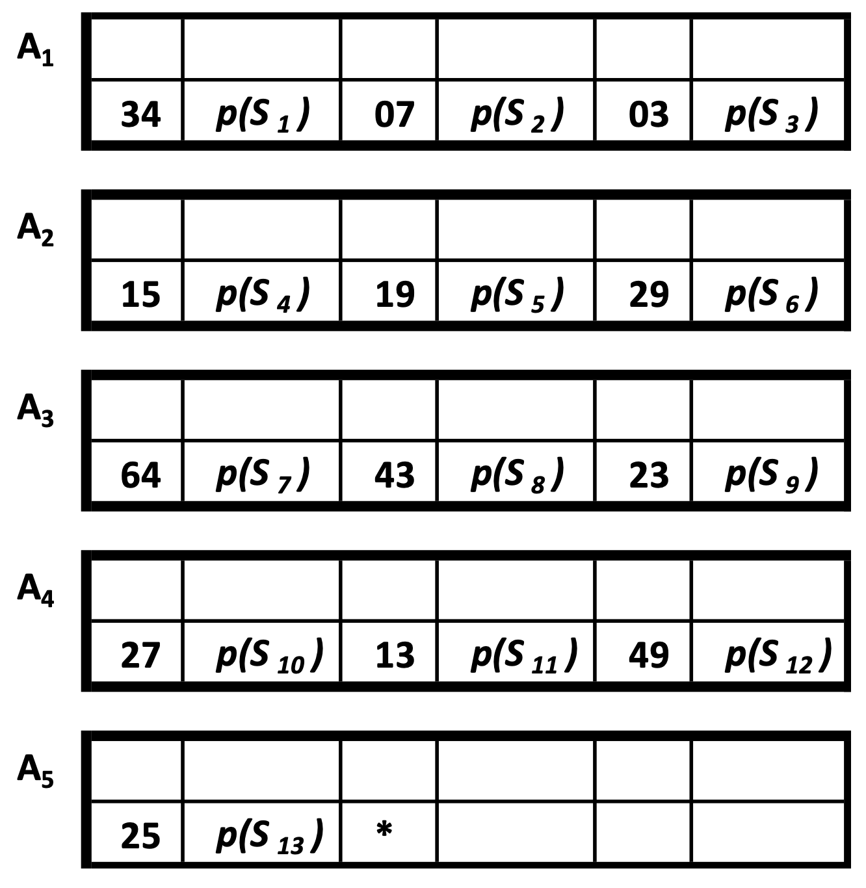
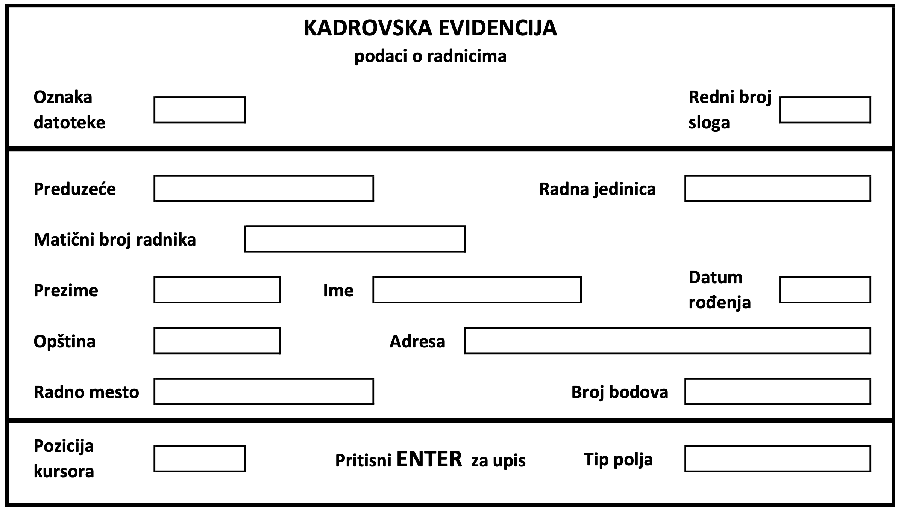
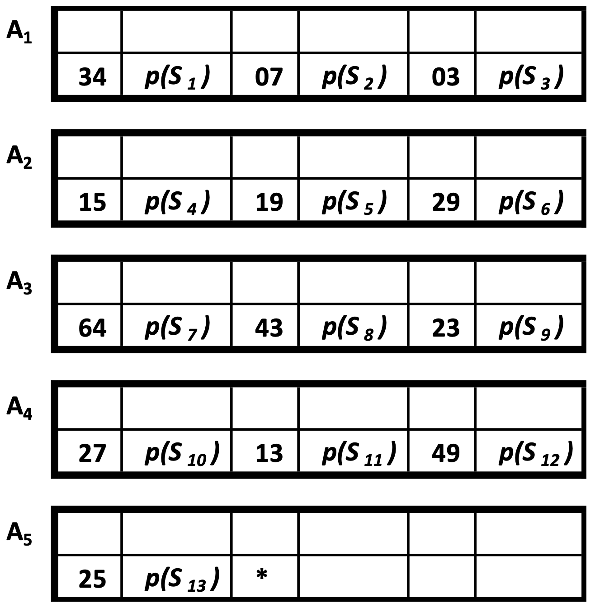
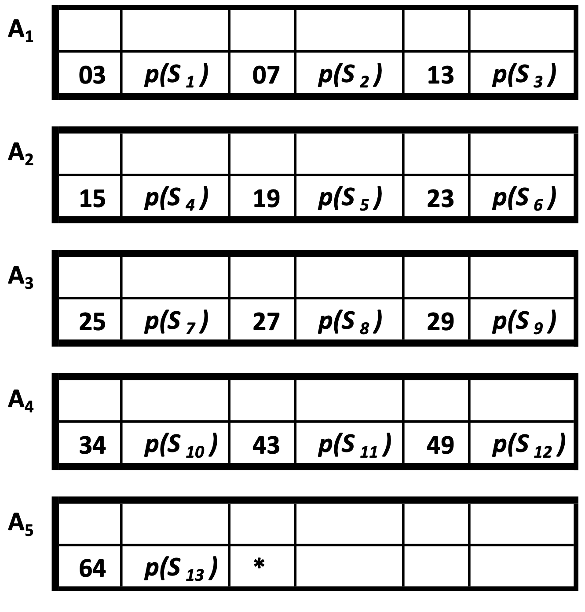
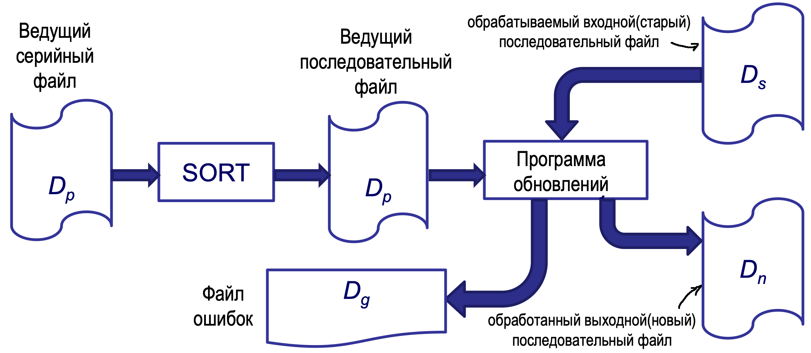
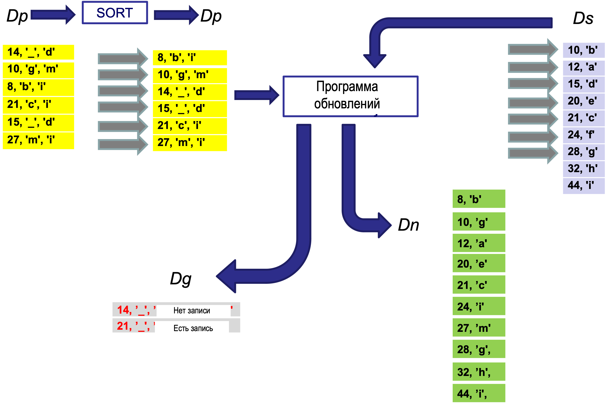

# Серийная и последовательная организация файла
### *Структура, формирование, поиск, обработка, обновление, применение и оценка*

## Содержание
- [Серийная организация файла](#серийная-организация-файла)
  - [Основная структура серийного файла](#основная-структура-серийного-файла)
  - [Формирование серийного файла](#формирование-серийного-файла)
  - [Подробнее об охвате данных](#подробнее-об-охвате-данных)
  - [Обработка серийного файла](#обработка-серийного-файла)
  - [Обновление серийного файла](#обновление-серийного-файла)
  - [Области применения и оценка характеристик серийной организации файлов](#области-применения-и-оценка-характеристик-серийной-организации-файлов)
- [Последовательная организация файла](#последовательная-организация-файла)
  - [Основная структура последовательного файла](#основная-структура-последовательного-файла)
  - [Формирование последовательного файла](#формирование-последовательного-файла)
  - [Поиск записи в последовательном файле](#поиск-записи-в-последовательном-файле)
  - [Обработка последовательного файла](#обработка-последовательного-файла)
  - [Обновление последовательного файла](#обновление-последовательного-файла)
  - [Применение и оценка характеристик последовательной организации файлов](#применение-и-оценка-характеристик-последовательной-организации-файлов)

## Серийная организация файла
### Основная структура серийного файла
- Записи размещаются одна за другой
  - В последовательные места в памяти
- Физическая структура не содержит информации о связях между записями логической структуры файла
- Нет связи между значением ключа записи и адресом места, в которое она помещена
- Порядок меморизации записей обычно соответствует хронологическому порядку их создания
- Записи могут быть блокированы, но это не обязательно

**Пример** - маленький серийный файл - $D_s$
* Количество записей (N): 13
* Фактор блокирования (f): 3
* Записи:
  * Пары $k(S_i), p(S_i)$
  * $k(S_i)$ - Значение ключа
  * $p(S_i)$ - Конкретизация остальных характеристик записи $S_i, i = 1,...,13$
* Физические блоки
* Адреса (относительные) $A_i = i$ : A1, A2, A3, A4 и A5
* Окончание файла
  * Отметка конца файла: $*$

      

### Формирование серийного файла
* *Серийный файл генерируется*
  * Обычно в процессе сбора данных
* *Записи*
  * Формируются передачей данных из различных источников
    * Исходные документы
    * Устройства и программы для считывания значений (в реальном времени)
  * Записи поочередно записываются в последовательные места в памяти
  * Каждая новая запись добавляется в конец файла
* *Результат сбора данных*
  * Серийный файл может быть
    * Неблокированный или
    * Блокированный
* *Охват данных*
  - Процесс с задачей обеспечения первоначального сохранения корректных данных
* Основная активность: *запись данных на носитель*, выполняемая:
    - Человеком-оператором, с использованием
      - Программы с соответствующим пользовательским интерфейсом для форматирования данных и
      - Соответствующих устройств ввода/вывода, или
    - Специализированным ПО с соответствующим аппаратным обеспечением

### Подробнее об охвате данных
**Охват данных – время выполнения**
  * В реальном времени
    * На месте и в момент возникновения данных
  * В отложенном режиме (позже)
    * После определенного интервала времени от возникновения данных
    * Как правило, выполняется оператором, который не регистрировал исходные данные, на основе созданных вручную документов
 
**Верификация**
* Процедура существенной проверки правильности введенных данных (вручную или автоматизированно)
  * Например, другой оператор повторно вводит уже введенные данные, используя тот же исходный документ
  * Например, использование интеллектуальных программных решений

**Пользовательский интерфейс программы для охвата данных – программа форматирования**
* *Описание формата документа* – расположение полей (layout), экранная форма

* *Правила навигации* – перемещение курсора между полями
  * Возможность доступа к полям через мышь или клавиатуру
  * Порядок перемещения между полями в навигации
    * С использованием клавиши TAB, ENTER или автоматически
* *Описания и форматирование содержимого полей*
  * Фиксированный текст (заголовок) и текстовые подсказки с описанием поля
  * Тип поля (алфавитный, числовой, алфанумерический, даты)
  * Способ визуализации содержимого
    * Текстовое поле, раскрывающийся список, комбо-бокс, радио-группа
    * Скрытое поле содержимого
    * Форматирование маски для числовых или датских значений
    * Установка визуальных атрибутов поля на форме
  * Максимальное количество символов, которое можно ввести
  * Способ выравнивания содержимого поля (слева, справа, по центру)
  * Способ переноса содержимого текстовых полей (без переноса, перенос на один символ, перенос на целое слово)
* *Специальные элементы управления содержимым полей*
  * Обязательность ввода хотя бы одного символа в поле
  * Обязательность полного заполнения содержимого поля
  * Контроль на допустимый диапазон (домен) значений
  * Контроль по модулю – только для числовых полей
    * Числу из n цифр присваивается одна контрольная цифра, вычисляемая с использованием специального алгоритма для числа из n цифр
  * Проверка, находится ли введенные данные в таблице/списке допустимых значений
* *Допустимые операции с содержимым полей*
  * Ручной ввод содержимого поля
  * Модификация существующего содержимого поля
  * Удаление содержимого одного, выбранных или всех полей
  * Дублирование содержимого одного, выбранных или всех полей
    * С целью повышения производительности оператора
    * Когда одно и то же или почти одинаковое содержимое поля повторяется несколько раз

### Поиск записи в серийном файле
- **Поиск случайно выбранной записи**
  - Не существует функциональной связи между значением ключа и адресом
  - Поиск логически следующей = поиск случайно выбранной записи
- **Применение метода линейного поиска**
  - Начинается с начала файла
  - Доступ к последовательно сохраненным блокам и записям
  - *Успешный поиск*, общее количество доступов $R_u$: $$1 ≤ R_u ≤ B$$
  - *Неудачный поиск*, общее количество доступов $R_n$: $$R_n = B$$
    - B – общее количество блоков в серийном файле
- **Общее количество блоков в файле:** $$B = \lceil \frac{N + 1}{f} \rceil$$
  - N – количество записей
  - f – фактор блокирования
  - +1 - из-за специальной записи с меткой конца файла
- **Успешный поиск, ожидаемое (среднее) количество доступов:**
  - Вероятность поиска любой записи файла одинакова, $1 / N$: $$ \overline {R_u} = \frac {B}{N}(N - \frac{f(B - 1)}{2})$$
  - Когда $f | N$, т.е. $B = \frac{N}{f} + 1$, или когда $N >> 1$, тогда:
    - Количество доступов при успешном поиске $R_u$: $$R_u = B / 2$$
- **Успешный поиск, общее количество сравнений аргумента поиска и значения ключа $U_u$:** $$1 ≤ Uu ≤ N$$
- **Успешный поиск, ожидаемое (среднее) количество сравнений аргумента поиска и значения ключа:**
  - Вероятность поиска любой записи файла одинакова, $1 / N$: $$\overline{U_u} = \frac{N+1}{2}$$
- **Неудачный поиск, общее количество сравнений аргумента поиска и значения ключа Un:** $$U_n = N$$

### Обработка серийного файла
* **Виды**:
  * Прямая обработка
  * Последовательная обработка
* Если используется последовательный доступ к записям в хронологическом порядке
  * Может использоваться как ведущая в режиме прямой обработки
  * Может использоваться как ведущая в последовательной обработке файла, ключ которого содержит
    * В качестве своего внешнего ключа
    * Когда он упорядочен в соответствии с невозрастающими значениями этого внешнего ключа
- Программа, выполняющая **последовательную обработку** серийного файла:
  - Загружает последовательные записи ведущего файла
  - Каждая следующая запись ведущего файла содержит логически следующее значение ключа обрабатываемого серийного файла
  - Эти значения ключа используются в качестве аргументов для поиска в серийном файле методом линейного поиска
- В режиме **прямой обработки**:
  - Последовательные записи ведущего файла содержат случайно выбранные значения ключа обрабатываемого серийного файла
  - Поиск также осуществляется линейным методом
- Поиск логически следующей и случайно выбранной записи в серийном файле:
  - Выполняется идентично, начиная с первой записи файла
- С использованием ведущего файла из $N_v = N_v^u + N_v^n$ записей
  - $N_v^u$ записей инициируют успешные поиски
  - $N_v^n$ записей инициируют неудачные поиски
- Инициирует общее среднее количество поисков:
$$\overline{R}_{uk} = N_v^u\overline{R}_u + N_v^n\overline{R}_n$$
$$\overline{R}_{uk} \approx N_v^u\frac{B}{2} + N_v^nB$$
- Количество доступов не различается для случаев прямой и
  последовательной обработки

* **Пример** - небольшой серийный файл - $D_{ser}$
  - Записей $N = 13$
  - Фактор блокирования $f = 3$
  - **Прямая обработка**
    - Содержимое ведущего файла:
    - 64, 21, 8, 3
  - **Последовательная обработка**
    - Содержимое ведущего файла:
      - 3, 8, 21, 64

### Обновление серийного файла
- **Вставка новой записи**
  - В первую свободную локацию в конце файла
  - Ей предшествует один неудачный поиск
  - Простой, но требует большого числа доступов:
    $$R_i =
    \begin{cases}
    R_n+1, \sim(f | (N+1)) \\
    R_n+2, f|(N+1)
    \end{cases}$$
    - Каждый f-ый раз необходимо расширить файл новым блоком
- **Удаление существующей записи**
  - Ему предшествует один успешный поиск
  - Обычно только логическое удаление – изменение статуса актуальности записи
  - Физическое удаление потребовало бы большого числа доступов
- **Модификация содержимого существующей записи**
  - Ему предшествует один успешный поиск
- **Ожидаемое количество доступов для**
  - Логического удаления или
  - Модификации содержимого записи
  $$\overline{R}_d = \overline{R}_u + 1$$

### Области применения и оценка характеристик серийной организации файлов
- *Подходит для небольших файлов*
  - Когда они полностью помещаются в оперативную память
  - Из-за очень большого числа доступов, необходимых для поиска логически следующей или случайно выбранной записи
  - Другие типы организации приносят лишь небольшие улучшения в эффективности обработки малых файлов
- *Серийная организация данных в сочетании с индексными структурами*
  - Очень удобна для прямой обработки
  - Основная физическая структура реляционных баз данных
- *Серийный файл как результат обхвата данных*
  - Исходная основа для построения файлов с другими типами организации данных

## Последовательная организация файла
### Основная структура последовательного файла
- Записи располагаются последовательно одна за другой.
- Логически смежные записи занимают физически смежные места.
  - Имеется информация о связях между записями в логической структуре данных файла, встроенной в физическую структуру.
  - Реализована как линейная логическая структура данных, где запись с более высоким значением ключа помещается в место с более высоким адресом.
  - Возрастающая упорядоченность по значениям ключа $\Rightarrow$ запись с наименьшим значением ключа помещается в первую локацию.
- Также называется физической последовательной организацией.
- Взаимосвязь между сохраненными значениями ключа k(S) и
адресами местоположений:
  - Не встроена в структуру файла.
  - Не представляет собой математическую функцию.
- Записи размещаются в блоках по $f (≥1)$ записей.
  - Желательно, чтобы фактор блокирования f был как можно больше.
- Современные операционные системы (Unix) и языки программирования (C, C++, Java) поддерживают только последовательный способ доступа.
  - Пользователям предоставляется возможность создавать свои собственные последовательные методы доступа.

**Пример - небольшой последовательный файл - Dsek**
- Записей N = 13
- Фактор блокирования f = 3
- Записи
  - Тот же самый контент, что и в $D_{ser}$
  - Пары $k(S_i), p(S_i)$
    - $k(S_i)$ - значение ключа
    - $p(S_i)$ - конкретизация других характеристик записи
  - $S_i (i = 1,...,13)$ - индексы указывают на логический порядок расположения записей
- Отметка конца файла: $*$

### Формирование последовательного файла
* чаще всего путем сортировки серийного файла
* по возрастанию или уменьшению значения ключа

### Поиск записи в последовательном файле
- Поиск **случайно выбранной** записи
  - Можно использовать методы
    - **Линейного поиска**
    - **Бинарного поиска**
  - Не имеет практического смысла, если файл большой и находится на внешнем устройстве памяти
  - Имеет практический смысл, если весь файл помещается в оперативной памяти
    - В этом случае его можно представить как
      - **Линейную структуру** над множеством записей или
      - **Блок другого файла**, например, индекс-последовательного
- Поиск **логически следующей** записи
  - Методом **линейного поиска**
  - Начиная с первой записи, физически смежные блоки загружаются в оперативную память (ОП)
  - В центральном процессоре выполняется сравнение аргументов поиска и значений ключа последовательных записей до тех пор, пока
    - Не будет найдена искомая запись
    - Аргумент поиска не станет меньше значения ключа записи
    - Не будет достигнут конец файла
  - Поиск новой логически следующей записи начинается с записи, на которой остановился предыдущий поиск
    - Текущей записи файла
  - Количество обращений при успешном и неуспешном поиске
    $$0 ≤ R ≤ B - i$$
      - $i$ - порядковый номер текущего блока относительно начала
  - Количество сравнений аргументов поиска и значений ключей записей при успешном и неуспешном поиске
      $$1 ≤ U ≤ N - i + 1$$
      - $i$ - порядковый номер текущей записи

### Обработка последовательного файла
* **Прямая обработка**
  - Прямая обработка имеет смысл, если последовательный файл небольшой и может поместиться в оперативную память
  - Производительность обработки немного отличается от производительности обработки серийного файла
  $$\overline{R}_{uk} = N_v^u\overline{R}_u+N_v^n\overline{R}_n$$
  $$\overline{R}_uk \approx N_v^u\frac{B}{2}+N_v^n\frac{B}{2}$$
- **Последовательная обработка**
  - Итеративный процесс
  - Ведущий файл генерирует логически следующие значения ключа для поиска в обрабатываемом последовательном файле
    - Каждый шаг обработки = поиск логически следующей записи
  - Выполняется методом линейного поиска
    - Каждый блок файла загружается в оперативную память только один раз
    - Ведущий файл содержит $N_v$ $(Nv ≥ 1)$ записей
      - Включает значение ключа, большее или равное наибольшему значению ключа в обрабатываемом файле
  - Общее количество обращений
  $$R_{uk} = B$$
  - Среднее количество обращений за один поиск
  $$\overline{R} = \frac{B}{N_v}$$
    - Чем меньше $\overline{R}$, тем более эффективна обработка
    - Желательны большие значения фактора блокировки $f$ и большое количество поисков $N_v$
  - Общее количество сравнений
  $$U ≥ N + Nv$$
  - Среднее количество сравнений
  $$\overline{U} \ge \frac{N}{N}_v+1$$
- **Ведущий файл в прямой и последовательной обработке**
  - Часто используется
  - Последовательная загрузка физически смежных записей, начиная с первой и заканчивая последней
  - Общее количество обращений при использовании последовательного файла в качестве ведущего при обработке
  $$R_{uk} = B = \lceil \frac{N+1}{f} \rceil$$

### Обновление последовательного файла
**Операции обновления последовательного файла**
  - **Запись** новой записи
    - Поиск места для записи новой записи - неудачный поиск
      - Место записи с первым ключом, превышающим данный ключ
      - Сдвиг на одну позицию вправо всех записей с ключами, превышающими ключ новой записи
  - **Удаление** существующей записи
    - Предварительный поиск записи - успешный поиск
    - Сдвиг на одну позицию влево всех записей с более высоким ключом, если удаление физическое
  - **Модификация** содержимого записи
    - Предварительный поиск записи - успешный поиск
    - Запись и удаление: серьезная проблема общего числа обращений

**Режимы обработки**
- В режиме **прямой обработки**
  - В среднем смещение половины общего числа записей на одну позицию вправо (при вставке) или влево (при удалении) записи
  - Применяется, когда вся файл помещается в оперативную память
- В режиме **последовательной обработки**
  - Отдельный итеративный процесс
  - Создание полностью нового файла на основе существующего
  - Подходит, когда файл не может быть полностью помещен в оперативную память
  - **Файлы и роли в обработке**
    - $D_s$ - обрабатываемый, входной (старый) последовательный файл
    - $D_n$ - обработанный, выходной (новый) последовательный файл
    - $D_p$ - ведущий файл изменений, последовательный, входной
    - $D_g$ - файл ошибок, выходной
  
    - Формат записи файла $D_s$ и $D_n$ идентичен: $k(S_i), p(S_i)$
    - Формат записи файла изменений $D_p$: $k(S_i),p_p(S_i),s_p(S_i)$
      - $s_p(S_i)$ - поле статуса выполненной операции, возможные значения:
        - n – новая запись, m – данные для модификации, b – запись для удаления
    - Формат записи файла ошибок $D_g$: $k(S_i), p(S_i), sg(S_i)$
      - $s_g(S_i)$ - поле описания ошибки, возможные значения указывают на:
        - попытку вставки уже существующей записи в файл
        - попытку удаления или модификации несуществующей записи файла
  - **Последовательный доступ с загрузкой записей $S_s(D_s)$ и $S_p(D_p)$**
    - Сравнение значений ключей текущих записей
    - Генерация новых записей $S_n(D_n)$ на основе содержимого текущих записей $S_s$ и $S_p$
    - Запись записей $S_n$ в файл $D_n$
  - **Длина интервала между двумя обновлениями**
    - Определяется так, чтобы в течение этого времени накопилось достаточное количество изменений, которое бы оправдало доступ ко всем записям старого и создание нового файла
    - Длинный интервал $\Rightarrow$ более эффективная обработка, но и более долгий период несогласованности содержимого файла с фактическим состоянием

- **В режиме последовательной обработки**
  - Файл изменений $D_p$ содержит $N_v = N_v^n + N_v^b + N_v^m$ записей
  - $N_v^n$ для добавления, $N_v^b$ для удаления и $N_v^m$ для модификации
  - И $B_v$ блоков:
  $$B_v = \lceil \frac{N_v+1}{f} \rceil$$
  - Существующий файл $D_s$ содержит $B_s$ блоков:
  $$B_s = \lceil \frac{N+1}{f} \rceil$$
  - Новый файл $D_n$ содержит $B_n$ блоков:
  $$B_n = \lceil \frac{N + N_v^n - N_v^b + 1}{f} \rceil$$
  - Среднее количество обращений при обновлении файла для одного поиска логически следующей записи
  $$\overline{R} = \frac{B_v + B_s + B_n}{N_v}$$

### Применение и оценка характеристик последовательной организации файлов
- **Преимущества**
  - Наилучшая физическая организация для последовательной обработки
  - Экономичное использование оперативной памяти
  - Возможность использования как магнитной ленты, так и магнитного диска в качестве носителей данных
- **Недостатки**
  - Непригодность для прямой обработки
  - Необходимость сортировки при формировании
  - Относительно длительный процесс обновления
- **Наиболее подходящая физическая организация для последовательной обработки**
  - Режим последовательной обработки часто используется на практике в пакетной обработке данных.
  - Это следствие того, что логически соседние записи хранятся в физически соседних местах.
  - Загрузив один блок в оперативную память, получаем $f$ записей, которые наиболее вероятно будут участвовать в последующих этапах обработки.
  - Желательно, чтобы $f$ было как можно больше.
  - Когда $N_v → N$, тогда $\overline{R} → 1 / f$, так что с увеличением $f$ улучшается эффективность обработки.
