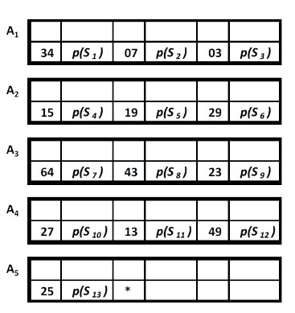

# Серийная организация файлов

## Основная структура:

- Записи расположены одна за другой
    - в последовательные места в памяти
- Физическая структура не содержит информации о связях между записями логической структуры файла
- Нет связи между значением ключа записи и адресом места, где она находится
- Порядок сохранения записей обычно следует хронологическому порядку их создания
- Записи могут быть, а могут и не быть блокированными

# Пример серийного файла

# Задания

## Задание 1

Написать программу на C/C++, позволяющую работать с данными о зарегистрированных поступлениях заключенных в городскую тюрьму. 

- Для каждого поступления нового заключенного в не-блочном серийном файле регистрируется:
    - Номер учета (до 8 цифр)
    - Код заключенного (ровно 7 символов)
    - Дата и время прибытия
    - Обозначение ячейки, в которую заключенный будет помещен (ровно 5 символов)
    - Продолжительность наказания в месяцах (до 480 месяцев)

- Обеспечить:
    - Выбор файла
    - Формирование файла
    - Поиск по файлу
    - Ввод новой записи
    - Вывод всех записей
    - Обновление записи
       - Прямая обработка серийного файла
    - Удаление записи
       - Логическое удаление

## Задание 2

- Реализовать физическое удаление для предыдущего файла

## Задание 3

- Реализовать блочный серийный файл для той же записи cо всеми операциями
