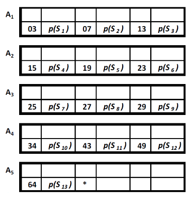

# Последовательная организация файла

# Последовательный файл (sequential file)

## Основная структура

- Записи расположены последовательно одна за другой
- Реализована как линейная логическая структура данных
- Логически соседние записи размещаются в физически соседних местах
- Имеется информация о связях между записями логической структуры данных файла, встроенная в физическую структуру
- Помещением записи с более высоким значением ключа на место с более высоким адресом
- Упорядочивание по значениям ключа в порядке возрастания -> запись с наименьшим значением ключа помещается на первое
  место
- Также известен как физическая последовательная организация
- Связь между сохраненными значениями ключа _k(S)_ и адресами местоположения
- Не встроена в структуру файла
- Не представляет собой какую-либо математическую функцию
- Записи размещаются блоками по `f` записей
- Желательно, чтобы фактор блокировки `f` был как можно больше
- Современные ОС ( _`Unix`_ ) и языки программирования ( _`C`_, _`C++`_, _`Java`_ ) поддерживают только последовательный
  способ доступа
- Пользователям предоставляется возможность создавать свои собственные последовательные методы доступа

# Пример последовательного файла

# Задача 1

Написать программу, которая будет работать с данными о зарегистрированных прибытиях заключенных в городскую тюрьму. Для
каждого поступления нового заключенного в последовательном файле с фактором блокировки `f = 4` регистрируются:

- Регистрационный номер (до 8 цифр)
- Код заключенного (ровно 7 символов)
- Дата и время прибытия
- Обозначение ячейки, в которую заключенный будет помещен (ровно 5 символов)
- Продолжительность наказания в месяцах (до 480 месяцев)

- Реализовать:
    - Формирование файла
    - Ввод новой записи
    - Обновление записи
    - Удаление записи
        - Логическое
    - Поиск по ключу
    - Реорганизация файла
    - Вывод всех записей

# Задача 2

- Реализовать последовательный файл, в котором записи вводятся с использованием последовательного файла изменений.

- Все ошибки, возникающие во время работы программы, должны быть помещены в файл ошибок

# Задача 3

- Реализовать последовательный файл, параметры которого (фактор блокировки, наличие последовательного файла изменений,
  пути к файлам) задаются с помощью отдельной программы. После задания этих параметров, последовательный файл должен
  автоматически функционировать с указанными параметрами.