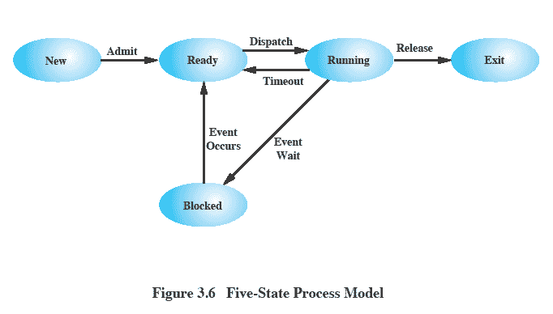
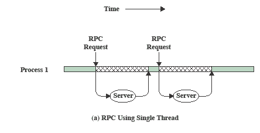
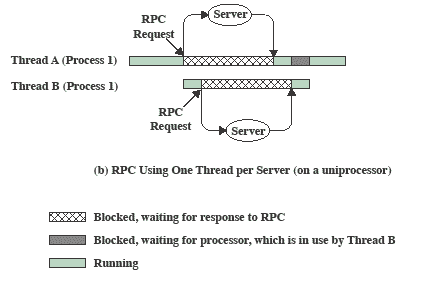
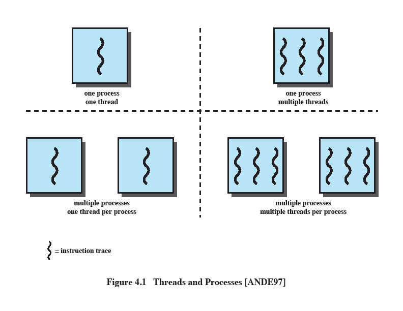
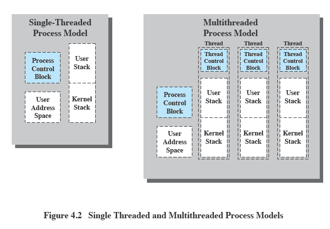
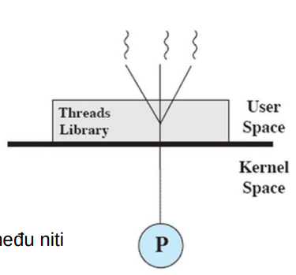
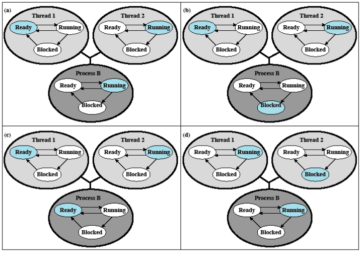
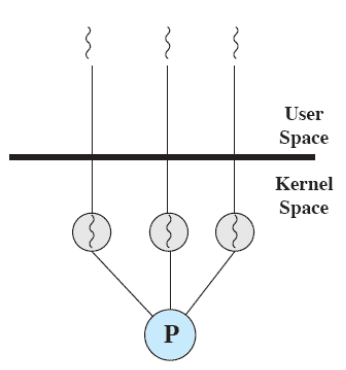
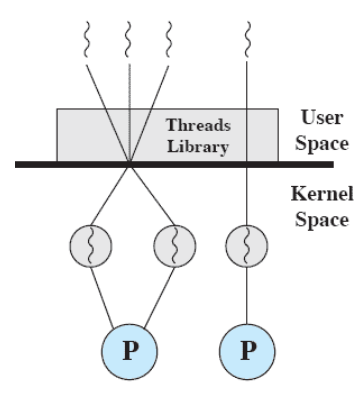

# Оперативные системы

> Лекции Goran Savić <savicg@uns.ac.rs> NTP 337

> Практики Sanja Špica <sanjaspica@uns.ac.rs> NTP 337

Лекции:
 - [Лекция 1](#лекция-1)
 - [Лекция 2](#лекция-2)

Содержание курса:

1. Конкурентное программирование
    - Понятие потока
    - Взаимное исключение
    - Условная синхронизация
2. Операционные системы
    - Роль операционной системы
    - Процессы
    - Управление памятью
    - Планирование процессора
    - Управление подсистемой пользовательского интерфейса (UI)
    - Управление файлами

Книги:
- Operativni sistemi, principi unutrašnje organizacije i dizajna, 7. izdanje, William Stallings, CET, Beograd, 2013.
- Operating system concepts 9th edition, A.
Silbershatz, P.B. Galvin, G. Gagne, Wiley, 2013.

Ютуб:
- www.youtube.com/ftnenastava (Для первого колка)
- www.youtube.com/timek12 (Материал 1й половины)

# Лекция 1

Состояния процесса:



Исполнение
    - процесс, инструкции которого процессор в данный момент выполняет
Готов
    - процесс, который готов к выполнению, но в данный момент процессор не выполняет его инструкции
Заблокирован (В ожидании)
    - процесс, который не может выполняться до наступления определенного события например, завершение операции ввода-вывода
Новый
    - процесс, который только что создан, но операционная система еще не приняла его в очередь готовых процессов
Выход
    - процесс, который операционная система убрала из очереди готовых процессов, потому что он завершил свою работу


Способность операционной системы поддерживать несколько конкурирующих путей выполнения одного процесса
Поток (нить) - это один путь выполнения в рамках процесса

Нити в C++11:
- Представленный объектом класса thread из заголовочного файла thread
- Создание объекта создает новый поток, который становится готовым
- Параметр конструктора класса thread - это функция, которую выполняет поток
(Эта функция называется телом потока)
- Входной точкой программы по-прежнему является функция main
- Завершение происходит, когда завершается функция main

Отношение создателя к созданному потоку

Метод join() класса thread
- Создатель ждет, пока созданный поток завершит выполнение
- Таким образом, два потока выполнения объединяются
-  Метод является блокирующим
(Создатель будет заблокирован, пока созданный поток не завершит выполнение)
Метод detach() класса thread
-  Отделяет создателя от созданного потока
-  Тогда создателю разрешено завершить выполнение независимо от выполнения созданного потока

Передача параметров в поток
-  Параметры тела потока передаются как параметры конструктора класса thread после имени функции
-  Возвращаемое значение функции игнорируется
-  Необходимо передавать объекты по ссылке в функцию
-  Необходимо явно передавать ссылку с использованием ref(object)

Пример улучшения производительности с использованием многозадачной обработки

-  Программа отправляет два запроса удаленному серверу для вычисления результата
-  Вариант с одним потоком


-  Вариант с двумя потоками
-  Блокировка одного потока не блокирует другой поток



#### Польза от многопоточной обработки

#### Фоновая задача
-  Длительные или блокирующие фоновые операции могут выполняться в отдельном потоке, например, запись в журнальный файл
-  Взаимодействие с пользователем возможно даже в то время, когда другой поток еще не завершил операцию
#### Асинхронная обработка
-  Команда передает задачу другому потоку
-  Поток, который передал задачу, может продолжить выполнение других команд, пока предыдущая еще не завершилась
#### Скорость выполнения
-  Пока один поток процесса блокирован, другие могут продолжать выполнение
#### Деление ресурсов внутри приложения
-  Потоки одного процесса разделяют одну и ту же память
-  Более быстрое и простое взаимодействие между потоками по сравнению с процессами
#### Экономичность
-  Создание нового потока быстрее, чем отдельного процесса
-  Переключение между двумя потоками одного процесса быстрее, чем между двумя процессами
#### Использование многопроцессорной архитектуры
-  Возможность ускорения приложения, если потоки выполняются на разных процессорах
#### Модульная структура программы
-  Организация кода в несколько потоков разделяет логические части программы
-  Более простая реализация и обслуживание



1. Операционная система поддерживает только один процесс, содержащий один поток (MS DOS)

2. Операционная система поддерживает несколько процессов, каждый из которых содержит один поток (традиционный UNIX)

3. Среда содержит один процесс, в котором может существовать несколько потоков (Java VM)

4. Операционная система поддерживает несколько процессов, каждый из которых поддерживает несколько потоков (Windows, Linux, Solaris)

### Процесс в многозадачной обработке
- Единица выделения ресурсов
  - виртуальное адресное пространство, в котором находится образ процесса
- Единица защиты ресурсов
  - защищенный доступ
  - процессору
  - другим процессам (межпроцессное взаимодействие)
  - файлам
  - вводу/выводу (устройства, каналы)

### Нить в многозадачной обработке
Один процесс может содержать несколько потоков.
У каждого потока есть:
- Состояние выполнения (выполнение, готовность и т. д.).
- Контекст потока: сохраненное состояние регистров процессора во время ожидания выполнения.
- Стек выполнения потока.
- Доступ к памяти и ресурсам своего процесса, общий с другими потоками того же процесса.

### Модель процесса с многозадачностью

Каждый поток имеет свой управляющий блок и стек
Все потоки разделяют адресное пространство и имеют доступ к одним и тем же данным

### Планирование потоков
-  Если операционная система поддерживает потоки, планирование выполняется на уровне потоков.
-  Большая часть информации о состоянии выполнения сохраняется на уровне потоков.
-  Некоторые действия влияют на все потоки.
-  Тогда операционная система должна выполнять планирование на уровне процессов.
   - Например, прерывание процесса прерывает все его потоки.

### Состояния потока
- Как и у процесса
  - Выполнение
  - Готов
  - Заблокирован
- Действия, изменяющие состояние потока
  - Создание
  - Создается управляющий блок потока и стек, и поток переводится в состояние готовности.
- Блокирование
  - Когда поток должен ожидать события,
  -  содержимое регистров процессора сохраняется, и процессор переключается на другой поток из готового набора.
- Разблокирование
  - Когда происходит ожидаемое событие, на которое ожидался поток.
  - Завершение

### Синхронизация потоков

-  Все потоки одного процесса разделяют одно и то же адресное пространство
-  Необходимо синхронизировать доступ к этим общим ресурсам
-  Без синхронизации
   - может возникнуть некорректная работа программы
   - ресурсы могут оказаться в несогласованном состоянии

Типы потоков:

Потоки уровня пользователя
User Level Threads (ULT)

Потоки уровня ядра
Kernel Level Threads (KLT)


Потоки уровня пользователя (ULT)
- Вся работа по управлению потоками выполняется
приложением
- Ядро не осведомлено о существовании
потоков
- Потоки создаются в рамках приложения
с использованием библиотеки потоков
- Библиотека включает код для
  - создания и уничтожения потоков
  - передачи сообщений и данных между потоками
  - планирования потоков
  - сохранения и восстановления содержимого потоков
- Все действия выполняются в пользовательском
пространстве в пределах одного процесса



Планирование потоков на уровне пользователя
- Ядро (Kernel) планирует процессы и назначает им состояние
- Потоки имеют свое собственное состояние, которое представляет собой "логическую" категорию и
не прямо связано с состоянием процесса
- Состояние потока обозначает статус потока внутри процесса
- Например, состояние потока "Исполнение"
  - означает, что поток активен в пределах процесса
  - не обязательно означает, что поток в данный момент выполняется на
процессоре
  - когда процессор начнет выполнять процесс, выполняется
поток в состоянии "Исполнение" внутри этого процесса



Преимущества и недостатки ULT (User Level Threads)

Преимущества:
- Переключение потоков не требует перехода в режим ядра операционной системы.
- Приложение может реализовать собственный алгоритм планирования потоков.
- ULT могут выполняться на любой операционной системе.

Недостатки:
- При блокировке процесса все потоки этого процесса также блокируются.
- Невозможность использования многозадачности, так как все потоки принадлежат одному процессу и выполняются на одном процессоре.

Потоки уровня ядра (KLT)
- Приложение инициирует создание
потоков
- Вся управляющая работа с потоками
выполняется ядром
- Ядро поддерживает данные
  - для всего процесса
  - для каждого отдельного потока
- Ядро осуществляет планирование
на основе потоков



Преимущества и недостатки KLT ("Kernel-Level Threads")

**Преимущества:**
- Ядро может одновременно планировать выполнение нескольких потоков одного процесса на нескольких процессорах.
- Если один поток в процессе заблокирован, ядро может планировать выполнение другого потока того же процесса.

**Недостатки:**
- Переключение между потоками одного процесса требует перехода в режим ядра.
- Поэтому коммутация KLT на порядок медленнее, чем коммутация ULT (User-Level Threads).

Комбинированные подходы
- Создание потоков и большая часть управления и планирования выполняются в пространстве пользователя.
- Множество пользовательских потоков (ULT) могут быть отображены на некоторое (меньшее или равное) количество ядерных потоков (KLT).



# Лекция 2

**Управление процессами**
- Операционная система может обеспечить при управлении процессами:
  - Мультипрограммирование
    - выполнение нескольких процессов в пределах однопроцессорной системы
  - Мультипроцессирование
    - выполнение нескольких процессов в пределах многопроцессорной системы
  - Распределенную обработку
    - выполнение нескольких процессов на нескольких распределенных компьютерах
- Конкурентность
  - важный аспект при управлении множественными процессами
  - вопросы взаимодействия и зависимости процессов

**Где проявляется конкурентность?**
- Везде, где происходит переплетение различных процессов.
  - Весь сценарий и момент времени переплетения обычно непредсказуемы.
- Множество приложений
  - В многозадачных системах различные процессы обращаются к одним и тем же ресурсам.
- Структурированные пользовательские приложения
  - Одно приложение может содержать несколько конкурентных процессов/потоков.
- Операционная система
  - Функции операционной системы реализованы в виде нескольких процессов/потоков.

**Проблемы, которые вносит конкурентность**
- Деление глобальных ресурсов
  - Вредное переплетение
    - Два процесса выполняют запись/чтение в одной и той же глобальной переменной.
    - Неопределенный порядок выполнения и результатов операций.
- Более сложное распределение ресурсов
  - Ресурс может быть выделен процессу, который его не использует.
  - Процессы могут взаимно блокироваться из-за ожидания ресурсов.
- Обнаружение ошибок
  - Труднее определить, почему программа ведет себя неожиданно.
  - Результаты не детерминированы, и труднее воспроизвести неожиданное поведение.

**Как решаются проблемы**
- Взаимное исключение
  - Возможность процесса выполнять действие без негативного воздействия на другие процессы.
- Синхронизация
  - Согласование поведения процессов с действиями других процессов.

**Пример вредного переплетения**
```c
 int x;
void echo() {
 cin >> x;
 int y = x;
 cout << y;
 }
 ```
   - Два процесса вызывают метод.
   - x - общий ресурс.
   - Неправильное функционирование, если произойдет переплетение после команды в строке 3.
   - Проблему можно решить, если определить, что только один процесс в данное время может выполнять код метода.

**Data race против детерминизма**
- Data race
  - Результат программы зависит от сценария переплетения и порядка выполнения инструкций между процессами.
  - Повторные выполнения одного и того же кода не дают одинаковый результат.
- Детерминистское поведение
  - Работа процесса должна быть независимой от скорости выполнения по сравнению со скоростью других текущих процессов.

> Data race - пример
> Primeri/Konkurentnost/Sum

**Взаимодействие процессов**
- Процессы не осведомлены о других процессах
  - Независимые процессы, которые не предполагают взаимодействия друг с другом
  - Тем не менее, они обращаются к одним и тем же ресурсам
  - Соперничество за ресурсы
- Процессы осведомлены о других процессах
  - Процессы разработаны для совместной работы
  - Явная синхронизация деятельности

**Соперничество процессов за ресурсы**
- Взаимное исключение процессов
  - Несколько процессов должны использовать один и тот же ресурс.
  - Для правильной работы необходимо, чтобы в какой-то момент только один процесс обращался к ресурсу.
  - Такой ресурс называется критическим ресурсом.

**Соперничество процессов за ресурсы**
- Критическая секция
  - Часть программы, в которой происходит доступ к критическому ресурсу.
  - Для правильной работы код в критической секции должен выполняться последовательно (поочередно, по одному).
  - В любой момент времени только один процесс может находиться в критической секции.

**Вход в критическую секцию**
- **Если один процесс вошел в критическую секцию
  - Что происходит с другими процессами, которые пытаются войти?

*Первый вариант - busy waiting*
- Процесс, который не может войти в критическую секцию, остается активным, непрерывно проверяя, может ли он войти.
- Процесс продолжает использовать процессорное время, даже когда нет условий для выполнения работы.
```c
int x;
bool is_lock_free = true;
void echo() {
	while (!is_lock_free) {
	} 
	is_lock_free = false;
	cin >> x;
	int y = x;
	is_lock_free = true;
	cout << y;
}
```
*Второй вариант - блокировка процесса*
- Процесс, который не может войти в критическую секцию, переходит в состояние блокировки.
- Система уведомляет его, когда он может войти в критическую секцию.
```c
int x;
mutex m; 1
void echo() {
	m.lock(); 2
	cin >> x; 
	int y = x; 3
	m.unlock(); 
	cout << y;
 }
```
1 -
Билет в критическую секцию

2 - 
• Получение билета
  • Процесс проверяет, свободен ли билет.
  • Если да, продолжает.
  • Если нет, переходит в состояние блокировки.

3 -
• Возвращение билета
  • Один из процессов, ожидающих билета, переходит в состояние готовности.

**Пропускной билет** 
- Замок (Lock)
  - Каждый процесс перед входом в критическую секцию запрашивает блокировку для какого-то общего объекта.
  - Процесс, который первым запросил блокировку, удается заблокировать объект и входит в критическую секцию.
  - Эта блокировка реализуется с использованием аппаратной поддержки для взаимного исключения.
  - Каждый последующий процесс не может заблокировать объект и переходит в состояние блокировки.
  - Процесс при выходе из критической секции разблокирует объект.
  - Один из ожидающих процессов удается заблокировать объект и входит в критическую секцию.
  - Чтобы это работало, все процессы должны блокировать один и тот же объект (каждый процесс не может работать со своей локальной копией).

**Как реализуется получение билета?**
- При получении билета необходимо:
  - Проверить, свободен ли билет.
    - Если да, занять билет.
    - Если нет, поставить процесс в состояние блокировки.
    ```c
	if (is_lock_free) 
		is_lock_free = false;
	```
  - Как быть, если после строки 1 произойдет переплетение?
    - Два процесса могут обнаружить, что билет свободен, и оба войдут в критическую секцию.
  - Поэтому получение билета не реализуется таким образом, а зависит от аппаратной поддержки для взаимного исключения.

**Аппаратная поддержка для взаимного исключения**
- Отключение прерываний
  - Процесс выполняется до возникновения прерывания.
  - Если мы отключим прерывания при захвате билета, переплетение становится невозможным.
  - Неэффективно
    - Процессор ограничен в переплетении программ.
  - Не работает на многопроцессорной архитектуре
    - Процессы выполняются на разных процессорах.
    - Отключение прерываний на одном процессоре не препятствует другому процессу доступ к ресурсу.

**Аппаратная поддержка для взаимного исключения**
- Специальные машинные инструкции
  - Аппаратура предоставляет инструкции, которые выполняют несколько операций атомарно (неделимо).
  - Эти инструкции можно использовать для получения билета.
  - Процесс в одном неделимом шаге проверяет
    - Может ли он занять билет, и
    - Если может, устанавливает индикатор, что он занят.

**Аппаратная поддержка для взаимного исключения**
- Инструкция Compare&Swap
  - Описание инструкции на языке высокого уровня
```c
int compare_and_swap(int* word, int testval, int newval)
{
    int oldval = *word;
    if (oldval == testval)
        *word = newval;
    return oldval;
}
```
- Инструкция атомарно выполняет набор операций.
- Проверяется текущее значение.
- Устанавливается новое значение, если текущее значение удовлетворяет условию.

**Аппаратная поддержка для взаимного исключения**
- Использование инструкции Compare&Swap для обеспечения взаимного исключения.
- Объект блокируется при входе в критическую секцию.
- Иллюстрация поведения на языке высокого уровня:
```c
if (compare_and_swap(locked_flag, 0, 1) == 0) {
    // Процесс продолжает работу
} else {
    // Процесс ожидает
}
```

**Аппаратная поддержка для взаимного исключения**
- Инструкция Exchange
  - Описание инструкции на языке высокого уровня
```c
void exchange(int* register, int* memory) {
    int temp = *memory;
    *memory = *register;
    *register = temp;
}
```

**Аппаратная поддержка для взаимного исключения**
- Использование инструкции Exchange для обеспечения взаимного исключения.
- Объект блокируется при входе в критическую секцию.
- Иллюстрация поведения на языке высокого уровня:
```c
bool locked = false; // глобальная

bool keyi = true; // локальная для каждого процесса
exchange(keyi, locked);
if (keyi == true) {
    // процесс ожидает
}
```

**Критическая секция в стандарте C++11**
- Создание критической секции осуществляется объектами класса mutex.
- Объект класса mutex - это общий объект, который процессы блокируют.
- Методы класса mutex:
  - lock()
    - блокирует объект mutex, если он разблокирован, в противном случае процесс переходит в ожидание.
  - unlock()
    - разблокирует объект mutex.
  - try_lock()
    - пытается заблокировать mutex.
    - если не удается, возвращает false, процесс не переходит в ожидание.

> Пример использования класса mutex 
> Primeri/Konkurentnost/MutexSum

