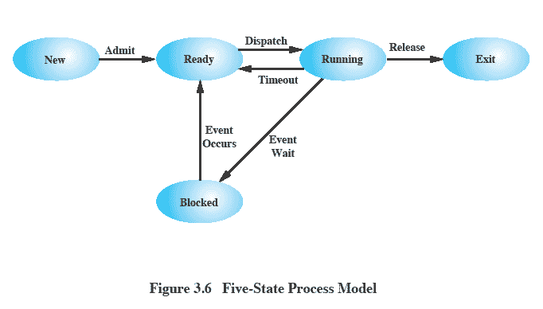
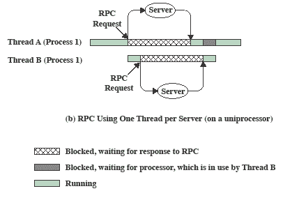
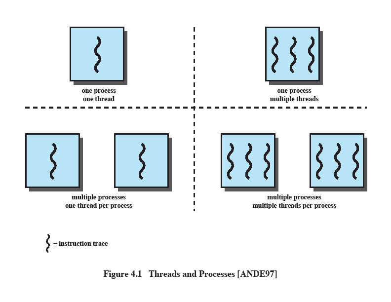
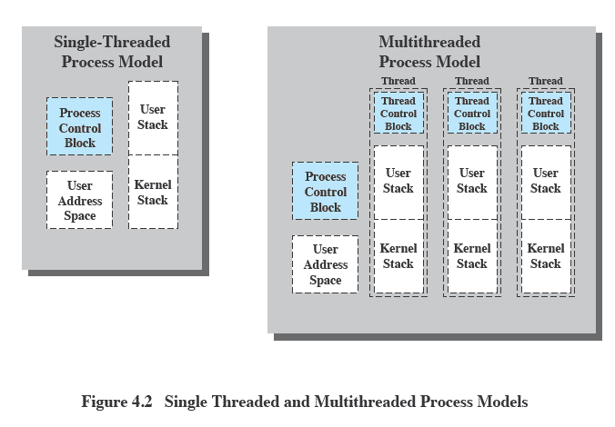

# Оперативные системы

> Лекции Goran Savić <savicg@uns.ac.rs> NTP 337

> Практики Sanja Špica <sanjaspica@uns.ac.rs> NTP 337

Содержание:

1. Конкурентное программирование
    - Понятие потока
    - Взаимное исключение
    - Условная синхронизация
2. Операционные системы
    - Роль операционной системы
    - Процессы
    - Управление памятью
    - Планирование процессора
    - Управление подсистемой пользовательского интерфейса (UI)
    - Управление файлами

Книги:
- Operativni sistemi, principi unutrašnje organizacije i dizajna, 7. izdanje, William Stallings, CET, Beograd, 2013.
- Operativni sistemi, principi unutrašnje organizacije i dizajna, 7. izdanje, William Stallings, CET, Beograd, 2013.

Ютуб:
- www.youtube.com/ftnenastava (Для первого колка)
- www.youtube.com/timek12 (Материал 1й половины)

## Лекция 1

Состояния процесса:

Исполнение
    - процесс, инструкции которого процессор в данный момент выполняет
Готов
    - процесс, который готов к выполнению, но в данный момент процессор не выполняет его инструкции
Заблокирован (В ожидании)
    - процесс, который не может выполняться до наступления определенного события например, завершение операции ввода-вывода
Новый
    - процесс, который только что создан, но операционная система еще не приняла его в очередь готовых процессов
Выход
    - процесс, который операционная система убрала из очереди готовых процессов, потому что он завершил свою работу

Способность операционной системы поддерживать несколько конкурирующих путей выполнения одного процесса
Поток (нить) - это один путь выполнения в рамках процесса

Нити в C++11:
- Представленный объектом класса thread из заголовочного файла <thread>
- Создание объекта создает новый поток, который становится готовым
- Параметр конструктора класса thread - это функция, которую выполняет поток
(Эта функция называется телом потока)
- Входной точкой программы по-прежнему является функция main
- Завершение происходит, когда завершается функция main

Отношение создателя к созданному потоку

Метод join() класса thread
- Создатель ждет, пока созданный поток завершит выполнение
- Таким образом, два потока выполнения объединяются
-  Метод является блокирующим
(Создатель будет заблокирован, пока созданный поток не завершит выполнение)
Метод detach() класса thread
-  Отделяет создателя от созданного потока
-  Тогда создателю разрешено завершить выполнение независимо от выполнения созданного потока

Передача параметров в поток

-  Параметры тела потока передаются как параметры конструктора класса thread после имени функции
-  Возвращаемое значение функции игнорируется
-  Необходимо передавать объекты по ссылке в функцию
-  Необходимо явно передавать ссылку с использованием ref(object)

Пример улучшения производительности с использованием многозадачной обработки

-  Программа отправляет два запроса удаленному серверу для вычисления результата
-  Вариант с одним потоком

-  Вариант с двумя потоками
-  Блокировка одного потока не блокирует другой поток

#### Польза от многопоточной обработки

#### Фоновая задача
-  Длительные или блокирующие фоновые операции могут выполняться в отдельном потоке, например, запись в журнальный файл
-  Взаимодействие с пользователем возможно даже в то время, когда другой поток еще не завершил операцию
#### Асинхронная обработка
-  Команда передает задачу другому потоку
-  Поток, который передал задачу, может продолжить выполнение других команд, пока предыдущая еще не завершилась
#### Скорость выполнения
-  Пока один поток процесса блокирован, другие могут продолжать выполнение
#### Деление ресурсов внутри приложения
-  Потоки одного процесса разделяют одну и ту же память
-  Более быстрое и простое взаимодействие между потоками по сравнению с процессами
#### Экономичность
-  Создание нового потока быстрее, чем отдельного процесса
-  Переключение между двумя потоками одного процесса быстрее, чем между двумя процессами
#### Использование многопроцессорной архитектуры
-  Возможность ускорения приложения, если потоки выполняются на разных процессорах
#### Модульная структура программы
-  Организация кода в несколько потоков разделяет логические части программы
-  Более простая реализация и обслуживание

1. Операционная система поддерживает только один процесс, содержащий один поток (MS DOS)

2. Операционная система поддерживает несколько процессов, каждый из которых содержит один поток (традиционный UNIX)

3. Среда содержит один процесс, в котором может существовать несколько потоков (Java VM)

4. Операционная система поддерживает несколько процессов, каждый из которых поддерживает несколько потоков (Windows, Linux, Solaris)

### Процесс в многозадачной обработке
- Единица выделения ресурсов
  - виртуальное адресное пространство, в котором находится образ процесса
- Единица защиты ресурсов
  - защищенный доступ
  - процессору
  - другим процессам (межпроцессное взаимодействие)
  - файлам
  - вводу/выводу (устройства, каналы)

### Нить в многозадачной обработке
Один процесс может содержать несколько потоков.
У каждого потока есть:
- Состояние выполнения (выполнение, готовность и т. д.).
- Контекст потока: сохраненное состояние регистров процессора во время ожидания выполнения.
- Стек выполнения потока.
- Доступ к памяти и ресурсам своего процесса, общий с другими потоками того же процесса.

### Модель процесса с многозадачностью

Каждый поток имеет свой управляющий блок и стек
Все потоки разделяют адресное пространство и имеют доступ к одним и тем же данным

### Планирование потоков
-  Если операционная система поддерживает потоки, планирование выполняется на уровне потоков.
-  Большая часть информации о состоянии выполнения сохраняется на уровне потоков.
-  Некоторые действия влияют на все потоки.
-  Тогда операционная система должна выполнять планирование на уровне процессов.
   - Например, прерывание процесса прерывает все его потоки.

### Состояния потока
- Как и у процесса
  - Выполнение
  - Готов
  - Заблокирован
- Действия, изменяющие состояние потока
  - Создание
  - Создается управляющий блок потока и стек, и поток переводится в состояние готовности.
- Блокирование
  - Когда поток должен ожидать события,
  -  содержимое регистров процессора сохраняется, и процессор переключается на другой поток из готового набора.
- Разблокирование
  - Когда происходит ожидаемое событие, на которое ожидался поток.
  - Завершение

### Синхронизация потоков

-  Все потоки одного процесса разделяют одно и то же адресное пространство
-  Необходимо синхронизировать доступ к этим общим ресурсам
-  Без синхронизации
   - может возникнуть некорректная работа программы
   - ресурсы могут оказаться в несогласованном состоянии

Типы потоков:

Нити уровня пользователя
User Level Threads (ULT)

Нити уровня ядра
Kernel Level Threads (KLT)
