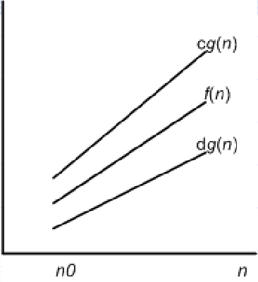
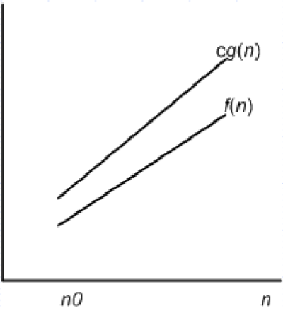

# Асимптотические нотации
## Асимптотические нотации и их виды
Асимптотические нотации используются для описания времени выполнения алгоритма $T(n)$, где $n \in \mathbb{N}$ представляет размер входных данных (например, количество элементов входного массива)

Например, $T(n) = an^2 + bn + c$, где $a$, $b$ и $c$ - константы. 
Пренебрегая деталями этой функции, можно оценить, что асимптотическое время выполнения этого алгоритма является некоторой функцией $n^2$, потому что этот член растет быстрее всего с $n$.

Асимптотические нотации могут быть применены и к другим аспектам эффективности алгоритма. Например, к использованию памяти.
Если они используются для времени, какое время?:
- Время в наихудшем случае (worst-case running time)
- Время независимо от размера входных данных, и т.д.

Существует пять асимптотических нотаций: 
- Θ-нотация
- O-нотация
- Ω-нотация
- o-нотация
- ω-нотация

## Θ-нотация
$\Theta$-нотация используется для определения времени выполнения алгоритма в наихудшем случае.

Определение: Для заданной функции $g(n)$, $\Theta(g(n))$ - это набор функций, $\Theta(g(n)) = \{ f(n) \}$, таких что существуют положительные константы $c_1$, $c_2$ и $n_0$ для которых выполняется: $0 \leq c_1 g(n) \leq f(n) \leq c_2 g(n)$ для всех $n \geq n_0$.

Мы говорим: $g(n)$ - это АСИМПТОТИЧЕСКИЙ ВЕРХНИЙ ПРЕДЕЛ для $f(n)$. Вместо $f(n) \in \Theta(g(n))$ мы пишем $f(n) = \Theta(g(n))$.



$g(n)$ должна быть АСИМПТОТИЧЕСКИ НЕОТРИЦАТЕЛЬНА.

$\Theta$-нотация основана на отбрасывании членов низшего порядка и игнорировании коэффициента перед ведущим членом.
  - Например, чтобы доказать, что $\frac{n^2}{2} - 3n = \Theta(n^2)$, необходимо определить $c_1$, $c_2$ и $n_0$, такие что для каждого $n \geq n_0$ верно $c_1 n^2 \leq n^2/2 - 3n \leq c_2 n^2$. Решение: $c_1 = 1/14$, $c_2 = 1/2$ и $n_0 = 7$.
  - Второй пример: $6n^3 \neq \Theta(n^2)$. Доказательство от противного: предположим, что существуют $c_2$ и $n_0$, такие что $6n^3 \leq c_2 n^2$, для каждого $n \geq n_0$. Тогда $n \leq c_2/6$, что противоречит, так как $c_2$ - константа

Теорема:
Для любого полинома $p(n)$ степени $d$ верно, что $p(n) = \Theta(n^d)$.
Пример: Для $f(n) = an^2 + bn + c$ верно, что $f(n) = \Theta(n^2)$

Доказательство:
Из определения. Необходимо выбрать константы $c_1 = \frac{a}{4}$, $c_2 = \frac{7a}{4}$ и $n_0 = 2\max(\frac{|b|}{a}, (\frac{|c|}{a})^{\frac{1}{2}})$. 

Константа - это полином нулевой степени: он может быть выражен как $\Theta(n^0)$ или как $\Theta(1)$.

## О-нотация
O-нотация используется для определения асимптотичеaской верхней границы заданной функции.

Определение: 
Для заданной функции $g(n)$, $O(g(n))$ - это набор функций, $O(g(n)) = \{f(n)\}$, таких что существуют положительные константы $c$ и $n_0$, для которых выполняется: $0 \leq f(n) \leq cg(n)$, для каждого $n \geq n_0$.

$f(n) = an^2 + bn + c$ находится в $\Theta(n^2)$, также находится и в $O(n^2)$. Но и линейная функция $an + b$ также находится в $O(n^2)$. Согласно теории множеств, $\Theta(g(n)) \subseteq O(g(n))$.



Может показаться необычным, что, например, $n = O(n^2)$. Время выполнения зависит от общей структуры алгоритма.
Например, для следующего псевдокода с двумя циклами очевидно, что $O(n^2)$ является верхней границей времени выполнения:
```python
for (j = 0; j < n; j++)
    for (k = 0; (k < n) && condition; k++)
        // Некоторая операция O(1)
```
Эта граница не означает, что время выполнения всегда будет $O(n^2)$ для каждого входа. Например, если `condition` является ложным, верхняя граница будет $O(n)$.

## $\Omega$-нотация
$\Omega$-нотация служит для определения АСИМПТОТИЧЕСКОЙ НИЖНЕЙ ГРАНИЦЫ заданной функции.

Определение: 
Для заданной функции $g(n)$, $\Omega(g(n))$ - это набор функций, $\Omega(g(n)) = \{f(n)\}$, таких что существуют положительные константы $c$ и $n_0$, для которых выполняется: $0 \leq cg(n) \leq f(n)$, для каждого $n \geq n_0$. $\Omega(g(n))$ дает время выполнения алгоритма в лучшем случае (best-case running time).

## Теорема о асимптотических нотациях
Теорема о асимптотических нотациях гласит, что для любых двух функций $f(n)$ и $g(n)$ верно, что $f(n) = \Theta(g(n))$ тогда и только тогда, когда $f(n) = O(g(n))$ и $f(n) = \Omega(g(n))$. Асимптотические нотации определяют поведение функции относительно $g(n)$, то есть ее асимптотическую верхнюю и нижнюю границу. Обратно, на основе асимптотически узкой границы, мы можем определить асимптотическую верхнюю и нижнюю границу.

## Асимптотические нотации в уравнениях и неравенствах
Мы уже видели формулу $n = O(n^2)$. Подобно этому, мы могли бы написать $2n^2 + 3n + 1 = 2n^2 + \Theta(n)$. Как интерпретировать такие формулы?
В $n = O(n^2)$, знак $=$ означает: $n \in O(n^2)$. В более крупных формулах, асимптотическая нотация представляет собой некую неизвестную функцию.
Например, формула $2n^2 + 3n + 1 = 2n^2 + \Theta(n)$ означает, что $2n^2 + 3n + 1 = 2n^2 + f(n)$, где $f(n)$ - это некоторая функция из множества $\Theta(n)$.

Количество анонимных функций в выражении равно количеству появлений асимптотических обозначений. Например, в выражении $\sum O(i)$ присутствует только одна анонимная функция, зависящая от $i$.

Что касается появления асимптотической нотации слева от уравнения, например, $2n^2 + \Theta(n) = \Theta(n^2)$, правило таково, что независимо от выбора функции слева, существует выбор функции справа, чтобы удовлетворить равенство. Для $2n^2 + \Theta(n) = \Theta(n^2)$ существует $g(n) \in \Theta(n^2)$, такое что $2n^2 + f(n) = g(n)$ для каждого $n$.

Возможно связать несколько таких отношений:
- Например: $2n^2 + 3n + 1 = 2n^2 + \Theta(n) = \Theta(n^2)$.
Применяя вышеуказанное правило, каждое уравнение в цепочке интерпретируется независимо:
- Сначала: $2n^2 + 3n + 1 = 2n^2 + f(n)$.
- Затем: $2n^2 + g(n) = h(n)$, $g(n) \in \Theta(n)$, $h(n) \in \Theta(n^2)$.
- Вывод: $2n^2 + 3n + 1 = \Theta(n^2)$.

## о-нотация
Граница, определенная О-нотацией, может, но не обязательно, быть асимптотически узкой:
- Например, $2n^2 = O(n^2)$ является асимптотически узкой, $2n = O(n^2)$ не является.
о-нотация используется для определения верхней границы, которая не является узкой.

Определение:
$o(g(n))$ определяется как множество функций $o(g(n)) = \{f(n)\}$, таких что для каждой константы c существует $n_0$, для которого выполнено: $0 \leq f(n) < cg(n)$, для всех $n \geq n_0$.
- Например, $2n = o(n^2)$, но $2n^2 \neq o(n^2)$.
- Если $f(n) = o(g(n))$, то $\lim_{n \to \infty} \frac{f(n)}{g(n)} = 0$.

## ω-нотация
Нижняя граница, обозначаемая ω-нотацией, не является асимптотически узкой.

Определение:
ω(g(n)) определяется как множество функций ω(g(n)) = {f(n)}, таких что для каждой константы c существует n_0, для которого выполнено: $0 \leq cg(n) < f(n)$, для всех $n \geq n_0$.
- Например, $\frac{n^2}{2} = ω(n)$, но $\frac{n^2}{2} \neq ω(n^2)$.
- Если $f(n) = ω(g(n))$, то $\lim_{n \to \infty} \frac{f(n)}{g(n)} = ∞$.

## Сравнение функций
Реляционные свойства отношений вещественных чисел также справедливы для асимптотических сравнений:
- Транзитивность для всех 5 асимптотических обозначений.
- Рефлексивность для Θ, O и Ω.
- Симметричность для Θ, и транспонированная симметрия для O-Ω и o-ω.

Таким образом, следующее верно (где a и b - вещественные числа):
- $f(n) = Θ(g(n))$ аналогично $a = b$.
- $f(n) = O(g(n))$ аналогично $a \leq b$.
- $f(n) = Ω(g(n))$ аналогично $a \geq b$.
- $f(n) = o(g(n))$ аналогично $a < b$.
- $f(n) = ω(g(n))$ аналогично $a > b$.

Говорят, что:
- $f(n)$ асимптотически меньше чем $g(n)$, если $f(n) = o(g(n))$, и
- $f(n)$ асимптотически больше чем $g(n)$, если $f(n) = ω(g(n))$.
Однако трехчленность не действует!
- Трехчленность: для двух вещественных чисел a и b, только одно из следующих трех отношений может быть верным: $a < b$, $a = b$, или $a > b$.
- Однако, две функции $f(n)$ и $g(n)$ могут быть такими, что для них не верно ни $f(n) = O(g(n))$, ни $f(n) = Ω(g(n))$.

# Метод мастеровой теоремы
Рецепт для решения рекуррентного уравнения вида $T(n) = aT(n/b) + f(n)$, где $a \geq 1$ и $b > 1$, $f(n)$ - асимптотически положительная функция.

[ну тут я хуй знает надо редактировать когда разберемся с этим методом]()
Метод мастеровой теоремы различает три случая:
1. Простое решение для многих рекуррентных уравнений.
   - Уравнение описывает время выполнения алгоритма,
   - который делит проблему размера n на a подпроблем,
   - каждая размером n/b решается рекурсивно,
   - время решения подпроблемы - $T(n/b)$,
   - $f(n)$ покрывает стоимость деления проблемы на подпроблемы и объединения решений этих подпроблем.
Дано рекуррентное уравнение вида: $T(n) = aT(n/b) + f(n)$, где $a \geq 1$ и $b > 1$, $f(n)$ - асимптотически положительная функция. Тогда $T(n)$ имеет следующие асимптотические границы:
- Если $f(n) = O(n^{\log_b a - \epsilon})$ для некоторой константы $\epsilon > 0$, тогда $T(n) = \Theta(n^{\log_b a})$.
- Если $f(n) = \Theta(n^{\log_b a})$, тогда $T(n) = \Theta(n^{\log_b a \cdot \log n})$, где $\log$ - это $\log_2$.
- Если $f(n) = \Omega(n^{\log_b a + \epsilon})$ для некоторой константы $\epsilon > 0$, и если $af(n/b) \leq cf(n)$ для некоторой константы $c < 1$ и для всех достаточно больших $n$, тогда $T(n) = \Theta(f(n))$.

## Толкование мастер теоремы
Во всех трех случаях $f(n)$ сравнивается с $n^{\log_b a}$. Большее из этих двух функций определяет решение.
При сравнении следует учитывать следующее:
- В случае 1, $f(n)$ должна быть полиномиально меньше в $n^\epsilon$ раз.
- В случае 3, $f(n)$ должна быть полиномиально больше и должна удовлетворять так называемому условию регулярности $af(n/b) \leq cf(n)$.
Три случая не покрывают все возможности! Существуют разрывы между случаем 1 и 2, а также между случаем 2 и 3.

## Использование мастер-метода
Определяется какой случай из мастер теоремы применяется, а затем просто записывается ответ.

Пример 1: $T(n) = 9T(n/3) + n$
- Решение: $a=9$, $b=3$, $f(n)=n$, $\log_b a=2$, $n^{\log_b a} = \Theta(n^2)$. Поскольку $n = O(n^{2-\epsilon})$ для $\epsilon=1$, это первый случай, и ответ $T(n) = \Theta(n^2)$.

Пример 2: $T(n) = T(2n/3) + 1$
- Решение: $a=1$, $b=3/2$, $f(n)=1$, $\log_b a=0$, $n^{\log_b a} = 1$. Поскольку $1 = \Theta(n^0) = \Theta(1)$, это второй случай, и ответ $T(n) = \Theta(\log n)$.

Пример 3: $T(n) = 3T(n/4) + n \log n$
- Решение: $a=3$, $b=4$, $f(n)=n \log n$, $\log_b a=0.793$, $n^{\log_b a}=\Theta(n^{0.793})$.
- Поскольку $n \log n = \Omega(n^{0.793 + \epsilon})$ для $\epsilon \approx 0.2$, это относится к случаю 3, если выполнено условие регулярности.
- Для достаточно больших $n$: $af(n/b) = 3(n/4)\log(n/4) \leq (3/4)n \log n = cf(n)$ для $c=3/4$.
- Поскольку условие регулярности выполняется, решение: $T(n) = \Theta(n \log n)$.
