# Анализ эффективности алгоритмов II

## Алгоритм сортировки вставкой элементов

Алгоритм сортировки вставкой для входного массива из n чисел <a1, a2,...,an> на выходе предоставляет перестановку <a1', a2',...,an'>, где a1' ≤ a2' ≤ ... ≤ an' (ai называются ключами).

"Insertion sort" (сортировка вставкой) - эффективный алгоритм для сортировки небольшого количества элементов.
- Имитирует способ, которым человек сортирует карты в левой руке.
- Карта в правой руке сравнивается с картами в левой справа налево.

# Алгоритм сортировки вставкой элементов (2/4)

Карты в левой руке все время упорядочены! Принадлежит классу ИНКРЕМЕНТАЛЬНЫХ алгоритмов.

## Процедура Insertion-Sort

- Входной массив чисел в массиве A[1..n].
- Количество элементов n определено атрибутом массива A.length.
- Сортирует числа в том же массиве (in place).
- По завершении процедуры массив A содержит упорядоченный набор чисел.

# Алгоритм сортировки вставкой элементов (3/4)

```c
Insertion-Sort(A)

for j = 2 to A.length
    key = A[j]
    // Вставить A[j] в упорядоченную A[1..j-1]
    i = j - 1
    while i > 0 and A[i] > key
        A[i + 1] = A[i]
        i = i - 1
    A[i + 1] = key
```

- Индекс j соответствует текущей карте в правой руке.
- Элементы в A[1..j-1] соответствуют отсортированным картам в левой руке.
- Элементы в A[j+1..n] соответствуют картам в колоде на столе.

Характеристика того, что A[1..j-1] всегда упорядочено, называется ИНВАРИАНТОЙ ПЕТЛИ.
# Алгоритм сортировки вставкой элементов (4/4)
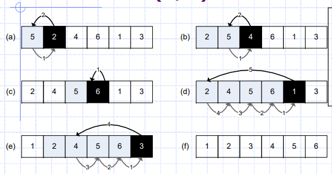

- Шаги (a) до (f) соответствуют итерациям цикла for, строки 1-8.
- Черный квадрат = ключ, взятый из A[j], который сравнивается в строке 5 с числами в заштрихованных квадратах слева.
- Светлые стрелки - перемещение в строке 6, Черная стрелка перемещает ключ в строке 8 (нумерация в порядке перемещения).

# Проверка корректности алгоритма

Инварианта петли используется для доказательства корректности алгоритма. Необходимо показать три свойства инварианты петли:

1. **Инициализация:** Истинно перед первой итерацией петли.
2. **Поддержание:** Если истинно перед итерацией петли, остается истинным после итерации.
3. **Завершение:** Когда петля завершается, инварианта предоставляет полезное свойство для доказательства корректности.

Этот процесс схож с математической индукцией. Здесь процесс завершается, когда петля завершается.

# Проверка корректности процедуры Insertion-Sort

- **Инициализация:** Перед первой итерацией, когда j = 2, подмассив A[1..j-1] равен A[1], который уже отсортирован.

- **Поддержание:** Увеличение индекса j для следующей итерации не влияет на упорядоченность подмассива A[1..j-1].

- **Завершение:** Условие j > A.length = n вызывает завершение цикла for. При этом j должно иметь значение j = n + 1. Подставив это в инварианту, получаем A[1..j-1] = A[1..(n+1-1)] = A[1..n], что представляет весь массив. Так как весь массив отсортирован, алгоритм считается корректным.

# Анализ алгоритма

Время выполнения зависит от размера входных данных:
- Сортировка 10^3 чисел займет больше времени, чем сортировка 3 чисел.

Время выполнения для двух массивов одинакового размера зависит от того, насколько хорошо они уже отсортированы.

Время выполнения определяется количеством операций, то есть шагов:
- ШАГ, насколько это возможно, максимально независим от аппаратных характеристик.
- Например, для каждой строки псевдокода требуется некоторая постоянная времени.

Пусть ci - это постоянное время, необходимое для i-й строки.
Тогда время выполнения можно оценить как сумму ci для каждой строки псевдокода.

# Анализ процедуры Insertion-Sort (1/3)

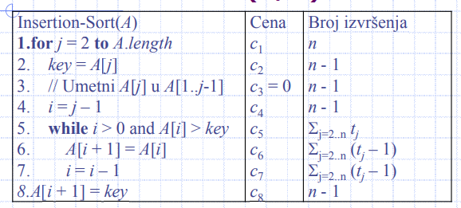

где t(j) представляет собой количество проверок условия в while-цикле на строке 5. Проверка условия выполняется на один раз больше, чем тело цикла.
Время выполнения T(n) вычисляется путем сложения произведений:

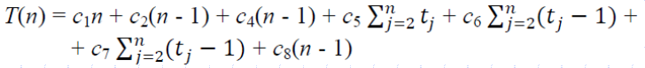


# Анализ процедуры Insertion-Sort (2/3)

- Время выполнения зависит от характера входных данных.
- Лучший случай возникает, когда вход уже упорядочен.
- В этом случае A[i] ≤ key для каждого j на строке 5, поэтому tj = 1, и лучшее (наименьшее) время выполнения равно:
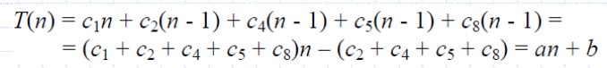
- Если входной массив упорядочен в обратном порядке, получается худший случай (наибольшее время выполнения).
- Каждый A[j] должен быть сравнен со всем подмассивом A[1..j-1], поэтому tj = j.
- Учитывая:
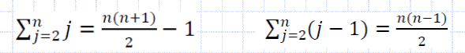

# Анализ процедуры Insertion-Sort (3/3)

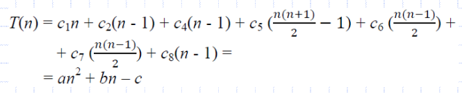
Итак, худшее время выполнения представляет собой квадратичную функцию размера входных данных: an^2 + bn – c, где константы a, b и c зависят от стоимости выражения.

# Анализ худшего и среднего случая

Наибольший интерес представляет время выполнения алгоритма в худшем случае, по следующим причинам:

1. Это верхняя граница выполнения для любого входа - никогда не будет выполняться дольше.
2. Худший случай происходит очень часто, например, в базах данных - худший случай может быть, когда запрашиваемая информация отсутствует в базе данных.
3. Средний случай часто также плох, как и худший. Например, для случайно сгенерированного массива чисел:
   - Половина элементов в A[1..j-1] меньше A[j], а половина больше, поэтому tj = j/2.
   - Время выполнения также является квадратичной функцией n.

# Асимптотическое поведение алгоритма

## Массив упрощений:

1. Изначально были пренебрежены стоимости выражений с использованием констант ci.
2. Затем перешли к константам a, b, c.

## Дальнейшее упрощение - асимптотическая нотация:

- Оценка скорости роста, или ОРДИНАТА РОСТА, времени выполнения алгоритма.
- Ранее был сделан вывод, что асимптотическая верхняя граница для функции f(n) = an^2 + bn - c равна Θ(n^2).
- Таким образом, асимптотическая верхняя граница для времени выполнения алгоритма сортировки вставкой элементов в худшем случае равна Θ(n^2).

# Алгоритм сортировки слиянием подмассивов (1/2)

Использует метод "Разделяй и властвуй".
- Эти алгоритмы рекурсивны.
На каждом уровне рекурсии выполняются следующие 3 шага:
1. Разделение проблемы на несколько подпроблем, которые представляют собой меньшие экземпляры той же проблемы.
2. Решение подпроблем с помощью рекурсивного метода. Если подпроблемы достаточно малы, они решаются напрямую.
3. Комбинирование решений подпроблем в общее решение исходной проблемы.

# Алгоритм сортировки слиянием подмассивов (2/2)

Этот конкретный алгоритм выполняется следующим образом:
1. **Разделение:** Разделяет массив из n элементов на два подмассива по n/2 элементов в каждом.
2. **Властвование:** Рекурсивно сортирует два подмассива с использованием того же алгоритма.
3. **Комбинирование:** Объединяет два отсортированных подмассива, чтобы получить отсортированный массив.

Рекурсия опускается до самого низа, до массива длиной 1, так как массив из одного элемента уже считается отсортированным.

# Слияние двух отсортированных подмассивов

Слияние выполняется процедурой Merge(A, p, q, r):
- A - массив, а p, q и r - индексы массива, где p ≤ q < r.
- Предполагается, что A[p..q] и A[q+1..r] уже отсортированы.
- Процедура Merge объединяет их в один отсортированный массив A[p..r].

Требуется Θ(n) времени, где n = r - p + 1 - это количество элементов, которые необходимо объединить.
- Две кучи карт на столе, лицевой стороной вверх.
- Уже отсортированы, наименьшая карта находится вверху кучи.
- Объединение их в одну отсортированную кучу на столе, лицевой стороной вниз.

# Основные шаги процедуры Merge

Основной шаг состоит в следующем:
- Выбор меньшей карты с верха двух входных куч.
- Удаление этой карты с вершины кучи (карта под ней становится видимой).
- Размещение карты вниз на выходной куче.

Основной шаг повторяется до тех пор, пока одна из входных куч не опустеет. Затем:
- 2-ю кучу мы помещаем, лицевой стороной вниз, на выходную кучу.

Каждый шаг занимает Θ(1), поскольку мы только сравниваем 2 карты.
Итак, всего n шагов занимает Θ(n) времени.

# Специальная карта

Проверка: Пуста ли какая-либо из исходных куч?
- Замена: Была ли достигнута специальная карта?
В псевдокоде это особое значение ∞.
- Эта карта не может быть меньше или равна (≤) другой карте,
- за исключением случая, когда достигнуто дно обеих куч.
  - Когда это происходит, все карты до специальной карты уже были перемещены в выходную кучу.

Всего имеется r–p+1 обычных карт.
- Процедура повторяет основной шаг столько раз.

# Псевдокод процедуры Merge

# Процедура Merge(A, p, q, r)

```c
n1 = q – p + 1
n2 = r – q
Создать массивы L1..n1+1 и R1..n2+1
for i = 1 to n1
   Li = Ap + i – 1
for j = 1 to n2
   Rj = Aq + j
Ln1+1 = ∞
Rn2+1 = ∞
i = 1
j = 1
for k = p to r
   if Li ≤ Rj
     Ak = Li
     i = i + 1
   else
     Ak = Rj
     j = j + 1
```

- 1: Вычислить длину подмассива n1 = q - p + 1
- 2: Вычислить длину подмассива n2 = r - q
- 3: Создать массивы L и R длиной n1+1 и n2+1
- 4-5: Скопировать подмассив A[p..q] в массив L[1..n1]
- 6-7: Скопировать подмассив A[q+1..r] в массив R[1..n2]
- 8-9: Установить специальное значение ∞ в конец массивов L и R
- 10-17: Повторить основной шаг r–p+1 раз

# Иллюстрация работы процедуры Merge
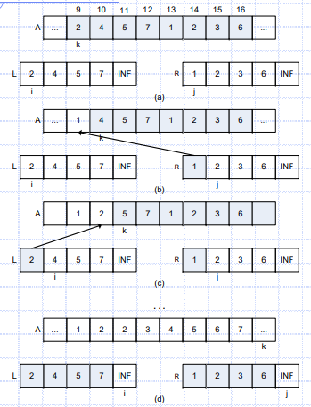
- Вызов Merge(A, 9, 12, 16), где массив A[9..16] содержит числа <2,4,5,7,1,2,3,6>.
- После копирования и вставки специального значения, массив L содержит <2, 4, 5, 7, ∞>, а массив R содержит <1, 2, 3, 6, ∞>.
- Ненакрытые позиции в A имеют свои конечные значения.
- Покрытые позиции в L и R копируются в A.
- Индекс k - позиция в выходном массиве A.
- Индекс i - позиция входного массива L.
- Индекс j - позиция входного массива R.
- На рисунке (b):
- L[1]=2 и R[1]=1, R[1] содержит меньшее значение (1), которое копируется в A[9].
- Этот шаг повторяется еще 6 раз.


# Инвариант цикла

На каждой итерации цикла for, строка 12-17, A[p..k-1] содержит k-p наименьших элементов из L[1..n1+1] и R[1..n2+1] в отсортированном порядке.
При этом L[i] и R[j] содержат наименьшие элементы их массивов, которые еще не были скопированы обратно в массив A.

Напомним: Проверка корректности?
- Ответ: инициализация, поддержание, завершение.

# Проверка корректности алгоритма

Проверка трех свойств:
1. **Инициализация:** Перед I-й итерацией цикла, k = p, и массив A[p..k-1] пуст. Пустой массив содержит k-p = 0 минимальных элементов из L и R. Так как i = j = 1, L[1] и R[1] - минимальные элементы.

2. **Поддержание:**
   - I часть: Если L[i] ≤ R[j], то L[i] - минимальный элемент. A[p..k-1] содержит k-p минимальных элементов, и после копирования L[i] в A[k], A[p..k] содержит k-p+1 минимальных элементов.
   - II часть: Если L[i] > R[j], тогда строки 16-17 поддерживают инвариант.

3. **Завершение:** В конце k = r + 1. A[p..k-1] становится A[p..r], и содержит k-p = r-p+1 минимальных элементов. L и R вместе содержат n1 + n2 + 2 = r-p+3 элемента, и все они копируются обратно в A, за исключением 2 специальных элементов ∞.

# Процедура Merge-Sort

```c
Merge-Sort(A, p, r )
1.if p < r
2. q = (p + r)/2
3. Merge-Sort(A, p, q )
4. Merge-Sort(A, q+1, r )
5. Merge(A, p, q, r )
```

Процедура `Merge-Sort(A, p, r)` сортирует подмассив A[p..r].
Если p ≥ r, то этот подмассив содержит не более одного элемента, и он уже считается отсортированным.
В противном случае, шаг разделения просто вычисляет индекс q, который делит A[p..r] на два подмассива: A[p..q] и A[q+1..r].
- Первый подмассив содержит ⌊n/2⌋ элементов, а второй - ⌈n/2⌉ элементов.

Начальный вызов: `Merge-Sort(A, 1, A.length)`


# Работа процедуры Merge-Sort

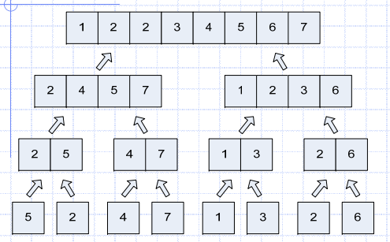
- Входной массив (внизу): <5,2,4,7,1,3,2,6>
- Алгоритм начинает, объединяя массивы по 1 элементу в отсортированные массивы длиной 2 и так далее, до объединения двух массивов длиной n/2 в конечный массив длиной n.

# Анализ рекурсивных алгоритмов (1/2)

Когда алгоритм содержит рекурсивные вызовы, время выполнения описывается рекуррентным соотношением или, коротко, рекурренцией.
Например, "разделяй и властвуй":
- Прямое решение для n ≤ c занимает Θ(1) времени.
- Разделение проблемы на a подпроблем, каждая размером 1/b.
- Подпроблема занимает Θ(n/b) времени.
- a подпроблем занимают aΘ(n/b) времени.
- Разделение проблемы на подпроблемы занимает D(n) времени.
- Объединение решений занимает C(n) времени.

# Анализ рекурсивных алгоритмов (2/2)

Общее рекуррентное соотношение для T(n) алгоритма, основанного на принципе "разделяй и властвуй":

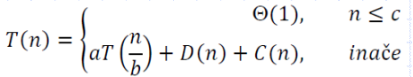

# Анализ процедуры Merge-Sort

Время по шагам:
- **Разделение (`D`):** Вычисляется средний элемент подмассива, поэтому D(n) = Θ(1).
- **Властвование (`T`):** Два подзадачи, каждая размером n/2, вносят вклад в общее время выполнения 2T(n/2).
- **Объединение (`C`):** Сортировка массива из n элементов с использованием процедуры Merge занимает Θ(n) времени.

Так как C(n) + D(n) = Θ(n), рекуррентное соотношение для T(n) в процедуре Merge-Sort выглядит следующим образом:

T(n) = 2T(n/2) + Θ(n), n > 1

Θ(1), n = 1

# Решение (1/3)

Применяя метод мастера, случай 2, мы получаем решение T(n) = Θ(n log n).

Интуитивное понимание решения T(n) = Θ(n log n) без использования мастер-теоремы:
- Запишем уравнение следующим образом:
- 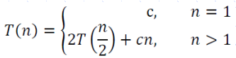
- , гдe c - время для задачи размером 1, а также время на каждый элемент массива для шагов разделения и объединения.
- Далее представим уравнение графически.

Предположение: n - степень 2.

# Решение (2/3)

**Рекурсивное дерево для \(T(n) = 2T(n/2) + cn\):**

(a): \(T(n)\), которое расширяется в (b) дерево в соответствии с рекурсией.

(cn - стоимость на самом верхнем уровне, и два поддерева - это рекурсии \(T(n/2)\))

(c): Результат расширения \(T(n/2)\)

(d): Полное рекурсивное дерево.

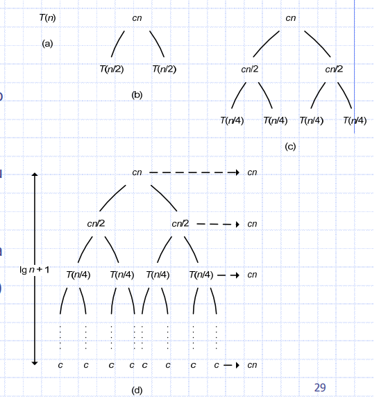

# Решение (3/3)

Далее производится сложение стоимостей для каждого уровня дерева:
- Наивысший уровень: стоимость \(cn\)
- Следующий уровень: стоимость \(c(n/2) + c(n/2) = cn\)
- Следующий уровень: \(c(n/4) + c(n/4) + c(n/4) + c(n/4) = cn\), и так далее.
- На самом низком уровне: \(n\) узлов x стоимость \(c = cn\). Всегда \(cn\).

Всего уровней в дереве: \(\log n + 1\), где \(n\) - количество листьев.

Итоговая стоимость рекурсии:
- Количество уровней x Стоимость уровня = \((\log n + 1) \* cn = cn \* \log n + cn\)

Пренебрегая младшим членом \(cn\) и константой \(c\), получаем:
\[T(n) = \Θ(n \log n)\]
