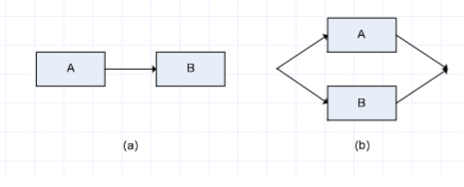

```table-of-contents
title: # Содержание 
style: nestedList # TOC style (nestedList|inlineFirstLevel)
minLevel: 0 # Include headings from the specified level
maxLevel: 0 # Include headings up to the specified level
includeLinks: true # Make headings clickable
debugInConsole: false # Print debug info in Obsidian console
```
# Введение
**Платформа динамического параллелизма** - позволяет специфицировать параллелизм в приложении без забот о коммуникационных протоколах, балансировке нагрузки и других проблемах.

**Конкурентная платформа** включает планировщик, который балансирует нагрузку процессорных ядер

Платформа поддерживает две абстракции:
- **Вложенная параллелизация**: подпрограмма может быть запущена как параллельная активность (`spawn`)
- **Параллельные циклы**: итерации могут выполняться параллельно

## Основная модель динамической параллелизации
Проектировщик определяет логическую параллельность в приложении
- Потоки внутри платформы распределяются и балансируют нагрузку между собой

Эта модель предлагает следующие 4 важные преимущества:
- Псевдокод с всего тремя новыми ключевыми словами: `parallel`, ``spawn`` и `sync`. Их удаление из псевдокода параллельного алгоритма ⇔ последовательный алгоритм, так называемая **сериализация** параллельного алгоритма
- Обеспечивает квантификацию параллелизма на основе понятий **работа** и **распределение**
- Многие параллельные алгоритмы вытекают из практики "разделяй и властвуй". Они подвергаются анализу с использованием метода решения рекурсий (как и последовательные алгоритмы такого типа)
- Современные конкурентные платформы поддерживают одну из вариантов динамической параллелизации. Например, Cilk, Cilk++, OpenMP, TPL (Библиотека параллельных задач) и TBB (Строительные блоки потоков)

# Основы динамической параллелизации 
## Вычисление чисел Фибоначчи
### Серийный/Рекуррентный алгоритм
Пример рекурсивного вычисления чисел Фибоначчи:
$$
F_0 = 0\text{;\quad}F_1 = 1\text{;\quad}F_i = F_{i-1} + F_{i-2}\text{, для }i \geq 2
$$
Серийный алгоритм и дерево рекурсивных вызовов $Fib(n)$:
>Если $n \leq 1$
>>Вернуть $n$
>Иначе
>>$x = \text{Fib}(n - 1)$
>>$y = \text{Fib}(n - 2)$
>>Вернуть $x + y$


Недостаток этого алгоритма: многократное выполнение одной и той же работы. Например, $Fib(5)$ вызывает $Fib(4)$ и $Fib(3)$, а $Fib(4)$ также вызывает $Fib(3)$.
#### Анализ серийного/рекуррентного алгоритма
Рекуррентное уравнение для процедуры:
$$
Fib(n)\text{:\quad}T(n) = T(n - 1) + T(n - 2) + \Theta(1)
$$

Решение:
$$
T(n) = \Theta(F_n) = \Theta(\varphi^n)\text{, где }\varphi = \frac{1 + \sqrt{5}}{2}\text{, так называемое золотое сечение.}
$$

Проверка методом подстановки:
- Индуктивное предположение: $T(n) \leq aF_n - b$, где $a$ и $b$ константы.
- Подстановкой получаем:
$T(n) \leq (aF_{n-1} - b) + (aF_{n-2} - b) + \Theta(1) = a(F_{n-1} + F_{n-2}) - 2b + \Theta(1) = aF_n - b - (b - \Theta(1)) \leq aF_n - b$
### Параллельный алгоритм
Псевдокод расширяется добавлением ключевых слов ``spawn`` и `sync`, результатом является `P_Fib(n)`. Удаление `spawn` и `sync` из ` P_Fib(n)` приводит к **сериализации** - серийному коду, решающему ту же проблему:
>$P-Fib(n)$
>Если $n \leq 1$
>>Вернуть $n$
>Иначе
>>x = spawn $P-Fib(n - 1)$
>>$y = \text{P-Fib}(n - 2)$
>>sync
>>Вернуть $x + y$

Вложенная параллельность всегда происходит, когда ключевое слово `spawn` предшествует вызову процедуры, как, например, в строке 3.
`spawn` выражает логическую параллельность в вычислениях: указывает на части, которые могут выполняться параллельно, символ: `||`
При выполнении планировщик определяет, какие вычисления действительно выполняются параллельно.
### Угнежденная параллельность
>$P-Fib(n)$
>Если $n \leq 1$
>>Вернуть $n$
>Иначе
>>x = spawn $P-Fib(n - 1)$
>>$y = \text{P-Fib}(n - 2)$
>>sync
>>Вернуть $x + y$

Семантика ключевого слова `spawn` отличается от обычного вызова процедуры. Экземпляр процедуры, который выполняет `spawn`, так называемый предок, может выполняться параллельно с новым **экземпляром**, так называемым **потомком**.
Например, пока потомок вычисляет `P_Fib(n - 1)`, предок может параллельно вычислять `P_Fib(n - 2)` на строке 4. ``P_Fib`` не может использовать значение `x`, возвращенное выполненным потомком, пока не выполнит `sync` на строке 5.

## Модель параллельного выполнения
Граф вычислений $G = (V, E)$
- Узлы в $V$ - это инструкции
- Рёбра в $E$ представляют зависимости между инструкциями
- $(u, v) \in E$ означает, что инструкция $u$ должна быть выполнена до $v$
Серийные выражения могут быть сгруппированы в одну строку (strand) выполнения. Инструкции для управления параллельным выполнением не включаются в строки, а представляются в структуре графа.
Таким образом, набор $V$ формирует набор строк, в то время как набор направленных рёбер из $E$ представляет зависимости между ними.

Если в $G$ существует направленный путь от строки $u$ до строки $v$, две строки находятся в логической последовательности.
В противном случае, строки $u$ и $v$ находятся в логической параллельности.
Граф строк выполнения встроен в дерево экземпляров процедуры.
Он представляет собой детализацию этого дерева (приближение).
Например, в предыдущем дереве экземпляров процедуры для вызова `P_Fib(5)`, мы можем увеличить часть для вычисления `P_Fib(4)`.
### Четыре типа рёбер графа вычислений
- **Ребро продолжения** $(u, u')$ рисуется вправо, соединяет строку $u$ с её последующей строкой $u$' внутри той же процедурной инстанции.
- **Ребро развития** $(u, v)$ рисуется вниз и показывает, что строка выполнения $u$ породила строку $v$.
- **Ребро вызова** также рисуется вниз и представляет собой обычный вызов процедуры (но не порождает продолжения).
- **Ребро возврата** $(u, x)$ рисуется вверх и показывает, что строка выполнения $u$ возвращается в свою вызывающую процедуру $x$.
### Граф вычислений для вызова Fib(4)

- **Овальный символ**  одна строка
- **Чёрный узел** - базовый случай или часть инстанции процедуры до точки разветвления
- **Теневой узел** - часть процедуры, которая вызывает `P_Fib(n-2)`, от строки 4 до оператора `sync`
- **Белый узел** - часть процедуры после оператора `sync`
Критический путь в графе обозначен более толстыми стрелками

***Критический путь графа** — путь максимальной длины в ориентированном ациклическом графе.*
## Идеальный параллельный компьютер
Набор процессоров и последовательно согласованной ($SK$) общей памяти
- $SK$: множество одновременных операций $R$ и $W$, как если бы выполнялась одна $R/W$ операция одним процессором
- Линейный порядок, сохраняющий порядок графа
Предполагается, что все процессоры имеют одинаковую мощность, и стоимость планирования игнорируется.
## Меры производительности
### Работа и распределение
Две меры эффективности параллельного алгоритма:
- **Работа** (RAD) - общее время выполнения на одном процессоре. Если время для каждого узла равно $1$, то рабочий объем равен количеству узлов.
- **Распределение** - максимальное время, необходимое для выполнения строк вдоль любого пути. Если время для каждого узла равно $1$, то распределение равно количеству узлов вдоль самого длинного пути в графе.

Пример: граф для вызова `Fib(4)` имеет $17$ узлов, и $8$ из них находятся на критическом пути. Если время для каждого узла равно $1$, то рабочий объем $= 17$, распределение $= 8$.
### Времена $T_P$, $T_1$ и $T_\infty$
Реальное время выполнения параллельного алгоритма:
- Сколько процессоров доступно?
- Как планировщик распределяет процессоры между строками?
Обозначения:
- $T_P$ - время на $P$ процессорах
- $T_1$ - время на одном процессоре ($=$ рабочий объем)
- $T_\infty$ - время для бесконечного числа процессоров ($=$ распределение, так как каждая строка выполняется на своем процессоре)
Рабочий объем и распределение обеспечивают нижние границы для времени выполнения $T_P$ - закон работы и закон распределения.
### Законы работы и распределения, ускорение
**Закон работы**:
$$
T_P \geq T_1 / P
$$
**Закон распределения**:
$$
T_P \geq T_\infty
$$
**Ускорение** на $P$ процессорах - это отношение $T_1 / T_P$
- Говорит, во сколько раз выполнение быстрее на $P$ процессорах
- Если $T_1 / T_P = \Theta(P)$, $\Rightarrow$ это **Линейное ускорение**
- Если $T_1 / T_P = P$, $\Rightarrow$ это **Совершенное линейное ускорение**
## Параллелизм
**Параллелизм параллельного алгоритма** - это отношение $T_1 / T_\infty$.
Три перспективы:
- Как отношение: среднее количество работы, которое можно выполнить параллельно
- Как верхняя граница, максимальное возможное ускорение
- Ограничение совершенного линейного ускорения (максимальное количество процессоров для идеального линейного ускорения)
Например, работа $T_1 = 17$, распределение $T_\infty = 8$, значит параллелизм $T_1 / T_\infty = 17/8 = 2.125$.
Следствие: невозможно достичь ускорения значительно больше чем в два раза (обозначается как $2x$).
## Лабавость параллелизма
**Лабавость параллелизма** - это отношение:
$$
\frac{T_1}{(P T_\infty)}
$$
Смысл лабаваости - фактор, с которым параллелизм алгоритма превосходит количество процессоров.

Если лабавость меньше $1$, невозможно достичь идеального линейного ускорения:
  - Из $\frac{T_1}{P T_\infty} < 1$, следует $\frac{T_1}{T_P} \leq \frac{T_1}{T_\infty} < P$
  - По мере уменьшения лабавости от $1$ к $0$, ускорение удаляется все дальше от совершенного.

Если же лабавость больше $1$, ограничивающим фактором является работа на процессор.
- По мере увеличения лабавости от $1$, ускорение приближается к идеальному.
## Распределение
**В идеале** - распределитель конкурентной платформы непосредственно отображает строки на процессоры.
**На практике** - распределитель отображает строки на статические нити, а ОС распределяет нити на процессоры.
### Жадные распределители
На каждом шаге жадные распределители назначают как можно больше строк.
**Шаг**:
- Полный: как минимум $P$ строк => $P$ строк на выполнение.
- Неполный: менее $P$ строк => все на выполнение.

Из закона работы: $T_P = \frac{T_1}{P}$, из закона диапазона: $T_P = T_{\infty}$. Чему равен максимальный $T_P$?
### Теорема о верхней границе $T_P$:
На $P$ процессорах, жадный распределитель выполняет параллельный алгоритм с работой $T_1$ и диапазоном $T_{\infty}$ за время: $T_P \leq \frac{T_1}{P} + T_{\infty}$.
- Следствие I: $T_P$ никогда не превышает в два раза оптимальное время $T_P^*$: $T_P \leq 2T_P^*$.
- Следствие II: если $P << \frac{T_1}{T_{\infty}}$, тогда время $T_P$ приблизительно равно $\frac{T_1}{P}$, или эквивалентно, ускорение примерно равно $P$.
## Анализ параллельных алгоритмов
Цель анализа: определить границы $T_P$ для различных значений $P$.
- Анализ работы $\Leftrightarrow$ анализ сериализации.
- Анализ диапазона $\Leftrightarrow$ анализ критического пути.

Анализ диапазона различает 2 случая:
1. Если два подграфа $A$ и $B$ связаны последовательно: 
$$
T_{\infty}(A \cup B) = T_{\infty}(A) + T_{\infty}(B)
$$
5. Если два подграфа $A$ и $B$ связаны параллельно:
$$
T_{\infty}(A \cup B) = \max(T_{\infty}(A), T_{\infty}(B))
$$


Пример:
Анализ `P_Fib(n)`
- Работа: поскольку `Fib` является сериализацией `P_Fib`:
$$
T_1(n) = T(n) = \Theta(\phi^n)
$$

- Распределение: поскольку внутри `P_Fib(n)` существует параллельная связь `P_Fib(n – 1)` и `P_Fib(n – 2)`:
$$
T_{\infty}(n) = \max(T_{\infty}(n – 1), T_{\infty}(n – 2)) + \Theta(1) = T_{\infty}(n – 1) + \Theta(1)
$$
- Решение этого уравнения: $T_{\infty}(n) = \Theta(n)$.

- Параллелизм `P_Fib(n)`:
$$
\frac{T_1(n)}{T_{\infty}(n)} = \Theta(\frac{\phi^n}{n})
$$
- Уже для небольших значений $n$, совершенное ускорение, даже на самых мощных параллельных компьютерах (из-за большой свободы).

## Параллельные циклы
Циклы, в которых все итерации могут выполняться параллельно. Обычно параллелизируются с помощью конструкции `parallel for`.

**Пример**:
Умножение матрицы $A$ на вектор $x$:
$$
y_i = \sum_{j=1}^{n} a_{ij} x_j\text{, где }i = 1, 2, \ldots, n
$$
>$Mat-Vec(A, x)$
>$n = \text{A.rows}$
>Пусть $y$ - новый вектор длиной $n$
>parallel for i = 1 to n
>>$y_i = 0$
>parallel for i = 1 to n
>>for j = 1 to n
>>>$y_i = y_i + a_{ij}x_j$
>return y

Компилятор реализует каждый `parallel for` цикл как процедуру, основанную на подходе "разделяй и властвуй", которая использует вложенную параллельность.

>$Mat-Vec-Main-Loop(A, x, y, n, i, i’)$
>Если $i == i'$
>>for j = 1 to n
>>>$y_i = y_i + a_{ij}x_j$
>Иначе $mid = \left\lfloor \frac{i + i'}{2} \right\rfloor$
>>spawn Mat-Vec-Main-Loop(A, x, y, n, i, mid)
>>Mat-Vec-Main-Loop(A, x, y, n, mid+1, i')
>>sync

**Бинарное дерево вычислений для процедуры $Mat-Vec-Main-Loop$**:
Граф вызова $Mat-Vec-Main-Loop(A, x, y, 8, 1, 8)$. Два числа под линией представляют значения индексов: $i, i'$.


### Анализ процедуры Mat-Vec
**Работа $T_1(n)$**:
- Сериализация: параллельные циклы заменяются обычными циклами.
- $T_1(n) = \Theta(n^2)$, так как квадратное время выполнения двойного вложенного цикла доминирует.

Каково время потери из-за маркировки?
- Количество внутренних узлов на 1 меньше, чем количество листьев.
- Каждый узел занимает $\Theta(1)$.
- Каждый лист соответствует одной итерации, которая занимает $\Theta(1)$.
- Общее время составляет $\Theta(n)$, что поглощается $\Theta(n^2)$.

**Диапазон $T_{\infty}(n)$:**
Поскольку глубина рекурсивного вызова является логарифмической функцией числа итераций, для параллельного цикла с $n$ итерациями, где $i$-я итерация имеет диапазон $iter_{\infty}(i)$:
$$
T_{\infty}(n) = \Theta(\log n) + \max_{1 \leq i \leq n} iter_{\infty}(i)
$$

- Для параллельного цикла в строках 3-4 диапазон составляет $\Theta(\log n)$.
- Диапазон двух вложенных циклов в строках 5-7 составляет $\Theta(n)$.
- Диапазон оставшегося кода в этой процедуре является постоянным.
- Диапазон всей процедуры составляет $\Theta(n)$.

Поскольку работа $\Theta(n^2)$, параллелизм составляет $\frac{\Theta(n^2)}{\Theta(n)} = \Theta(n)$.
## Гонка за данными
Параллельный алгоритм является **детерминистичным**, если его поведение всегда одинаково для одинакового ввода.
**Гонка за данными** происходит между двумя логически параллельными инструкциями, которые обращаются к одному и тому же адресу памяти, и по крайней мере одна из этих инструкций записывает в этот адрес.

Пример:
>$x = 0$
>parallel for i = 1 to 2
>>$x = x + 1$
>print x

Аномалия происходит потому, что содержимое x не увеличивается на 1 сразу, а последовательностью инструкций:
1. Загрузить x из памяти в регистр
2. Увеличить содержимое этого регистра на 1
3. Записать регистр в x в памяти


В представленной последовательности инструкций процедура неправильно выводит 1.

Проблема: Многие выполнения не выявляют ошибку! Например, последовательность выполнения $<1,2,3,7,4,5,6,8>$ или $<1,4,5,6,2,3,7,8>$ приводит к правильному результату 2.
### Решение гонки за данными
Существует множество способов. Например, блокировки для взаимного исключения и т.д. Но лучшее решение:
- В конструкции с параллельным циклом все итерации должны быть независимыми.
- Между `spawn` и `sync` программный код потомка должен быть независим от кода его предка.
	- Включая код дополнительно запущенных или вызванных потомков!

## Осторожно! Очень легко ошибиться! 
Неправильная реализация параллельного умножения матрицы на вектор с диапазоном $\Theta(\log n)$ путем параллелизации внутреннего цикла:

>$Mat-Vec-Wrong(A, x)$
>$n = \text{A.rows}$
>Пусть $y$ - новый вектор длиной $n$
>parallel for i = 1 to n
>>$y_i = 0$
>parallel for i = 1 to n
>>parallel for j = 1 to n
>>>$y_i = y_i + a_{ij}x_j$
>return y

## Урок из параллелизма
### История
- Произошла во время разработки программы для игры в шахматы под названием Sokrates.
- Разработка на 32 процессорах, целевой компьютер - 512 процессоров.
- Одна оптимизация сократила время выполнения важного референтного теста с $T_{32} = 65s$ до $T_{32}' = 40s$.
- Исходя из работы и диапазона, был сделан вывод, что эта версия, которая была быстрее на 32 процессорах, на самом деле будет медленнее на целевом компьютере с 512 процессорами.
- Эпилог: они отказались от этой оптимизации.
### Расчет
- Исходная версия: $T_1 = 2048s$ и диапазон $T_{\infty} = 1s$.
- Если взять $T_P = \frac{T_1}{P} + T_{\infty}$:
  - $T_{32} = \frac{2048}{32} + 1 = 65$
  - $T_{32}' = \frac{1024}{32} + 8 = 40$
  - $T_{512} = \frac{2048}{512} + 1 = 5s$
  - $T_{512}' = \frac{1024}{512} + 8 = 10s$
- Дважды медленнее на 512 процессорах!
- Урок: Лучше рассчитывать работу и диапазон, чем полагаться только на измерения.
