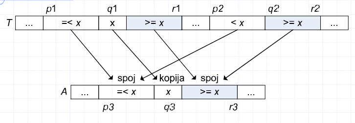

```table-of-contents
title: # Содержание
style: nestedList # TOC style (nestedList|inlineFirstLevel)
minLevel: 0 # Include headings from the specified level
maxLevel: 0 # Include headings up to the specified level
includeLinks: true # Make headings clickable
debugInConsole: false # Print debug info in Obsidian console
```
# Алгоритмы умножения матриц
Здесь приведены три параллельных алгоритма: 
1. Прямой алгоритм с тремя вложенными циклами
2. Параллельный алгоритм на основе принципа "разделяй и властвуй"
3. Параллельный алгоритм Штрассена

## Прямой алгоритм
Основанный на параллелизации циклов в стандартном последовательном алгоритме с тремя вложенными циклами.
Результатом является процедура P-Square-Matrix-Multiply:

**P-Square-Matrix-Multiply(A, B):**
1. $n = A.rows$
2. Пусть $C$ будет новой матрицей размером $n \times n$
3. parallel for $i = 1$ до $n$
4.   parallel for $j = 1$ до $n$
5.     $c_{ij} = 0$
6.     for $k = 1$ до $n$
7.       $c_{ij} = c_{ij} + a_{ik} \times b_{kj}$
8. return $C$

### Анализ прямого алгоритма
- **Сериализация:** код с тремя вложенными циклами с по $n$ итераций, поэтому $T_1(n) = \Theta(n^3)$.
- **Распределение:** $T_\infty(n) = \Theta(n)$, так как распределение для параллельного цикла - $\Theta(\log n)$, а для обычного - $\Theta(n)$; следовательно, общее время: $\Theta(n)$.
- **Параллелизм:** $\frac{\Theta(n^3)}{\Theta(n)} = \Theta(n^2)$.
- **На дом:**
	- Для улучшения параллелизма можно параллелизировать внутренний цикл, чтобы получить параллелизм $\Theta\left(\frac{n^3}{\log n}\right)$.
	    - Простая замена на parallel for может привести к гонкам данных!

## Алгоритм по принципу "Разделяй и властвуй"
Приступаем к разбиению исходной задачи на более мелкие подзадачи:
- Матрицы A, B и C размером n x n разбиваются на четыре подматрицы размером $n/2 \times n/2$:
$$
\begin{align*}
A &= \begin{bmatrix} A_{11} & A_{12} \\ A_{21} & A_{22} \end{bmatrix} \\
B &= \begin{bmatrix} B_{11} & B_{12} \\ B_{21} & B_{22} \end{bmatrix} \\
C &= \begin{bmatrix} C_{11} & C_{12} \\ C_{21} & C_{22} \end{bmatrix}
\end{align*}
$$

- Затем произведение матриц можно записать как:
$$
C = \begin{bmatrix} c_{11} & c_{12} \\ c_{21} & c_{22} \end{bmatrix} = \begin{bmatrix} a_{11} & a_{12} \\ a_{21} & a_{22} \end{bmatrix} \times \begin{bmatrix} b_{11} & b_{12} \\ b_{21} & b_{22} \end{bmatrix} = \begin{bmatrix} a_{11}b_{11} + a_{12}b_{21} & a_{11}b_{12} + a_{12}b_{22} \\ a_{21}b_{11} + a_{22}b_{21} & a_{21}b_{12} + a_{22}b_{22} \end{bmatrix}
$$

**P-Matrix-Multiply- Recursive(C, A, B):**
1. N = A.rows
2. if n == 1
3.     $c_{11} = a_{11}*b_{11}$
4. else пусть $T$ будет новой матрицей размером $n \times n$
5.     Разделите матрицы A, B, C и T на подматрицы размером $n/2$ x $n/2$
6.     spawn P-Matrix-Multiply-Recursive ($C_{11}, A_{11}, B_{11}$)
7.     spawn P-Matrix-Multiply-Recursive ($C_{12}, A_{11}, B_{12}$)
8.     spawn P-Matrix-Multiply-Recursive ($C_{21}, A_{21}, B_{11}$)
9.     spawn P-Matrix-Multiply-Recursive ($C_{22}, A_{21}, B_{12}$)
10.    spawn P-Matrix-Multiply-Recursive ($T_{11}, A_{12}, B_{21}$)
11.    spawn P-Matrix-Multiply-Recursive ($T_{12}, A_{12}, B_{22}$)
12.    spawn P-Matrix-Multiply-Recursive ($T_{21}, A_{22}, B_{21}$)
13.    P-Matrix-Multiply-Recursive ($T_{22}, A_{22}, B_{22}$)
14.    Sync
15.    Parallel for i = 1 to n
16.        Parallel for j = 1 to n
17.            $c_{ij} = c_{ij} + t_{ij}$

- Основной случай: строка 3.
- Рекурсивный случай: строки 4-17.
    - Рекурсивные вызовы в строках 6-13 выполняют 8 умножений подматриц.
    - Промежуточные произведения в матрицах C и T суммируются с помощью двух вложенных параллельных циклов в строках 15-17.

### Анализ процедуры P-Matrix-Multiply-Recursive
**Работа:**
 - Разделение матрицы во времени $\Theta(1)$, восемь рекурсивных умножений подматриц, и сложение матриц C и T в двойных циклах во времени $\Theta(n^2)$:  $$T_1(n) = 8T_1(n/2) + \Theta(n^2)$$
- **Решение:** согласно первому случаю мастер-теоремы: $T_1(n) = \Theta(n^3)$.
- Работа этого параллельного алгоритма асимптотически равна работе прямого алгоритма.
**Распределение**:
- Распределение разделения матрицы составляет $Θ(1)$.
- Распределение двойных вложенных параллельных циклов в строках 15-17 составляет $Θ(\log n)$.
- Распределение 8 параллельных рекурсивных вызовов = максимум из них = распределение любого из этих вызовов. Всего: $T_∞(n) = T_∞(n/2) + Θ(\log n)$
**Решение**:
- $T_∞(n) = Θ(\log^2 n)$ по методу подстановки.
- Почему нельзя применить метод мастер-теоремы?
	- Поскольку условия метода мастер-теоремы не выполняются.
**Параллелизм**: $$\frac{T_1(n)}{T_∞(n)} = Θ(\frac{n^3}{\log^2 n})$$
- Это очень высокий параллелизм.

## Штрасенов метод умножения матриц
* Ключевым моментом является уменьшение ветвления рекурсивного дерева:
	- Вместо $8$ умножений матриц размером $\frac{n}{2} \times \frac{n}{2}$, он выполняет $7$.
- Стоимость удаления одного матричного умножения:
    - Несколько матричных сложений.
    - Однако, константное число матричных сложений.
- Штрасенов метод основан на следующих преобразованиях:
$$
\begin{align*}
S_{1} &= B_{12}-B_{22},\ S_{2}=A_{11}+A_{12},\ S_{3}=A_{21}+A_{22},\ S_{4}=B_{21}-B_{11}\\
S_{5} &= A_{11}+A_{22},\ S_{6}= B_{11} + B_{22},\ S_{7}=A_{12}-A_{22},\ S_{8}=B_{21}+B_{22}\\
S_{9} &= A_{11}-A_{21},\ S_{10}=B_{11}+B_{12}
\end{align*}
$$
$$\begin{align*}
&P_{1}=A_{11}\times S_{1},\ P_{2}=S_{2}\times B_{22},\ P_{3}=S_{3}\times B_{11},\ P_{4}=A_{22}\times S_{4}\\
&P_{5}=S_{5}\times S_{6},\ P_{6}=S_{7}\times S_{8},\ P_{7}=S_{9}\times S_{10}
\end{align*}$$
$$C_{11}=P_{5}+P_{4}-P_{2}+P_{6}, \text{ }C_{12}=P_{1}+P_{2},\text{ }C_{21}=P_{3}+P_{4},\text{ } C_{22}=P_{5}+P_{1}-P_{3}-P_{7}$$
Метод состоит из следующих четырех шагов:
1. Разделить матрицы $A$, $B$ и $C$ на подматрицы размером $\frac{n}{2} \times \frac{n}{2}$. Этот шаг занимает $Θ(1)$ времени.
2. Создать $10$ матриц $S₁, S₂,..., S₁₀$. Этот шаг занимает $Θ(n²)$ времени.
3. Рекурсивно вычислить семь матричных произведений $P₁, P₂,..., P₇$.
4. Вычислить желаемые подматрицы $C₁₁, C₁₂, C₂₁, C₂₂$ матрицы $C$. Этот шаг занимает $Θ(n²)$ времени.
### Анализ Штрассенова метода
Цель: определить время выполнения $T(n)$.
- Для $n=1$ сводится к простому скалярному умножению: $Θ(1)$.
- Для $n > 1$, шаги 1, 2 и 4 требуют $Θ(n^2)$ времени, а шаг 3 требует семь умножений матриц размером $\frac{n}{2} \times \frac{n}{2}$.
- Рекурсивное уравнение для времени выполнения $T(n)$:

$$
T(n)=
\begin{cases}
Θ(1), & n=1\\
7T(\frac{n}{2})+Θ(n^2), & n>1
\end{cases} 
$$
- Применением метода мастер-теоремы получаем решение этого уравнения: $T(n) = Θ(n \log 7)$.
- Асимптотически быстрее прямого умножения матриц.

### Параллельный Штрассенов метод
Состоит из следующих четырех шагов:
- Разделить матрицы $A$, $B$ и $C$ на подматрицы размером $\frac{n}{2} \times \frac{n}{2}$. Этот шаг требует работы $Θ(1)$ и имеет тот же распределение.
- С использованием двух вложенных параллельных циклов создать $10$ матриц $S₁, S₂,..., S₁₀$. Работа составляет $Θ(n²)$, а распределение - $Θ(\log n)$.
- Рекурсивно вычислить семь матричных произведений $P₁, P₂,..., P₇$.
- С использованием двух вложенных параллельных циклов вычислить желаемые подматрицы $C₁₁, C₁₂, C₂₁, C₂₂$. Работа составляет $Θ(n²)$, а распределение - $Θ(\log n)$.
#### Анализ параллельного Штрассенова метода
**Работа**:
- Сериализация = оригинальный алгоритм ⇒ $T₁(n) = Θ(n \log 7)$.
**Распределение**:
- Семь рекурсивных вызовов выполняются параллельно.
- Получается идентичная рекуррентность, как для P-Matrix-Multiply-Recursive ⇒ $T_∞(n) = Θ(\log² n)$.
**Параллелизм**:
$$\frac{T₁(n)}{T_∞(n)} = Θ(\frac{n \log 7}{\log² n})$$
- Немного ниже, чем у параллелизма P-Matrix-Multiply-Recursive.
# Две версии параллельного алгоритма сортировки слиянием подстрок
## Параллельная версия алгоритма сортировки слиянием подмассивов
- Для серийного алгоритма: $T(n) = Θ(n lg n)$.
- Серийный алгоритм использует подход "Разделяй и властвуй".
	- Параллелизация с использованием вложенной параллелизации.
	- Первый рекурсивный вызов становится ветвящимся вызовом:

### Merge-Sort-P(A, p, r)
**Merge-Sort-P(A, p, r)**
1. if $p < r$
2.     $q = ⌊(p+r)/2⌋$
3.     spawn Merge-Sort-P(A, p, q)
4.     Merge-Sort-P(A, q+1, r)
5.     sync
6.     Merge(A, p, q, r)
- Как и его серийный аналог, Merge-Sort-P сортирует подмассив $A[p..r]$.
- Процедура ожидает завершение двух рекурсивных вызовов с помощью оператора `sync` в строке 5.
- Затем вызывает процедуру Merge, которую также использует и серийный аналог.

#### Анализ процедуры Merge-Sort-P
**Работа**:
- Поскольку процедура Merge является серийной, ее работа и распределение оба составляют $Θ(n)$.
- Рекурсия для работы $T₁(n)$ процедуры Merge-Sort-P: $$T₁(n) = 2T₁(n/2) + Θ(n) = Θ(n \log n)$$
- Таким образом, работа такая же, как и $T(n)$ для серийного аналога.
**Распределение**:
- Поскольку два рекурсивных вызова могут выполняться параллельно:$$T_∞(n) = T_∞(n/2) + Θ(n) = Θ(n)$$
**Параллелизм**:
$$\frac{T₁(n)}{T_∞(n)} = Θ(\log n)$$
- Эта процедура может достичь линейного ускорения на нескольких процессорах.
	- Но она не может эффективно масштабироваться на сотни процессоров.
- Где узкое место параллелизма?
	- Это серийная процедура Merge.
- Естественно ли серийное действие? Можно ли его параллельно?
    - Да, слияние можно параллельно выполнить с использованием вложенной параллелизации.
### Стратегия «разделяй и властвуй» для параллельного объединения подстрок
- Слияние двух отсортированных подмассивов:
	- $T[p_1..r_1]$ длины $n_1 = r_1 - p_1 + 1$ и
	- $T[p_2..r_2]$ длины $n_2 = r_2 - p_2 + 1$
	- во второй подмассив $A[p_3..r_3]$ длины $n_3 = r_3 - p_3 + 1$.
- Упрощающее предположение: $n_1 \geq n_2$.
- Два ключевых шага в начале:
	- Находим средний элемент $x = T[q_1]$ подмассива $T[p_1..r_1]$, где $q_1 = ⌊(r_1 + p_1)/2⌋$; $q_1$ - медиана!
	- Находим индекс $q_2$ массива $T[p_2..r_2]$ такой, что подмассив остается отсортированным после вставки $x$ между $T[q_2-1]$ и $T[q_2]$.


- После определения $q_1$ и $q_2$ следует просто слияние:
	1. Установить $q_3 = p_3 + (q_1 – p_1) + (q_2 – p_2)$
	2. Копировать $x$ в $A[q_3]$
	3. Рекурсивно объединить $T[p_1..q_1-1]$ и $T[p_2..q_2-1]$ и поместить результат в подмассив $A[p_3..q_3-1]$
	4. Рекурсивно объединить $T[q_1+1..r_1]$ и $T[q_2..r_2]$ и поместить результат в подмассив $A[q_3+1..r_3]$

- При вычислении $q_3$ значение:
	- $q_1 – p_1$ это количество предыдущих элементов из подмассива $T[p_1..q_1-1]$
	- $q_2 – p_2$ это количество предыдущих элементов из подмассива $T[p_2..q_2-1]$
	- Их сумма представляет собой количество элементов, предшествующих элементу $x$ в подмассиве $A[p_3..r_3]$.

- Базовый случай: для $n_1 = n_2 = 0$ ⇒ работы нет.
- Так как $n_1 ≥ n_2$, базовый случай: $n_1 = 0$.
- Если только один из подмассивов пуст, то это должен быть подмассив $T[p_2..r_2]$ (потому что $n_1 ≥ n_2$).

### Процедура Binary-Search( x, T, p, r)
**Binary-Search $(x, T, p, r)$**
1. $low = p$
2. $high = \max(p, r + 1)$
3. while $low < high$
4.     $mid = ⌊(low+high)/2⌋$
5.     if $x ≤ T[mid]$
6.         $high = mid$
7.     else
8.         $low = mid + 1$
9. return $high$

Принимает ключ $x$ и подмассив $T[p..r]$ и возвращает один из следующих трех результатов:
1. Если подмассив $T[p..r]$ пуст ($r < p$), тогда возвращает индекс $p$.
2. Если $x ≤ T[p]$, значит, он меньше или равен всем элементам $T[p..r]$, тогда возвращает индекс $p$.
3. Если $x > T[p]$, тогда возвращает наибольший индекс $q$, такой что $p < q ≤ r + 1$ и $T[q-1] < x$.

#### Анализ процедуры Binary-Search
- Вызов процедуры занимает $Θ(\log n)$ времени в худшем случае, где $n = r - p + 1$ - размер подмассива, на котором выполняется процедура.
- Поскольку Binary-Search является серийной процедурой, ее работа и распределение в худшем случае составляют $Θ(\log n)$.

### Процедура P-Merge (параллельное слияние подмассивов)
**P-Merge (T, p_1, r_1, p_2, r_2, A, p_3)**
1. $n_1 = r_1 - p_1 + 1$
2. $n_2 = r_2 - p_2 + 1$
3. If $n_1 < n_2$ // убедитесь, что $n_1 \geq n_2$
4.     Заменить $p_1$ на $p_2$
5.     Заменить $r_1$ на $r_2$
6.     Заменить $n_1$ на $n_2$
7. If $n_1 == 0$ // оба подмассива пусты?
8.     Return
9. Else $q_1 = ⌊(p_1+r_1)/2⌋$
10.    $q_2 = \text{Binary-Search}(T[q_1], T, p_2, r_2)$
11.    $q_3 = p_3 + (q_1 - p_1) + (q_2 - p_2)$
12.    $A[q_3] = T[q_1]$
13.    Spawn P-Merge (T, p_1, q_1 - 1, p_2, q_2 - 1, A, p_3)
14.    P-Merge (T, q_1 + 1, r_1, q_2, r_2, A, q_3 + 1)
15.    Sync

- Сливает подмассивы $T[p_1..r_1]$ и $T[p_2..r_2]$ в подмассив $A[p_3..r_3]$.
- 3-6: $n_1 ≥ n_2$
- 7: базовый случай?
- 9-15: реализует стратегию "Разделяй и властвуй".
- 10-11: $q_2$ и $q_3$
- 12: прямое копирование $T[q_1]$ в $A[q_3]$
- 13-15: вложенная параллелизация

#### Анализ процедуры P-Merge
**Распределение**:
- Два подмассива содержат в общей сложности $n = n_1 + n_2$ элементов.
- Рекурсивные вызовы выполняются параллельно. Какой из них дороже?
- Ключ: максимальное количество элементов в любом из этих двух рекурсивных вызовов может быть не более $\frac{3n}{4}$.
    - Поскольку $n_2 ≤ n_1$, следовательно, $n_2 = \frac{2n_2}{2} ≤ \frac{n_1 + n_2}{2} = \frac{n}{2}$.
    - В худшем случае, один из двух рекурсивных вызовов объединяет $⌊n1/2⌋$ элементов подмассива $T[p1..r1]$ с всеми $n2$ элементами подмассива $T[p2..r2]$, то есть общее количество объединяемых элементов будет:
$$⌊n1/2⌋ + n2 ≤ n1/2 + n2/2 + n2/2 = (n1 + n2)/2 + n2/2 ≤ n/2 + n/4 = \frac{3n}{4}$$
- Добавлением стоимости $Θ(\log n)$ для вызовов процедуры Binary-Search в строке 10 получаем следующее рекуррентное уравнение:
$$T_∞(n) = T_∞\left(\frac{3n}{4}\right) + Θ(\log n)$$
- Для базового случая распределение составляет $Θ(1)$, потому что строки 1-8 выполняются за постоянное время.
- Решение: $T_∞(n) = Θ(\log^2 n)$, что можно легко проверить методом замены.

**Работа**:
- Поскольку каждый из $n$ элементов должен быть скопирован из массива $T$ в массив $A$, следовательно, $T₁(n) = Ω(n)$.
- Во-вторых, покажем, что $T₁(n) = O(n)$.
    - Бинарный поиск в строке 10 занимает $Θ(\log n)$ времени, что доминирует над другой работой вне рекурсивных вызовов.
    - Уже показано: один рекурсивный вызов работает с наибольшим количеством элементов $\frac{3n}{4}$, поэтому:$$T₁(n) = T₁(αn) + T₁\left((1 - α)n\right) + Θ(\log n)$$
	- Параметр $α$ находится в диапазоне $1/4 ≤ α ≤ 3/4$.

Следует доказать, что решение этого рекуррентного уравнения $T₁(n) = O(n)$.
- Метод замены: предположим, что $T₁(n) ≤ c₁n – c₂\log n$ для некоторых положительных констант $c₁$ и $c₂$. Подстановкой:
    - $T₁(n) ≤ (c₁αn – c₂\log(αn)) + (c₁(1 - α)n – c₂\log((1 - α)n)) + Θ(\log n)$
    - = ... = $c₁n – c₂\log n – (c₂(\log n + \log(α(1 - α))) – Θ(\log n))$
    - ≤ $c₁n – c₂\log n$
    - где $c₂$ выбирается достаточно большим, чтобы член $c₂(\log n + \log(α(1 - α)))$ доминировал над $Θ(\log n)$
    - $c₁$ выбирается достаточно большим, чтобы удовлетворить рекуррентное соотношение.

Таким образом, $T₁(n) = Θ(n)$, следовательно, параллелизм $T₁(n)/T∞(n) = Θ(n/\log² n)$.
## 2 версия алгоритма параллельной сортировки со слиянием подмассивов
**P-Merge-Sort(A, p, r, B, s)**
1. $n = r - p + 1$
2. if $n == 1$
3.     $B[s] = A[p]$
4. else
5.     пусть $T[1..n]$ - новый массив
6.     $q = ⌊(p+r)/2⌋$
7.     $q’ = (q - p) + 1$
8.     spawn P-Merge-Sort(A, p, q, T, 1)
9.     P-Merge-Sort(A, q+1, r, T, q’+1)
10.    sync
11.    P-Merge(T, 1, q’, q’+1, n, B, s)

Вызов P-Merge-Sort(A, p, r, B, s) сортирует элементы из A\[p..r\] и помещает их в B\[s..s+r-p\].
- 1: Вычисляет количество элементов n
- 2-3: Базовый случай
- 4: Выделяет временный массив T
- 5: Вычисляет индекс q массива A\[p..r\] для его разделения на два подмассива A\[p..q\] и A\[q+1..r\]
- 6: Вычисляет количество элементов q' в первом подмассиве A\[p..q\]
- 7-8: Рекурсивный вызов с изменениями
- 10: Объединяет T\[1..q'\] и T\[q'+1..n\] в выходной подмассив B\[s..s+r-p\]
### Анализ процедуры P-Merge-Sort
**Работа**:
- Поскольку работа процедуры P-Merge равна $TPM₁(n) = Θ(n)$, работа процедуры P-Merge-Sort будет:
$$T₁(n) = 2T₁\left(\frac{n}{2}\right) + TPM₁(n) = 2T₁\left(\frac{n}{2}\right) + Θ(n)$$
- Решение: $T₁(n) = Θ(n \log n)$, согласно второму случаю мастер-теоремы.

**Распределение**:
- Поскольку два рекурсивных вызова работают логически параллельно, один из них можно игнорировать.
- Поскольку распределение процедуры P-Merge составляет $Θ(\log² n)$, распределение процедуры P-Merge-Sort будет:
$$T_∞(n) = T_∞\left(\frac{n}{2}\right) + TPM_∞(n) = T_∞\left(\frac{n}{2}\right) + Θ(\log² n)$$
- Мастер-теорема не применима. Решение: $T_∞(n) = Θ(\log³ n)$, что можно проверить методом замены.

**Параллелизм**:
- $\frac{T₁(n)}{T_∞(n)} = \frac{Θ(n \log n)}{Θ(\log³ n)} = Θ\left(\frac{n}{\log² n}\right)$
- Параллелизм Merge-Sort-P был только $Θ(\log n)$
- $Θ\left(\frac{n}{\log² n}\right)$ значительно лучше.
    - Часть может быть жертвована путем увеличения размера базового случая.
