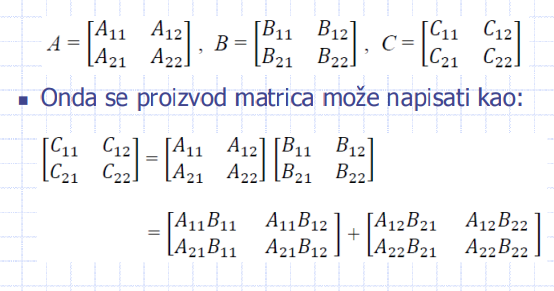
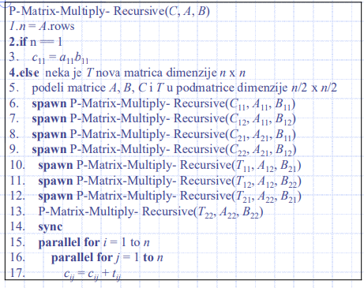

# Проектирование параллельных алгоритмов II

## Примеры параллельных алгоритмов, Часть I

### Параллельные алгоритмы для умножения матриц


# Алгоритмы умножения матриц

Здесь представлены три параллельных алгоритма:

1. **Прямой алгоритм с тремя вложенными циклами:**
    - Этот алгоритм использует три вложенных цикла для умножения матриц. Каждый элемент выходной матрицы вычисляется путем суммирования произведений элементов соответствующих строк и столбцов входных матриц.
   
2. **Параллельный алгоритм на основе принципа "разделяй и властвуй":**
    - Этот алгоритм разделяет матрицы на подматрицы и рекурсивно умножает их. Затем результаты объединяются для получения конечного результата. Этот подход может быть параллельно выполнен на нескольких процессорах или ядрах.

3. **Параллельный алгоритм Страссена:**
    - Этот алгоритм использует метод "разделяй и властвуй", но с использованием более эффективных операций умножения матриц, чтобы уменьшить количество необходимых операций. Это особенно полезно для больших матриц.


# Прямой алгоритм

Этот алгоритм основан на параллелизации циклов в стандартном последовательном алгоритме с тремя вложенными циклами for.

Результатом является процедура P-Square-Matrix-Multiply:

```python
P-Square-Matrix-Multiply(A, B)
1. n = A.rows
2. Пусть C - новая матрица размером n x n
3. parallel for i = 1 до n
4.   parallel for j = 1 до n
5.     cij = 0
6.     for k = 1 до n
7.       cij = cij + aik * bkj
8. return C
```

В этой процедуре матрицы A и B умножаются, и результат записывается в матрицу C. Каждый элемент C вычисляется параллельно, что позволяет ускорить процесс умножения матриц за счет использования множества параллельных вычислений.

# Анализ прямого алгоритма

## Работа:

- **Сериализация:** Код с тремя вложенными циклами for имеет сложность $$\( T_1(n) = \Theta(n^3) \)$$, так как у нас есть \( n^3 \) итераций.
  
- **Распределение:**
  - $$\( T_\infty(n) = \Theta(n) \)$$, так как распределение для цикла parallel for составляет \( \Theta(\log n) \), а для обычного цикла \( \Theta(n) \); следовательно, в общем: \( \Theta(n) \).

## Параллелизм:

$$\[ \frac{\Theta(n^3)}{\Theta(n)} = \Theta(n^2) \]$$

## Задание:

- Параллелизуйте внутренний цикл, чтобы получить параллелизм \( \Theta(n^3/\log n) \).
- Простая замена на parallel for приводит к гонке данных!


# Алгоритм по принципу "разделяй и властвуй" (1/2)

При подходе "разделяй и властвуй" исходная проблема делится на более мелкие проблемы.

- Матрицы A, B и C размером \( n \times n \) разбиваются на четыре подматрицы размером \( n/2 \times n/2 \):

Затем произведение матриц может быть записано как


# Алгоритм по принципу "разделяй и властвуй" (2/2)

- **Базовый случай:** строка 3
- **Рекурсивный случай:** строки 4-17
  - Рекурсивные вызовы в строках 6-13 выполняют 8 умножений подматриц.
  - Промежуточные произведения в матрицах C и T объединяются с помощью двух вложенных параллельных циклов for в строках 15-18.
  

# Анализ процедуры P-Matrix-Multiply-Recursive (1/2)

## Работа:

- Разделение матриц за время \( \Theta(1) \), восемь рекурсивных умножений подматриц, и сложение матриц C и T в двух вложенных циклах за время \( \Theta(n^2)\):
  - $$ \( T_1(n) = 8 \cdot T_1(n/2) + \Theta(n^2) \)$$

## Решение:

- Согласно первому случаю теоремы о мастере:
  - \( T_1(n) = \Theta(n^3) \)

## Работа этого параллельного алгоритма асимптотически эквивалентна работе прямого алгоритма.


# Анализ процедуры P-Matrix-Multiply-Recursive (2/2)

## Распределение:

- Распределение при разделении матрицы составляет \( \Theta(1) \), распределение двух вложенных циклов parallel for в строках 15-17 составляет \( \Theta(\log n) \), распределение 8 параллельных рекурсивных вызовов = максимум из них = распределение любого из этих вызовов. В общем:
  - $$\( T_\infty(n) = T_\infty(n/2) + \Theta(\log n) \)$$
## Решение:
- $$ \( T_\infty(n) = \Theta(\log^2 n) \)$$ с использованием метода замены.
- Метод мастер-теоремы не применим. Почему?
## Параллелизм:
- $$\( \frac{T_1(n)}{T_\infty(n)} = \Theta\left(\frac{n^3}{\log^2 n}\right) \)$$
- Это очень высокий параллелизм.

## Алгоритм Штрассена для умножения матриц (1/3)

- Ключевое значение имеет то, что рекурсивное дерево становится менее разветвленным.
- Вместо 8 умножений матриц размером \( n/2 \times n/2 \), он выполняет 7.
- Цена за устранение одного матричного умножения:
  - Несколько матричных сложений.
  - Однако, постоянное количество матричных сложений.


# Метод Штрассена для умножения матриц (2/3)

Метод Штрассена основан на следующих трансформациях:


# Метод Штрассена для умножения матриц (3/3)

Метод состоит из следующих четырех шагов:
1. Разделить матрицы A, B и C на подматрицы размером \( n/2 \times n/2 \). Этот шаг занимает \( \Theta(1) \) времени.
2. Создать 10 матриц \( S_1, S_2, \ldots, S_{10} \). Этот шаг занимает \( \Theta(n^2) \) времени.
3. Рекурсивно вычислить семь матричных произведений \( P_1, P_2, \ldots, P_7 \).
4. Вычислить желаемые подматрицы \( C_{11}, C_{12}, C_{21}, C_{22} \) матрицы C. Этот шаг занимает \( \Theta(n^2) \) времени.

## Анализ метода Штрассена

- Цель: определить время выполнения \( T(n) \).
- Для \( n=1 \) сводится к простому скалярному умножению: \( \Theta(1) \).
- Для \( n > 1 \) шаги 1, 2 и 4 требуют \( \Theta(n^2) \) времени, а шаг 3 требует семь умножений матриц размерности \( n/2 \times n/2 \).
- Рекурсивное соотношение для времени выполнения \( T(n) \):
- 
  - Применяя метод мастер-теоремы, получаем решение этого соотношения:
  - \( T(n) = \Theta(n \log 7) \).
- Асимптотически быстрее, чем прямое умножение матриц.

# Параллельный метод Штрассена

Параллельный метод Штрассена состоит из следующих четырех шагов:

1. Разделить матрицы A, B и C на подматрицы размером \( n/2 \times n/2 \). Этот шаг занимает время \( \Theta(1) \) и имеет тот же диапазон.
2. С использованием двух вложенных циклов parallel for создать 10 матриц \( S_1, S_2, \ldots, S_{10} \). Этот шаг имеет время выполнения \( \Theta(n^2) \) и диапазон \( \Theta(\log n) \).
3. Рекурсивно вычислить семь матричных произведений \( P_1, P_2, \ldots, P_7 \).
4. С использованием двух вложенных циклов parallel for вычислить желаемые подматрицы \( C_{11}, C_{12}, C_{21}, C_{22} \). Время выполнения этого шага составляет \( \Theta(n^2) \), а диапазон \( \Theta(\log n) \).

## Анализ параллельного метода Штрассена

### Работа:

- Сериализация = оригинальный алгоритм
  - \( T_1(n) = \Theta(n \log 7) \)

### Распределение:

- Семь рекурсивных вызовов выполняются параллельно.
- Получаем ту же рекурсию, что и для P-Matrix-Multiply-Recursive.
  - \( T_\infty(n) = \Theta(\log^2 n) \)

### Параллелизм:

- \( \frac{T_1(n)}{T_\infty(n)} = \Theta\left(\frac{n \log 7}{\log^2 n}\right) \)
- Немного ниже, чем параллелизм P-Matrix-Multiply-Recursive.
