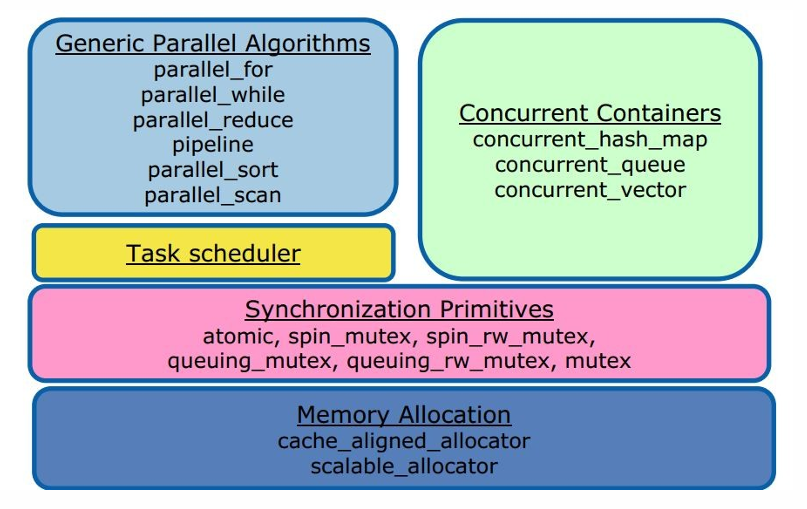
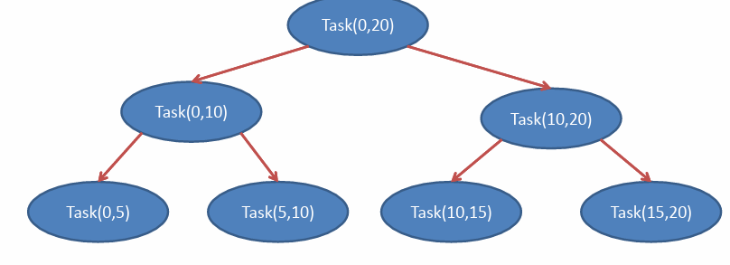

# Учебник: TBB, Часть I
## Содержание
- Введение в TBB
- Параллельные циклы

## Введение
- Intel Threading Building Blocks (TBB) - это библиотека на языке C++, которая абстрагирует детали работы с потоками.
- Использует шаблоны C++.
- По сравнению с явным использованием потоков, требуется меньше строк кода для достижения параллелизма.
- Программы переносимы на различные платформы.
- Библиотека масштабируема. При увеличении количества доступных процессоров не требуется написание нового кода.

## Ограничения
- TBB не рекомендуется для:
  - Обработки с ограниченным вводом/выводом.
  - Обработки в реальном времени с жесткими ограничениями (hard-real time processing).
- TBB не является инструментом, который обязательно приводит к оптимальному решению.

## Компоненты


# Последовательный цикл for
- Предположение: итерации цикла взаимно независимы.
- Последовательный код:
```cpp
void SerialApplyFoo(float a[], size_t n) {
    for (size_t i = 0; i != n; i++)
        Foo(a[i]);
}
```

## parallel_for цикл

```cpp
#include "tbb/tbb.h"
#include "tbb/parallel_for.h"

using namespace tbb;

class ApplyFoo { // **Тело цикла как объект-функция**
    float *const my_a;

public:
    void operator()(const blocked_range<size_t>& range) const {
        float *a = my_a;
        for (size_t i = range.begin(); i != range.end(); ++i)
            Foo(a[i]);
    } // `operator()` должен иметь квалификатор `const` в качестве защиты от попыток аккумулирования побочных эффектов, которые могли бы потеряться из-за частных копий каждого потока.

    ApplyFoo(float *a) : my_a(a) {}
};

void ParallelApplyFoo(float a[], size_t n) {
    parallel_for(blocked_range<size_t>(0, n), //Итерационное пр-во
                 ApplyFoo(a),
                 auto_partitioner()); // указание разделения пространства.
}
```

# Цикл `parallel_for`
- Итерационное пространство идет от 0 до n.
- Шаблонная функция `parallel_for` разделяет это пространство на части, над которыми будут выполняться операции в отдельных независимых потоках.
- Первый шаг в параллелизации - преобразование тела цикла в форму, которая оперирует частью итерационного пространства (объект тела).
- Объект тела представляет то, что будет выполняться над каждой частью итерационного пространства, вызывая оператор ().

## Цикл `parallel_for`
- `blocked_range<T>` - это шаблонный класс в библиотеке TBB.
- Описывает одномерное итерационное пространство с нижней и верхней границей.
- Алгоритм `parallel_for` может работать с различными итерационными пространствами, и поэтому в аргументах принимает параметры `Range` и `Body`, то есть итерационное пространство и тело цикла.

# Цикл `parallel_for`
- Кроме границ, в `blocked_range` также передаются тип элементов, и при необходимости можно указать параметр `grain_size`.
- Этот параметр представляет собой грануляцию итерационного пространства, и его следует изменять эмпирически, чтобы определить оптимальное значение для данного компьютера.
- Необходимо учесть, что слишком маленькое или большое значение может существенно снизить производительность из-за насыщения.

# Цикл `parallel_for`
- Например, если у нас есть итерационное пространство из 10 элементов, и мы хотим, чтобы над ним работали ровно 2 потока/процессора, то `grain_size` следует установить в значение 5.
- Если такой код запустить на машине с 4 или 8 ядрами, максимум 2 из них будут задействованы.
- В качестве третьего параметра для `parallel_for` можно указать `auto_partitioner()`, который автоматически определяет "удачное" значение для `grain_size`.

# Цикл `parallel_for`
- Требования к объекту тела (`body object`):
  - Должен существовать конструктор копии (может быть по умолчанию), так как каждый поток должен получить свою копию объекта.
  - Должен существовать деструктор (может быть по умолчанию).
  - Перегрузка оператора `()` должна быть `const` по причине того, что необходимо обеспечить, чтобы ни одна из копий объекта тела не изменяла атрибуты класса в рамках своего вызова оператора `()`. Таким образом, предотвращается зависимость между итерациями.
# Цикл `parallel_for`

- Возможно "обмануть" `parallel_for`, используя глобальные переменные, но это не является хорошей практикой. - Например:  
  ```cpp
  for (i=0; i < n; i++)
      a[i] = c;
      if (i == 3)
          c = 5;
```

- Если `c` является глобальной переменной, все будет в порядке, но структура `parallel_for` будет нарушена. Если `c` является полем класса, `const operator()` предотвратит компиляцию такого цикла

# Синтаксис цикла `parallel_for`
```cpp

template <typename Range, typename Body>
void parallel_for(const Range& range,
                  const Body& body
                  [, partitioner [, task_group_context));
```

- Требования к `Body` B:
  - `B::B(const B&)` - конструктор копирования.
  - `B::~B()` - деструктор, уничтожение копии.
  - `void B::operator()(Range& subrange) const` - обработка поддиапазона.

- `parallel_for` выделяет поддиапазоны рабочим потокам.
- `parallel_for` не интерпретирует значение диапазона.

# Пример 1: параллельное усреднение

```cpp
#include "tbb/blocked_range.h"
#include "tbb/parallel_for.h"
using namespace tbb;

struct Average {
    float* input;
    float* output;

    void operator()(const blocked_range<int>& range) const {
        for (int i = range.begin(); i != range.end(); ++i)
            output[i] = (input[i - 1] + input[i] + input[i + 1]) * (1 / 3.0f);
    }
};

// Note: The input must be padded such that input[-1] and
// input[n] can be used to calculate the first and last
// output values.
void ParallelAverage(float* output, float* input, size_t n) {
    Average avg;
    avg.input = input;
    avg.output = output;
    parallel_for(blocked_range<int>(0, n, 1000), avg);
}
```

# Пример 1: Параллельное усреднение
- Программа вычисляет среднее значение каждых 3 элементов входного массива.
- `output[i] = (input[i-1] + input[i] + input[i+1]) * (1/3.0f);`
- Необходимо создать отдельный класс или структуру, в чьем перегруженном операторе `()` будет содержаться тело цикла `paralel_for`.
- Также создать отдельную функцию, в которой будет вызван цикл `paralel_for` с передачей соответствующих параметров.

# Редукторы
- Редукторы применяются при использовании функций, таких как sum, max, min или логическое И ко всем элементам массива.
- Операции должны быть ассоциативными.
- Последовательный код:
  ```cpp
  float SerialSumFoo(float a[], size_t n) {
      float sum = 0;
      for(size_t i = 0; i != n; ++i)
          sum += Foo(a[i]);
      return sum;
  }
```
- Если итерации цикла независимы, цикл может быть параллелизирован.

```cpp
#include "tbb/blocked_range.h"
#include "tbb/parallel_reduce.h"

class SumFoo {
    float* my_a;

public:
    float sum;

    void operator()(const blocked_range<size_t>& r) {
        float* a = my_a;
        for (size_t i = r.begin(); i != r.end(); ++i)
            sum += Foo(a[i]);
    }

    // Разделяющий конструктор отличается от
    // конструктора копии с использованием фиктивного аргумента
    SumFoo(SumFoo& x, split) : my_a(x.my_a), sum(0) {}

    void join(const SumFoo& y) {
        sum += y.sum;
    }

    // Метод join вызывается каждый
    // раз, когда нить завершает свою задачу
    // и должна объединить свой результат с
    // телом базового объекта.
    SumFoo(float a[]) : my_a(a), sum(0) {}
};

void ParallelReduceFoo(float a[], size_t n) {
    SumFoo sumFoo(a);
    parallel_reduce(blocked_range<size_t>(0, n), sumFoo);
    float result = sumFoo.sum;
}
```

- `parallel_reduce` применяется для выполнения операции редукции (в данном случае, суммирование) на элементах массива.
- Класс `SumFoo` определяет оператор `()`, разделяющий конструктор и метод `join`, который вызывается для объединения результатов нитей.
- `parallel_reduce` автоматически управляет разделением задач и объединением результатов.
- Оператор() не является константой, поскольку частные копии тела объекта должны объединиться в одну (обновить слияние в одну (обновить SumFoo::sum)

# `parallel_reduce`
- Причина того, почему `parallel_reduce` требуется и должен обновлять общее поле `sum`, заключается в том, чтобы произвести операцию редукции и аккумуляции.
- Разделяющий конструктор имеет параметр `split`, который является фиктивным аргументом, определенным TBB для того, чтобы конструктор копии отличался от разделяющего конструктора.
- Разделяющий конструктор принимает в качестве параметра ссылку на оригинальный объект, и второй параметр игнорируется.

# `parallel_reduce`
- Как работает редукция?
- Когда какая-то нить свободна и доступна для выполнения задачи, вызывается разделяющий конструктор `parallel_reduce`, в котором создается подзадача, которая назначается этой нити.
- Когда нить завершает свою задачу, вызывается метод `join`, с помощью которого `parallel_reduce` аккумулирует результат подзадачи.

**parallel_reduce**
**parallel_reduce(blocked_range(0,20,5))****


# Редукторы
- Необходимо учитывать, что при параллельной редукции могут возникнуть различные результаты из-за округления.
- Причина этого заключается в том, что операции не всегда выполняются в том же порядке, что и в последовательном решении, поэтому может произойти ошибка округления.
- Пример: суммирование большого массива, в котором есть как очень большие, так и очень малые значения.

```cpp
#include <float.h>  // For FLT_MAX

// Пример 2: Поиск индекса минимального элемента в массиве
long SerialMinIndexFoo(const float a[], size_t n) {
    float value_of_min = FLT_MAX;
    long index_of_min = -1;

    for (size_t i = 0; i < n; ++i) {
        float value = Foo(a[i]);

        if (value < value_of_min) {
            value_of_min = value;
            index_of_min = static_cast<long>(i);
        }
    }

    return index_of_min;
}
```

- В данном коде реализован поиск индекса минимального элемента в массиве с использованием последовательной реализации.
- Значение `FLT_MAX` представляет максимальное положительное значение для типа `float` и используется для инициализации переменной `value_of_min`.
- Используется цикл, в котором проверяется каждый элемент массива, и если текущий элемент меньше текущего минимального значения, значения обновляются. Функция возвращает индекс найденного минимального элемента.

- Цикл запоминает текущее минимальное значение и его индекс. Это единственная информация, которая передается через итерации цикла.

# `parallel_sort`
- Сортировка сравнением с средней временной сложностью O(n log n) на однопроцессорной системе, где n - количество элементов в массиве. С увеличением числа процессоров сложность уменьшается до O(n).
- Когда доступны рабочие нити, `parallel_sort` создает подзадачи, которые могут выполняться конкурентно, что приводит к сокращению времени выполнения.
- Сортировка детерминирована. Сортировка одного и того же массива каждый раз приведет к одному и тому же результату.

```cpp
#include <algorithm>

// Количество элементов в массиве
const int N = 100;

void SortExample() {
    float a[N], b[N];

    for (int i = 0; i < N; i++) {
        a[i] = sin(static_cast<double>(i));
        b[i] = cos(static_cast<double>(i));
    }

    // Параллельная сортировка массива 'a' в возрастающем порядке
    parallel_sort(a, a + N);

    // Параллельная сортировка массива 'b' в убывающем порядке, используя std::greater<float>
    parallel_sort(b, b + N, std::greater<float>());
}
```

Вот несколько полезных ресурсов для изучения параллельного программирования с использованием TBB:

1. **Самостоятельное выполнение примеров:**
   - Работайте с предложенными примерами, чтобы углубить свои навыки в параллельном программировании с использованием TBB.

2. **Книга "Параллельное программирование":**
   - Изучите книгу "Параллельное программирование", чтобы получить более глубокое понимание концепций и техник параллельного программирования.

3. **Документация TBB:**
   - Изучите официальную документацию TBB, включая руководства по программированию и справочники, чтобы получить более подробную информацию и решения задач.
