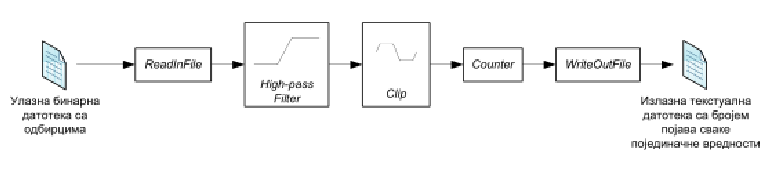

```table-of-contents
title: # Содержание 
style: nestedList # TOC style (nestedList|inlineFirstLevel)
minLevel: 0 # Include headings from the specified level
maxLevel: 0 # Include headings up to the specified level
includeLinks: true # Make headings clickable
debugInConsole: false # Print debug info in Obsidian console
```
# Конкурентные контейнеры
- Intel TBB предоставляет контейнеры, которые могут быть безопасно использованы конкурентно.
- Конкурентные операции небезопасны для STL (Standard Template Library) контейнеров.
- Обычно STL контейнеры блокируются с эксклюзивным доступом, что снижает параллелизм.
- Контейнеры TBB имеют более низкую производительность по сравнению со STL, если их использует один поток, но они обладают лучшей масштабируемостью.
- Они могут использоваться с TBB, OpenMP или обычными (pthread/c++11) потоками.
## Конкурентная очередь concurrent_queue\<T\>
- Сохраняет локальный порядок FIFO (First-In-First-Out).
- Если один поток помещает, а другой извлекает два значения из очереди, они выходят в том же порядке, в котором были помещены. Если несколько потоков помещают и извлекают значения конкурентно, порядок FIFO не гарантирован.

- Операции извлечения из очереди:
	- Неблокирующая: bool try_pop(T&)
- Встроенная поддержка итерации по очереди при отладке.
### Конкурентный вектор concurrent_vector\<T\>
- Динамически расширяемый массив типа T.
- `grow_by(n)` - увеличивает размер на n.
- `grow_to_at_least_(n)` - увеличивает размер до минимум n.
- Элементы не перемещаются при расширении вектора.
- Возможен конкурентный доступ и расширение.
- Методы для удаления и уничтожения вектора не безопасны для конкурентного выполнения с методами доступа или расширения.
### Конкурентная мапа concurrent_hash_map\<Key,T,HashCompare\>
- Ассоциативная таблица, которая отображает ключ Key на элемент типа T.
- `HashCompare` - класс, определяющий способ создания и сравнения ключей.
- Позволяет конкурентный доступ для чтения и записи:
	- `bool insert(accessor &result, const Key &key)` для добавления или изменения,
	- `bool find(accessor &result, const Key &key)` для поиска с возможностью изменения,
	- `bool find(const_accessor &result, const Key &key)` для доступа,
	- `bool erase(const Key &key)` для удаления.

- Поведение аналогично контейнеру элементов` std::pair<const Key, T>`.
- Доступ к таким элементам предполагает чтение или обновление их значений.
- Для чтения используется класс `const_accessor`, а для обновления - обычный `accessor`.
- Только один `accessor` может изменять элемент в один момент времени, но несколько const_accessor-ов могут одновременно считывать один и тот же элемент параллельно.

- Объект освобождается неявно в конце блока, в котором определен аксессор, или явно вызовом метода `accessor.release()`.
- С момента вызова `insert` или `find`, то есть с момента первого использования и до уничтожения объекта, доступ будет активен, то есть доступ к карте будет заблокирован.
- Поэтому рекомендуется освободить этот объект как можно скорее.
- Структура типа `accessor` имеет 2 поля:
	- `first`, представляющее ключ,
	- `second`, представляющее значение.
- Пример: `StringTable::accessor a; key: a->first value: a->second`.

Пример 2: concurrent_hash_map
В примере создается конкурентная карта, где ключи - это строки, а соответствующие данные представляют количество вхождений каждой строки в заданном массиве.

```cpp
#include <tbb/concurrent_hash_map.h>
#include <tbb/parallel_for.h>
#include <tbb/blocked_range.h>
#include <string>

using namespace tbb;
using namespace std;

// Объявление типа concurrent_hash_map
typedef concurrent_hash_map<string, int, MyHashCompare> StringTable;

// Функциональный объект для подсчета вхождений строк
struct Tally {
    StringTable& table;

    Tally(StringTable& table_) : table(table_) {}

    void operator()(const blocked_range<string*> range) const {
        for (string* p = range.begin(); p != range.end(); ++p) {
            StringTable::accessor a;
            table.insert(a, *p);
            a->second += 1;
        }
    }
};

int main() {
    // Пример использования
    StringTable table;

    // Пример строки для подсчета вхождений
    string exampleStrings[] = {"example1", "example2", "example1", "example3", "example2"};

    // Запуск параллельного цикла для подсчета вхождений
    parallel_for(blocked_range<string*>(exampleStrings, exampleStrings + 5), Tally(table));

    return 0;
}```

Структура HashCompare:
- Имеет метод `hash`, который определяет способ хеширования; он может быть сложным, как в примере ниже, или простым, например, `return x;`.
- Имеет метод `equal`, который используется для сравнения элементов.

```cpp
struct MyHashCompare {
    static size_t hash(const string& x) {
        // Пример сложного метода хеширования
        size_t h = 0;
        for (const char c : x) {
            h = (h * 31) ^ c;
        }
        return h;
    }

    static bool equal(const string& a, const string& b) {
        // Пример метода сравнения
        return a == b;
    }
};
```
# Синхронизация
- TBB предлагает два механизма взаимного исключения:
	- Мьютексы: блокировка объекта доступа, взаимное исключение чтения и записи.
	- Атомарные операции: основаны на атомарных операциях, предоставляемых процессором. Они проще и быстрее мьютексов, но ограничены более узким набором типов данных.
## Мьютексы: spin_mutex
- Поток, который пытается заблокировать уже заблокированный `spin_mutex`, должен ждать, пока он не будет разблокирован.
- `spin_mutex` удобен, когда им нужно заблокировать несколько инструкций.
- Обязательно давать имя объекту блокировки, в противном случае компилятор C++ может удалить его слишком рано.

Пример:
```cpp
#include <tbb/spin_mutex.h>

struct Node {
    Node* next;
    // other members...
};

Node* Freelist;
typedef tbb::spin_mutex FreeListMutexType;
FreeListMutexType FreeListMutex;

Node* AllocateNode() {
    Node* n;
    {
        FreeListMutexType::scoped_lock mylock(FreeListMutex);
        n = Freelist;
        if (n)
            Freelist = n->next;
    }
    if (!n)
        n = new Node();
    return n;
}

void FreeNode(Node* n) {
    FreeListMutexType::scoped_lock mylock(FreeListMutex);
    n->next = Freelist;
    Freelist = n;
}
```
## Атомарные операции
- Другие потоки видят атомарные операции как мгновенные.
- Пример: Если есть только один поток, можно написать:
```cpp
  if (x == 0) 
      action();
  --x;
```

  Однако, если есть несколько потоков, операции двух задач могут перепутаться:
  - Task A:
```cpp
Ta = x
x = Ta - 1
if (x==0)
```

- Task B:
```cpp
Tb = x
x = Tb - 1
if (x==0)
```


- Чтобы решить эту проблему, нужно обеспечить, чтобы только один поток выполнял декрементацию в любой момент времени, и чтобы проверка значения выполнялась над результатом декремента.
- Метод `atomic<int>::operator--` действует автоматически; никакой другой поток не может вмешаться.
```cpp
atomic<int> x;
if (--x == 0)
    action();
```

# Приготовление для Задачи 1
- `Extern` - указывает, что переменная объявлена в другом файле (вне текущей области видимости).
- Одна из причин использования `extern` состоит в том, чтобы некоторые данные можно было использовать в нескольких файлах без лишнего копирования.
- В случае, если связыватель не может найти данную переменную/функцию, которая объявлена как `extern`, возникнет ошибка "Unresolved External Symbol".

- На каждой стрелке находится какая-то структура данных, которая в "соседних" файлах определена как внешняя.
- Если вы изменяете что-то в одном файле, вы должны изменить это во всех остальных, чтобы избежать ошибок.
