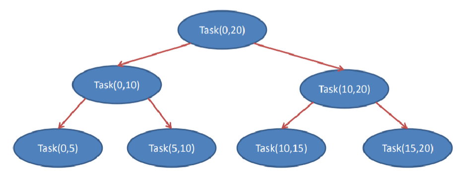
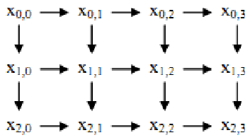

```table-of-contents
title: # Содержание 
style: nestedList # TOC style (nestedList|inlineFirstLevel)
minLevel: 0 # Include headings from the specified level
maxLevel: 0 # Include headings up to the specified level
includeLinks: true # Make headings clickable
debugInConsole: false # Print debug info in Obsidian console
```
# Введение
- Распределитель задач является основой шаблона петель.
- Шаблоны петель (например, `parallel_for`) скрывают сложность распределителя.
- Когда проблема (алгоритм) не соответствует шаблону высокого уровня петли, можно напрямую использовать распределитель задач.
- Можно создавать новые шаблоны высокого уровня.
## Лямбда-выражения
- Часть языка C++ с версии C++11.
- Определяют анонимный функциональный объект на месте вызова.
- Обычно используются для инкапсуляции нескольких строк кода, которые передаются алгоритмам или асинхронным методам (случай, который мы будем использовать в этом курсе).

### Части лямбда-выражения
```cpp
[=/&] () mutable throw() -> int{}
```
1. `[=/&]` - спецификатор захвата (в наших примерах мы будем использовать `[&]` для указания на доступ к переменным по ссылке)
2.  `()` - список параметров функции (может быть пустым)
3. `mutable` - ключевое слово mutable (необязательно)
4. `throw()` - список исключений, которые может возбудить лямбда (необязательно)
5. `-> int` - возвращаемый тип (необязательно)
6. `{}` - тело лямбда-выражения
В наших примерах мы будем использовать только части 1 (с указанием `[&]` для доступа к переменным по ссылке) и 6 (тело лямбда-выражения).

# Программирование на основе задач
- Лучше формулировать программу с помощью логических задач, а не потоков, по нескольким причинам:
	- Внедрение параллелизма с использованием доступных ресурсов.
	- Более быстрое создание и уничтожение задачи.
	- Эффективная оценка.
	- Лучшее балансирование нагрузки.
	- Мышление на высоком уровне.

- Потоки, созданные с использованием доступных пакетов, будут логическими потоками, которые отображаются на физические потоки (т.е. Ядра) процессора.
- Для вычислений, не зависящих от внешних событий, максимальная эффективность достигается, когда ровно один логический поток выполняется в пределах одного физического.

Возможные проблемы:
- Логических потоков меньше, чем физических.
- Логических потоков больше, чем физических.

- Вторая проблема более серьезна, поскольку она приводит к выполнению логических потоков в кусочках времени (time slice), что требует дополнительного времени выполнения.
- Распределитель пытается избежать этой проблемы, создавая один логический поток на один физический поток, отображая задачи на логические потоки и учитывая помехи с другими потоками того же или другого процесса.

- Важное преимущество задач по сравнению с потоками заключается в том, что они намного лучше в плане времени создания и уничтожения (на Linux OS до 18 раз быстрее, на Windows даже до 100 раз):
	- Потоки, в отличие от задач TBB, имеют свою локальную копию многих ресурсов (регистров, кэш-памяти и т. д.), а также свой идентификатор процесса (process id).
	- TBB задача, как правило, представляет собой только небольшую подпрограмму.

- Задачи TBB также эффективны, потому что планирование неравномерно (несправедливо).
- Обычно временные интервалы назначаются круговым образом (справедливо), потому что это самая безопасная стратегия, которую можно принять без знания более высокого уровня организации программы.
- Однако, поскольку TBB имеет информацию о более высоком уровне программы, он может жертвовать справедливостью ради эффективности.

- Распределитель работает по балансировке нагрузки (load balancing):
	- Помимо использования подходящего количества потоков, необходимо равномерно распределить задачи по доступным потокам.
	- Программа должна быть разбита на достаточно маленькие задачи (но не слишком маленькие), чтобы распределитель корректно распределил задачу потоку для балансировки нагрузки.
  
Совет: Проектировать программу таким образом, чтобы она создавала значительно больше задач, чем потоков, и оставить распределение задач на потоки распределителю.

- Основное преимущество задач по сравнению с потоками - это возможность мышления на более высоком уровне.
- При работе с потоками необходимо мыслить на низком уровне физических потоков для достижения высокой эффективности (один логический поток на один физический).
- Кроме того, необходимо работать с достаточно грубым разделением потоков.
- С задачами можно сосредоточиться на логических зависимостях задач, а распределение оставить самому распределителю.
## Когда не следует использовать программирование на основе задач
- Распределитель задач предназначен для высокопроизводительных алгоритмов, состоящих исключительно из неблокирующих задач.
- Он также может быть полезен, когда задача иногда (редко) блокируется.
- Однако, если нити часто блокируются (ожидание ввода/вывода, семафоры и т. д.), производительность снижается (пока нить заблокирована, она не выполняет никаких задач).
## Заключение о TBB задачах
- Распределитель задач работает наиболее эффективно, когда у нас есть шаблон "разветвление-присоединение" (fork-join).
- Должно быть достаточно разветвлений, чтобы создать достаточно большое количество задач, чтобы все потоки всегда были заняты и могли "украсть" часть работы от других потоков по мере завершения своей работы.

# Примеры
## Пример 1 – Фибоначчиеви числа
- Пример вычисления n-го числа Фибоначчи.
- Использует неэффективный способ вычисления, но демонстрирует основы библиотеки задач, используя простой шаблон рекурсивных задач.
- Шаблон рекурсивных задач TBB позволяет создавать больше задач, что является условием для масштабируемого ускорения в программировании на основе задач.
### Последовательный код

```cpp
long SerialFib(long n) {
    if (n < 2) return n;
    else return SerialFib(n - 1) + SerialFib(n - 2);
}
```

### Код наивысшего уровня для параллельной версии на основе задач
```cpp
long ParallelFib(long n) {
    long sum;
    task_group g; //группа задачи
    // ...
    // [&] - Вызов лямбда-выражения, которое обращается к параметрам по
	//ссылке.
	// g.run(....) - Создание и запуск задачи
    g.run([&] { x = ParallelFib(n - 1); });
    g.run([&] { y = ParallelFib(n - 2); });
    g.wait(); //синхронизация
    return sum;
}
```

- Прежде всего создается группа задач (task_group g).
- Когда мы достигаем места, где нужно вызвать параллелизм (в этом случае при рекурсивном вызове), вызывается метод run.
- Этому методу передается лямбда-выражение, которое выполняет вычисление, которое нас интересует.
- `g.run([&]{ x = ParallelFib(n - 1); });`
- Поскольку эти ветви могут выполняться параллельно, вызывается столько run-ов, сколько вычислений может быть выполнено параллельно, после чего следует вызов.
- `g.wait();`

- Происходит создание структуры fork-join, которая соответствует шаблону "разделить и властвовать", как это было в случае с редуктором.



- Такая задача описана с немного большим кодом по сравнению с `SerialFib`, потому что она выражает параллелизм на основе задач без использования каких-либо дополнений к стандартному C++.
- Метод `ParallelFib` сначала проверяет, является ли значение числа, для которого в данный момент выполняется вычисление, меньше порогового значения (которое в данном случае экспериментально определено как 16), потому что в этом случае последовательный алгоритм быстрее.

- Переход к последовательному алгоритму в случае маленькой задачи является характеристикой шаблона параллелизма "разделить и властвовать".
- В блоке `else` создаются две дочерние задачи, которые вычисляют $(n-1)-е$  и $(n-2)-е$  число Фибоначчи.
- Этот процесс повторяется и создается большое количество задач.
- Распределитель может сразу же запускать задачи, как только они созданы, потому что они независимы друг от друга.

- На первый взгляд может показаться, что параллелизм ограничен, потому что создаются всего две дочерние задачи, но трюк заключается в рекурсивном параллелизме:
  - Каждая из двух дочерних задач создает новые две дочерние задачи и так далее до тех пор, пока $n < Cutoff$.
- Преимущество распределителя задач заключается в том, что он преобразует этот потенциальный параллелизм в реальный параллелизм очень эффективным способом, выбирая задачи для выполнения таким образом, чтобы удерживать физические потоки занятыми с относительно небольшим переключением контекста потоков.

## Пример 2 – Quick Sort
- Алгоритм "быстрой" сортировки.
- Элемент считается отсортированным, если все элементы слева от него меньше, а все справа больше (независимо от того, отсортированы ли сами элементы слева/справа).
- Также использует шаблон "разделить и властвовать", так же как и рекурсивная реализация вычисления N-го элемента последовательности Фибоначчи.

## Пример 3 – WaveFront (1/3)
- Симуляция волнового фронта.
- Сначала выполняются элементы сверху и слева, затем элементы снизу и справа.


- Для синхронизации используются атомарные переменные, операции над которыми являются "неделимыми" с точки зрения других потоков.

- Каждая задача берет свое значение и прибавляет к нему значение задачи выше и слева от нее.
- Задача запускается только тогда, когда значение ее атомарной переменной равно 0.
- В этом примере граничные задачи неактивны, но решение можно модифицировать так, чтобы не требовался слой задач, которые ничего не делают.
- Добавлена симуляция обработки, чтобы продемонстрировать, как достигается параллелизм.
