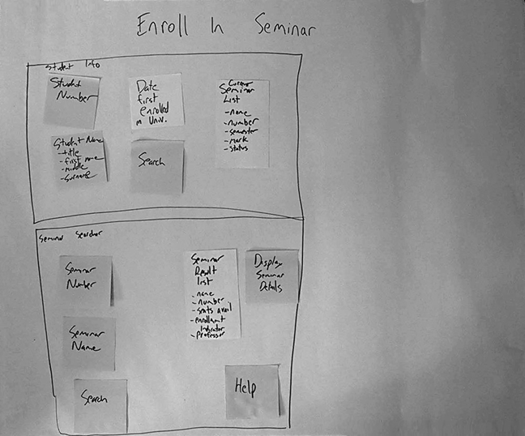

# Specifikacija i modeliranje softvera

Преподаватель:
Gordana Milosavljević, [milosavljevic.g@gmail.com](mailto:milosavljevic.g@gmail.com)

Ассистентка по практикам:
Milica Škipina, [m1l1c4@uns.ac.rs](mailto:m1l1c4@uns.ac.rs) *вот это стиль*

Содержание файла
- [Лекция 1](#лекция-1)

### Вводная часть

Цель предмета:
- Подготовка студентов к анализу и моделированию реальных систем
	- UML (Unified Modeling Language)
	- Инструменты моделирования (PowerDesigner, MagicDraw)

Фокус предмета:

На ваш взгляд, какую фазу самой сложной считаете для осуществления?

На тренировках мы сосредоточимся на итеративном-инкрементальном методе работы и принципах гибкого моделирования:
"ПЛАНИРУЙ НЕМНОГО,
	    АНАЛИЗИРУЙ НЕМНОГО,
		ПРОЕКТИРУЙ НЕМНОГО,
			РЕАЛИЗУЙ НЕМНОГО!"
Подходит для систем с высокой степенью неопределенности.

Примечание:
Усвоенное можно применять в рамках любой методологии, поскольку все они включают указанные этапы разработки.

##### Способ оценивания:
1. **Коллоквиум: 30 баллов**
2. **Коллоквиум: 30 баллов**
Экзамен можно сдать в течение семестра и в первые два срока июньской сессии.
Необходимо сдать оба коллоквиума.
Коллоквиумы предназначены для проверки знаний и реального применения изученных диаграмм UML.
**Проект: 40 баллов**
Защита проекта проходит в назначенный срок в июльском сессионном периоде.
Возможна дополнительная защита в сентябрьском периоде.
Дополнительные бонусы: активность, качество проекта...

**Проект:**
Платформа:
- MagicDraw
- Java или Python (по желанию)
- PyUnit или JUnit
- Svn или Git
Режим работы:
- В командах из 3-4 участников

Учебники:
1. Gordana Milosavljević, Uvod u modelovanje softvera
2. Scott W. Ambler, The Object Primer: Agile Model-Driven Development with UML 2.0, Cambridge University Press, 2004.
3. James Rumbaugh, Ivar Jacobson, Grady Booch, The Unified Modeling Language  Reference Manual, Second Edition, Addison-Wesley, 2004.
# Лекция 1

UML – *Unified Modeling Language*

Объединенный язык моделирования
- Изначально создавался с целью объединения и стандартизации различных нотаций, используемых для моделирования.
- Первую версию разработали Грейди Буч, Ивар Якобсон и Джеймс Рамбо в корпорации Rational Software в 1995 году.
- С 1997 года его дальнейшее развитие и поддержание были взяты на себя Object Management Group (OMG): www.omg.org/
- Все версии UML можно найти здесь: www.omg.org/spec/UML/
- Последняя версия - UML 2.5 от июня 2015 года.

> Модель - это упрощенное представление реальной системы, созданное с определенной целью.

Почему мы моделируем?
- Для более глубокого понимания системы, которую мы реализуем.
- Для упрощения коммуникации.
- Для исследования будущих характеристик строящейся системы.
- Для спецификации реализации.

**Виды моделей**
Дескриптивные
- используются для лучшего понимания явлений, коммуникации и прогнозирования явлений и поведения
Прескриптивные
- используются в качестве спецификации для построения конечной системы

**Исполняемые модели**
- Модели, записанные с использованием хорошо определенного языка, который поддерживает автоматический интерпретатор или генерацию кода компьютером.
- Используются в рамках Инженерии программного обеспечения, основанной на моделях (Model Driven Software Engineering - MDSE).

**Model Driven Software Development**
MDSD – Развитие программного обеспечения на основе моделей
- DSL – Языки, специфичные для области (Domain Specific Languages), которые используются для генерации кода
MDA – Архитектура, основанная на моделях (Model Driven Architecture)
- Модели, независимые от платформы (Platform Independent Model – PIM)
- Модели, зависимые от платформы (Platform Specific Model – PSM)

- Среды разработки Low Code
	- обычно графические среды
	- избегается классическое программирование
	- акцент на создании графической спецификации для различных аспектов системы
	- автоматическая генерация кода на основе спецификации или интерпретация спецификации
- Реализуют принципы Инженерии программного обеспечения, основанной на моделях (MDSE)
- Mendix
- Cuba
- ...

Mendix пример модели

Mendix дизайн экрана

Разделение диаграмм UML

UML Use-Case пример

UML диаграмма класса пример

Пример - диаграмма последовательности UML.

**Проблемы в разработке программного обеспечения**
**CHAOS Summary 2009**
- 32% проектов были реализованы вовремя, в рамках запланированного бюджета и с необходимой функциональностью.
- 44% проектов не были реализованы вовремя и в пределах запланированного бюджета и/или не имели требуемой функциональности.
- 24% проектов были прерваны.

**Проблемы**
- сложность реальных систем, для которых разрабатывается программное обеспечение
- социально-психологические
- в области коммуникации
- технические
- внешние воздействия
- ...

В области коммуникации:
- Пользователи обычно не обладают техническими знаниями в определенной области, а проектная команда стремится к обобщениям.
- Пользователи в основном занимаются конкретными вопросами своей работы, в то время как проектная команда пытается формировать обобщения.
- Различные документы, предлагаемые пользователям для утверждения, обычно имеют мало смысла для них.
- Джеймс Мартин представил результаты исследования, в котором было установлено, что 64% ошибок происходят на этапах анализа и проектирования, хотя пользователи подписали все документы, вытекающие из этих этапов.
- Многие процедуры и методы представлены в форме "скрытых" знаний, которые подразумеваются в рамках определенной области и обычно не выражаются в контакте с командой разработчиков.

Организационные проблемы
- Оперативные исполнители обычно знают только свои процедуры и, возможно, процедуры тех, с кем они непосредственно сотрудничают.
- Руководство обычно имеет общее представление о бизнес-процессах на уровне предприятия, но обычно не обладает детальными, оперативными знаниями, необходимыми для реализации информационной системы.
- Некоторые бизнес-процессы избыточны, противоречат друг другу или не вносят никакого вклада в предприятие.
- В случае децентрализованного предприятия возможно, что процедуры и процессы могут различаться в различных организационных подразделениях.

Соц-психологические проблемы
- Пользователи на более низких уровнях иерархии:
	- часто стесняются публично выражать свои потребности (особенно в присутствии руководства)
	- не хотят принимать решения, считая, что они недостаточно компетентны или что это не их обязанность
	- склонны соглашаться со всеми предложениями проектной группы (что радикально меняется после внедрения)
- "Владельцы" экспертных знаний, которые придают им определенную власть в их среде (субъективную или объективную), стремятся мистифицировать эти знания с целью "сохранения монополии".
- Если результатом внедрения информационной системы является изменение силовых отношений в предприятии, от тех, кто что-то теряет, нельзя ожидать искреннего участия и помощи.

Внешнее воздействие
- Разработка программного обеспечения осуществляется для нужд предприятий, которые подвергаются различным воздействиям:
- усилению конкуренции
- изменениям на рынке
- глобализации экономики
- быстрым технологическим изменениям

- Характер бизнеса в предприятиях быстро меняется, и программное обеспечение должно соответствовать этим изменениям предприятия.

Первая стадия разработки ПО:
- Сбор требований
- Основная цель - выявить потребности всех заинтересованных сторон (стейкхолдеров) в отношении программного обеспечения.

Заинтересованная сторона
- Люди или организации, которые активно участвуют в проекте или заинтересованы в его результатах
	- Заказчики
	- Инвесторы
	- Пользователи
	- Проектная группа
	- Различные организации, участвующие в проекте
	- .....

Эффективный сбор требований
- Используйте все доступные источники информации!
	- Интервью с пользователями разных уровней
	- Сессии брейншторминга
	- Наблюдение за активностями пользователей (этнографический подход)
	- Анализ реальных документов, которыми пользуются
	- Анализ функций существующего программного обеспечения, если оно существует
	- Схемы, экраны, отчеты
	- Анализ данных существующего программного обеспечения, если оно существует
	- Презентация прототипов
	- ....
- Не недооценивать проблему!

Требования
- Функциональные
	- Какие функции должно обеспечить программное обеспечение
- Нефункциональные (технические)
	- Производительность
	- Надежность
	- Безопасность
	- Доступность
	- ....
- Бизнес-правила
	- Условия, которые должны быть выполнены во время выполнения функций программного обеспечения

Когда собираются требования
- Не только в начале
	- Обычно в течение всего жизненного цикла проекта
- В начале необходимо выделить требования "в общих чертах" для формирования полного представления и возможности декомпозиции
- Позже для каждой декомпонированной части проводится подробное сбор требований.

Как собираются требования
- В зависимости от методологии
	- Пользовательские истории (user-stories)
	- Список требований (Product Backlog List)
	- Сценарии использования (use cases)
	- Основные сценарии использования
	- Системные сценарии использования
	- UML-диаграммы сценариев использования
	- Прототипы
	- ...

User stories
- Техника экстремального программирования (XP)
- Пользователи:
	- написание "пользовательских историй" (user stories) на картонных карточках
	- каждая история представляет собой определенную элементарную функцию
	- карточки имеют размеры, предотвращающие написание слишком длинных историй (обычно 3x5 дюймов)

Пользовательские истории
- техника экстремального программирования
- Шаблон:
- "Как <роль>, я хочу <цель> [чтобы <достигнуть выгоды>]"
- Пример:
	- Как кладовщик, я хочу видеть складскую карту с деталями движения товаров.
	- Как сотрудник кадровой службы, я хочу иметь возможность создавать основу для ежегодных отпусков.

Список требований (Product Backlog List) *(Список задач продукта)*
- Техника методологии SCRUM
- формируется собиранием требований, доступных на данный момент, от всех заинтересованных сторон:
	- непосредственных пользователей
	- управления
	- отделов продаж и маркетинга
	- отделов по оказанию поддержки пользователям
	- членов разработочной команды
- Список обновляется исключительно владельцем списка (чаще всего из числа пользователей):
	- определяет приоритеты
	- постоянно добавляет новые требования в сотрудничестве с заинтересованными сторонами.
- Проектная команда предоставляет владельцу списка оценки времени и энергии, необходимые для реализации отдельных требований.

UML случаи использования (пример)

Прототипы - примеры:

Прототипы
- Основная цель прототипов - помочь пользователям и разработческой команде лучше понимать друг друга.
- Прототипы пользовательского интерфейса также помогают оценить удобство использования разрабатываемого программного обеспечения на ранних этапах.

Создание прототипов
- Взаимодействие с пользователями
- В процессе или после сбора требований

Типы прототипов
- Эволюционные прототипы
	- Прототип постоянно улучшается в сотрудничестве с пользователями до тех пор, пока не превратится в окончательное решение.
- Прототипы, которые отбрасываются (throw-away)
	- Прототип, используемый только для анализа требований или проверки некоторых проектных решений при проектировании, а затем отбрасываемый.

Цели разработки прототипа
- Эволюционный прототип
	- Для обеспечения коммуникации с опорой на "что-то работающее"
	- Для достижения конечного решения с минимальными затратами времени и энергии
- Прототип, который отбрасывается
	- Для проведения валидации пользовательских требований или проектных предположений
	- Прототипы, которые отбрасываются, не должны быть "дорогими" с точки зрения времени и энергии.

Отвергнутые прототипы
- Для снижения риска из-за непонимания в процессе анализа требований
- Для проверки различных предположений

Обычный подход
- На ранних этапах используются бумажные прототипы и/или рисунки на бумаге.
- На более поздних этапах используются исполняемые прототипы.

Прототип на бумаге (пример)

На бумаге или в таблице (пр.)

Исполняемый прототип (конечный)

Схема навигации в приложении (пр.)

Почему используют бумажные прототипы и/или эскизы?
- То есть, почему не начинать сразу с создания исполняемого прототипа?
- В основном, нарисовать эскиз обычно быстрее, чем писать код.
- Его можно быстрее изменять, чем программный код.
- Можно создавать несколько изображений сразу, с большим или меньшим количеством деталей (по желанию).
- Удобно для групповой работы и идеогенерации.
- Такой вид прототипа не обязательно должны создавать программисты (его может создать и пользователь).

Риски разработки прототипов
- Если они исполняемые, существует опасность, что пользователь может их принять за окончательное решение.
- Если они не достаточно детализированы, они могут не вызвать желаемую реакцию у пользователя.
- Если слишком много времени и энергии затрачивается на прототипы, которые отбрасываются, это может замедлить ход проекта.

Инструменты для разработки прототипов
- Бумага и карандаш, наклейки...
- Доска и маркер
- Инструменты для создания эскизов
	- Framebox, http://framebox.org/
	- Mockingbird, https://gomockingbird.com/
	- Balsamiq, http://balsamiq.com/products/mockups/
- Обычные среды разработки и языки программирования
	- Java, Python, C#...
- CASE-инструменты
- Языки, специфичные для области (Domain Specific Languages – DSL) и генераторы кода
- ...

Прототип на языке предметной области (DSL) для разработки мобильных приложений (пример)

RAD – Rapid Application Development
- Методология, основанная на быстром прототипировании
	- Обычно использует инструменты, позволяющие это
- Предшественник методологий гибкой разработки (Agile)

Прототипы пользовательского интерфейса с целью достижения удобства использования
- Пользовательский интерфейс (User Interface – UI) является чрезвычайно важным.
	- Пользователи судят о приложении по пользовательскому интерфейсу.
- Плохо спроектированный UI может сильно затруднить работу и привести к катастрофическим ошибкам при использовании.
- Если UI неудачен, приложение не будет использоваться,
	- независимо от того, насколько много полезных функций оно предлагает.

Литература с лекции
1. 1.L. L. Constantine, Simplifying User Interfaces by Simplifying Use Cases, www.foruse.com/articles/simplifying.pdf

2. 2.D. Avison, G. Fitzgerald, _Information Systems Development:_ _Methodologies, Techniques and Tools_, Third Edition, McGraw-Hill Publishing, 2003.

3. 3.M. L. Markus, “Power, Politics, and MIS Implementation”, _Communications of the ACM_, June 1983, (26:6), pp. 430-444

4. 4.P. M. Asaro, “Transforming Society by Transforming Technology:  The Science and Politics of Participatory Design“, University of Illinois, 1999.

5. 5.D. Bečejski Vujaklija, Uvod u informacione sisteme, slajdovi sa predavanja, http://uis.fon.rs

# Лекция 2 
04.03.24

# Случай использования

Случай использования представляет собой функцию или сервис, которым рассматриваемая система обеспечивает измеримую ценность для одного из участников. 

Он определяется как последовательность действий, которые система и участник выполняют для достижения поставленных требований. Участник (актер) играет роль в функционировании рассматриваемой системы.

- Реальные пользователи: люди,
- Другие системы, с которыми взаимодействует данная система.

Один реальный пользователь может выполнять несколько ролей.

Формулировано Иваром Якобсоном (1994 г.).

# Основные назначения

Набор случаев использования представляет собой взгляд на систему с точки зрения пользователя – какие сервисы ему нужно предоставить, а не как разработчики должны их реализовать. При сборе набора случаев использования, обычно рекомендуется следующие шаги:

1. **Определение участников:**
   - Установить участников.

2. **Изолирование случаев использования для каждого участника:**
   - Для каждого участника выделить случаи использования, которые ему принадлежат.

3. **Детальный анализ и описание каждого участника и случая использования:**
   - Провести подробный анализ и описание каждого участника и случая использования.

# Начальная спецификация приложения для электронного тестирования студентов

Требуется разработать программное обеспечение для электронного тестирования студентов. Преподаватели создают тесты для предметов, которые они ведут. Тесты состоят из вопросов, где у каждого вопроса должно быть несколько предложенных ответов. По крайней мере, один ответ на каждый вопрос должен быть верным.

Тестирование начинается с того момента, когда преподаватель активирует тест. В этот момент все студенты, которые изучают этот предмет, могут получить доступ к тесту и начать его решение. Когда истекает время на решение теста, система должна заблокировать дальнейшее решение, провести оценку тестов и отправить результаты студентам и преподавателю на электронную почту.

Студент может просмотреть свой решенный тест (а также все предыдущие решенные тесты) и увидеть, где он совершил ошибку. Верные ответы должны быть выделены другим цветом.

# Диаграмма начальных случаев использования

# Участник, актер (actor)

Участник моделирует пользовательскую роль, того, кто запрашивает услугу от системы.
Человек или другая система, с которыми взаимодействует рассматриваемая система.
Участник может быть также системным таймером или аппаратным устройством, которое, отправляя сигнал, активирует выполнение некоторой функции.
Важно, чтобы участник был кем-то или чем-то вне данной системы и чтобы именно он запускал выполнение нужной функции.

# Случаи использования 
Функция (сервис), предоставляемый системой участнику
Функция (сервис) - это то, что система предоставляет участнику.
Сценарий использования достигает цель участника.
Всегда инициируется со стороны участника.
Сценарий использования является полным (функционально завершенным).

# Как выявить участников?

1. **Кто является основными пользователями рассматриваемой системы?**
   
2. **Кто нуждается в информации, которую можно получить от системы?**
   
3. **Кто предоставляет информацию, необходимую для работы системы?**
   
4. **Кто обновляет (вводит, изменяет и удаляет) данные?**
   
5. **Кто запускает систему?**
   
6. **Кто выключает систему?**
   
7. **Кто поддерживает работу системы?**
   
8. **Существуют ли системы, с которыми взаимодействует данная система?**
   
9. **Происходит ли что-то в определенное время?**

# Как выявить случаи использования для конкретного участника?

1. **Какие основные задачи выполняет этот участник?**

2. **Что ему нужно, чтобы выполнять свою работу?**

3. **Какие данные ему нужно видеть, вводить, изменять и удалять?**

4. **Нужно ли системе отправлять какую-то информацию или уведомления этому участнику?**

# Выявление дополнительных участников и случаев использования!

1. **Анализ текущих пользователей:**
   - Рассмотрите текущих пользователей системы и определите их основные задачи и потребности.

2. **Беседы с потенциальными пользователями:**
   - Проведите интервью или обсуждения с потенциальными пользователями, чтобы выявить их ожидания и требования к системе.

3. **Исследование конкурентов:**
   - Изучите системы, конкурирующие с рассматриваемой, чтобы выявить их участников и возможные сценарии использования.

4. **Анализ данных и потоков работ:**
   - Изучите текущие данные и процессы, чтобы выявить дополнительных участников и случаи использования, которые могли быть упущены.

5. **Спецификации и требования:**
   - Обратитесь к документам спецификаций и требований, где могут быть указаны дополнительные участники и их функциональные требования.

6. **Обратная связь от текущих пользователей:**
   - Проведите опросы или соберите обратную связь от текущих пользователей системы, чтобы выявить новые потребности и возможности.

7. **Постоянное обновление:**
   - Систематически обновляйте информацию о пользователях и сценариях использования, чтобы отслеживать изменения в потребностях и ожиданиях участников.

*Выше написана доп инфа*

# Новые участники и случаи использования

# Наследование участников

Преемник имеет все варианты использования своего предка!

# Спецификация варианта использования
Документ, содержащий подробную спецификацию варианта использования.
Содержимое может представлять собой простое текстовое описание или структурированный текстовый документ.

# Виды случаев использования

## Существенные (Esencijalni)

- Крайне упрощенные случаи использования, сосредоточенные на сути.
- Цель: выделить функции таким образом, чтобы избежать зависимости от реализационной платформы.

## Системные (Sistemski)

- Гораздо более детализированные случаи использования.
- Пишутся, когда реализационная платформа известна.

Skica S2 – forma za davanje odgovora

S3

# Связи между случаями использования

## Расширение (extend):
Случай использования может расширять другой случай использования.

## Обобщение (Generalizacija):
Обобщенный случай использования описывает поведение, общее для группы специализированных случаев использования.

## Включение (include):
Случай использования является частью другого случая использования.

# Связь обобщения

**Обобщенный случай использования:**
- Описывает функциональность, общую для группы случаев использования.

**Наследник:**
- Специализирует обобщенный случай использования, описывая ту же функциональность с некоторыми спецификациями.

**Возможные изменения у наследника:**
- Переопределение предусловий, постусловий, описания, целых течений, а также отдельных шагов в пределах течений.

**Примечание:**
- Если какая-то часть спецификации не требует переопределения у наследника, эта часть должна оставаться пустой, или читателям следует направиться на соответствующий раздел предка.

# Пример: отправка результатов преподавателям и студентам 1/4

## Документ D1 - содержание сообщения для студента

Почтовый адрес: <имя и фамилия>,

Отправляем вам результаты теста "<название теста>" по предмету "<название предмета>".
Вы набрали <количество баллов> из общего количества баллов <общее количество баллов>.

С наилучшими пожеланиями!

Примечание: Это сообщение было автоматически сгенерировано Системой электронного оценивания. Пожалуйста, не отвечайте на это сообщение.

# Связь включения (include)

Если один случай использования включает другой, он всегда должен выполнять и свои шаги, и шаги включенного случая использования. Если включает несколько других, он также должен выполнять все из них каждый раз при активации. Место включения указывается в шагах основного случая использования, чтобы порядок выполнения можно было точно определить.

# Когда использовать include

- Когда в ходе детального анализа становится ясно, что некая функциональность встречается несколько раз в рамках шагов различных случаев использования, и ее следует выделить и включить во все необходимые случаи использования (как при вызове библиотечной функции в высокоуровневых языках программирования).

- Когда один случай использования напрямую зависит от результатов выполнения другого случая использования (мы видели пример с завершением теста).

# Моделирование сложных случаев использования 1/2

# Моделирование сложных вариантов использования 2/2
Возможный метод спецификации создания теста
Это правильно с точки зрения UML, но почему не рекомендуется моделировать подобным образом?

### Техники решения сложных случаев использования - 3/3

Использование других видов диаграмм

Когда функциональность настолько сложна, что ее трудно описать сценариями использования, можно использовать другие виды диаграмм:

- Диаграммы активностей
- Диаграммы последовательностей
- Диаграммы состояний
- Эскизы диаграмм классов

В рамках основного потока сложного сценария использования указывается только название и идентификатор одной или нескольких диаграмм, по которым выполнена спецификация.

### Заключение

Цель моделирования - не использование определенного вида диаграммы любой ценой! 
Цель заключается в:
- улучшении коммуникации
- повышении взаимопонимания между разработческой командой и пользователями.
Для каждого конкретного случая следует использовать тот вид диаграммы, прототипа или документа, который наилучшим образом способствует достижению упомянутых целей!

