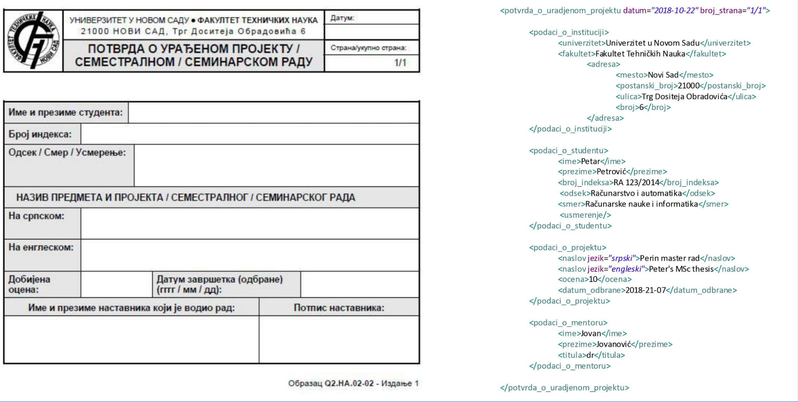
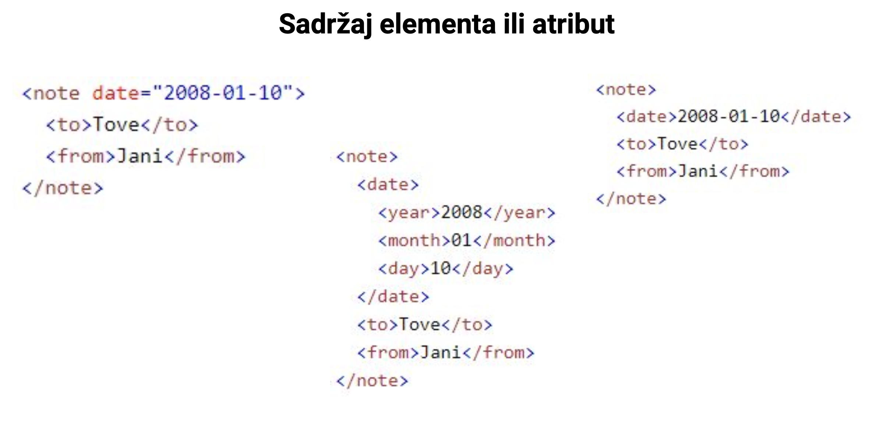
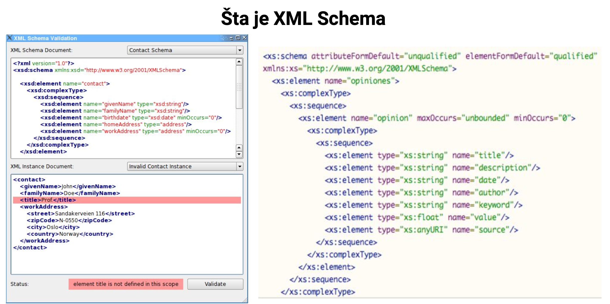

# xml и xml схема

Что такое XML
- eXtensible Markup Language (расширяемый язык разметки)
- Формат для хранения и обмена данными
- Позволяет стандартизированное взаимодействие между приложениями, написанными на различных технологиях
- XML-документы должны быть одновременно удобочитаемыми для человека и машиночитаемыми. В паре идут понятия строго и слабо структурированных документов
- Благодаря простой спецификации легко можно написать парсеры, обрабатывающие XML-документы, хотя это часто не требуется, так как каждый более популярный язык уже имеет встроенные парсеры.

XML синтаксис
➔ XML документ состоит из элементов, атрибутов и процессорных инструкций.
➔ Элементы:
  - Часть документа, которая начинается открывающим тегом, заканчивается закрывающим тегом и содержит контент, расположенный между тегами `<название_элемента>содержимое элемента</название_элемента>`
  - Элементы не обязательно должны иметь контент. В этом случае мы можем использовать "самозакрывающийся" тег `<название_элемента/>`
  - Каждый XML документ должен иметь ровно один начальный (корневой) элемент.
  - Элементы могут быть вложенными. `<e1>Lorem ipsum <e2>dolor</e2> sit</e1>`, но НЕ пересекающимися `<e1>...<e2>..</e1>...</e2>`
  - Названия тегов чувствительны к регистру.

XML синтаксис
➔ **Атрибуты:**
  - Помимо содержимого, каждый элемент может иметь свои атрибуты, которые указываются внутри открывающего тега `<название_элемента атрибут1="содержимое">содержимое элемента</название_элемента>`
  - Элемент может иметь произвольное количество атрибутов, но не может иметь несколько атрибутов с одинаковыми именами.
➔ В XML также могут быть комментарии: `<!-- комментарий -->`
➔ XML не поставляется с заранее определенными тегами, каждый может создавать свои теги в соответствии с потребностями домена.
➔ Некоторые из языков разметки, которые соответствуют спецификации XML: HTML, SVG, PNG, DOCX...

Содержимое элемента или атрибут
➔ Атрибуты не так легко расширяемы
➔ Не можем так точно определить и контролировать их содержимое с помощью XML Schema
➔ Гораздо проще осуществлять поиск содержимого на основе элементов, чем на основе атрибутов
➔ В основном используются только для метаданных (данные о данных)

➔ **xml схема это**
Если XML стандарт позволяет нам создавать свою собственную грамматику XML (свой тип XML документа), который соответствует нашей области, нам нужен язык, с помощью которого мы определим, как будут выглядеть эти документы:
  - Какие элементы должны содержать,
  - В каком порядке,
  - Какого типа должно быть содержимое элементов,
  - Обязательны ли элементы или нет,
  - Будут ли у элементов атрибуты, и если да, какие...

