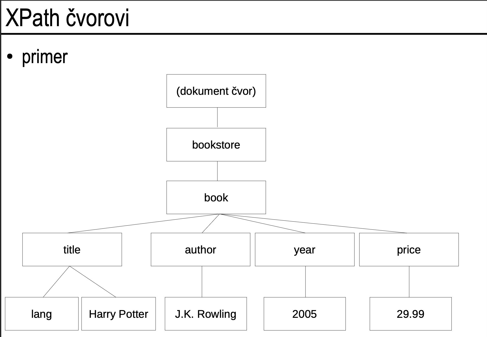
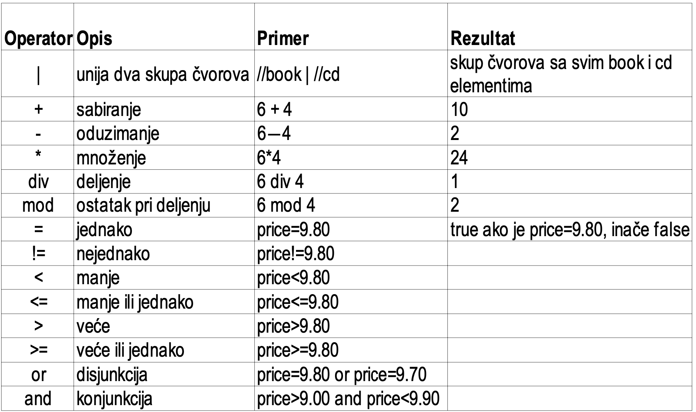
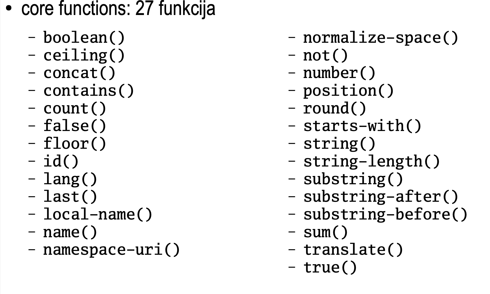

XPath выражения
- Эти выражения предназначены для указания узла или набора узлов в документе.
- Эти выражения похожи на выражения для работы с файловой системой.
  - `C:\windows\fonts\arial.ttf`
  - `\windows\fonts\arial.ttf`
  - `..\..\windows\fonts\arial.ttf`

Стандартные функции XPath
- XPath содержит около 100 встроенных функций:
  - Операции со строками
  - Операции с числовыми значениями
  - Операции с датой и временем
  - Манипуляции с узлами
  - Манипуляции с последовательностями
... 

XML документ, с точки зрения XPath, рассматривается как дерево с различными типами узлов:
- Элемент
- Атрибут
- Текст
- Пространство имен
- Процессорная инструкция
- Комментарий
- Документ (корень)

```
<?xml version="1.0"?>
<bookstore>

<book>
    <title lang="en">Harry Potter</title>
    <author>J. K. Rowling</author>
    <year>2005</year>
    <price>29.99</price>

  </book>
</bookstore>
```



Отношения между узлами:
- Родитель (book для title)
- Дочерний элемент (title для book)
- Брат/сестра (title и author)
- Предок (bookstore для title)
- Наследник (title для bookstore)


Навигация по дереву документа:
- Концепция текущего узла = "где я нахожусь в данный момент"
  - Если текущий узел - author:
    - В направлении родителя находится book
    - В направлении дочернего элемента находится текстовое содержимое, равное "J.K. Rowling"

XPath путь
- Состоит из нескольких шагов, разделенных символом /
- Абсолютный путь: начинается с символа /
  - /шаг/шаг/...
  - Всегда начинается с узла-документа
- Относительный путь: не начинается с символа /
  - шаг/шаг/...
  - Каждый шаг вычисляется относительно узлов в текущем наборе узлов (node-set)

Шаг пути состоит из:
- Оси движения
- Теста узла
- Нуля или более предикатов

 определяет набор узлов относительно текущего узла

- ancestor: все предки
- ancestor-or-self: все предки или текущий узел
- attribute: атрибут
- child: все дети
- descendant: все потомки
- descendant-or-self: все потомки или текущий узел
- following: все узлы после текущего
- following-sibling: все соседние узлы после текущего
- namespace: все пространства имен текущего узла
- parent: родитель
- preceding: все узлы перед текущим
- preceding-sibling: все соседние узлы перед текущим
- self: текущий узел

- Сокращенное написание:
  - Если ось не указана, подразумевается child::; self:: можно записать как точка .
  - parent:: можно записать как две точки ..
  - descendant:: можно записать как две косые черты //
  - attribute:: можно записать как @
  - following-sibling:: можно записать как ../

Используются для нахождения узла, который удовлетворяет заданному условию. Основное применение - фильтрация узлов.

Пример: из всех узлов title, выбрать те, у которых текстовое содержимое длиннее 20 символов.

- //title[@lang]
  - Примеры:
    - Все элементы title, которые имеют атрибут lang
- //title[@lang='eng']
  - Все элементы title, которые имеют атрибут lang со значением 'eng'
- /bookstore/book[price > 35.00]
  - Примеры:
    - Все элементы book, являющиеся детьми корневого элемента bookstore и имеющие подэлемент price со значением больше 35.00
- /bookstore/book[price > 35.00]/price
  - Все элементы price, принадлежащие элементам book, принадлежащим корневому элементу bookstore, у которых есть элемент price со значением больше 35.00
- /bookstore/book[price > 35.00]/title
  - Все элементы title, принадлежащие элементам book, принадлежащим корневому элементу bookstore, у которых есть элемент price со значением больше 35.00

- /bookstore/book[1]
  - Примеры:
    - Первый элемент book, являющийся дочерним элементом корня bookstore
- /bookstore/book[last()]
  - Последний элемент book, являющийся дочерним элементом корня bookstore
- /bookstore/book[last()-1]
  - Предпоследний элемент book, являющийся дочерним элементом корня bookstore
- /bookstore/book[position()<3]
  - Первые два элемента book, являющиеся дочерними элементами корня bookstore




- На указание нескольких выражений XPath, связанных оператором |
  - Результат - объединение наборов узлов, полученных базовыми выражениями.
- Примеры:
  - //book/title | //book/price
    - Все элементы title, являющиеся детьми элемента book, и все элементы price, являющиеся детьми элемента book
  - //title | //price
    - Все элементы title и все элементы price
- /bookstore/book/title | //price
  - Все элементы title элемента book, являющегося дочерним элементом корня bookstore, и все элементы price
